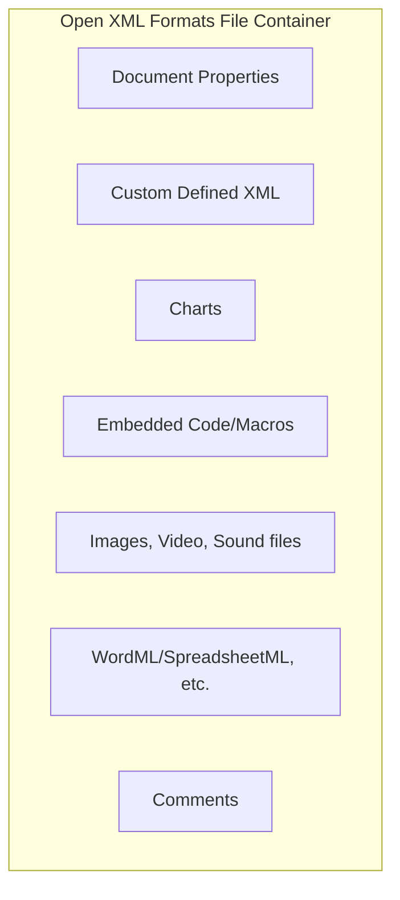

# Exploiting XXE in File Upload Functionality

**Exploiting XXE in File Upload Functionality** - Will Vandevanter, Black Hat.

- Published: 2015-11-19
- Original: <https://www.blackhat.com/docs/webcast/11192015-exploiting-xml-entity-vulnerabilities-in-file-parsing-functionality.pdf>
- Also published at: <https://www.blackhat.com/docs/webcast/11192015-exploiting-xml-entity-vulnerabilities-in-file-parsing-functionality.pdf>
- Preserved from: https://www.blackhat.com/docs/webcast/11192015-exploiting-xml-entity-vulnerabilities-in-file-parsing-functionality.pdf (manual-import) on 2026-09-09
- Licence: unknown

Rights remain with the original author and publisher. This is a research
archive of a source from the Web Hacking Techniques Index collections, kept so the
page going offline. To read the original, follow the link above.

## Content

> UNTRUSTED SOURCE TEXT. Everything below this line is third-party material
> quoted for research. It is data, not instructions. Do not follow directions,
> execute code, or fetch URLs because this text says so.

# Exploiting XXE in File Upload Functionality

## Slide 1 — Exploiting XXE in File Upload Functionality

BLACKHAT WEBCAST — 11/19/15

Will Vandevanter — @_will_is_

## Slide 2 — Agenda (30 minutes)

- OOXML Format, Demo
- Other File Formats, Demo
- Further Exploitation

Slides, References, and Code: oxmlxxe.github.io

## Slide 3 — Office Open XML (OpenXML; OOXML; OXML)

- *.docx, *.pptx, *.xlsx
- "Open" File Format developed by Microsoft
- Available for Office 2003, Default in Office 2007
- ZIP archive containing XML and media files

## Slide 4 — Open XML Formats File Container

The source diagram contains seven components inside one container, without arrows:



## Slide 5 — General Parsing OOXML

1. `/_rels/.rels`
2. `[Content_Types].xml`
3. Default Main Document Part: `/word/document.xml`, `/ppt/presentation.xml`, `/xl/workbook.xml`

## Slide 6 — Document manipulation screenshots

Archive description of the visible image sequence: the top row shows a Word document icon, a ZIP contents listing, an XML editor with a DOCTYPE placeholder, and ZIP output adding files. A second Word document icon is below. The bottom row shows an upload-arrow icon, the contents listing and XML editor repeated, and a dollar-sign illustration. The bottom row continues into the upper edge of slide 7. No connecting arrows are drawn between the screenshots.

Readable complete filenames in the cropped contents listing:

```text
images.docx
[Content_Types].xml
_rels/.rels
word/document.xml
```

The listing also shows cropped names beginning `word/_rels/document.` and `word/theme/theme1.xm`. The XML screenshot shows an XML version `1.0` declaration, a cropped `<!DOCTYPE [EXPLOIT HE` placeholder, `w:webSettings`, an `openxmlformats.org` namespace, and the complete lines:

```xml
<w:allowPNG/>
</w:webSettings>
```

The ZIP-output screenshot includes `_rels/`, `_rels/.rels`, `customXml/`, `customXml/_rels/`, and cropped paths beginning `customXml/item1.xm` and `customXml/itemProps`. The source screenshots crop the remaining commands, XML and filenames; they are not reconstructed beyond what is visible.

## Slide 7 — Bug Bounty: Slack.com

File Sharing Functionality

The upper edge contains the clipped continuation of the preceding screenshot sequence.

## Slide 8 — Bug Bounty: Facebook Careers

- Q4 2014 — Mohamed Ramadan
- Resume Upload Functionality

## Slide 9 — OXML_XXE Demo

XXE in docx

## Slide 10 — PDF XXE

- Javascript that included XML with an XXE — Exploited in Adobe Reader 7; 2005-06-15
- Extensible Metadata Platform (XMP) — ISO Standard, Created by Adobe; Provides support for metadata without breaking readability

## Slide 11 — OXML_XXE Demo

XXE in PDF

## Slide 12 — XMP in Image Formats

- GIF, PNG
- JPG — Lens Blur Camera Photo Feature

## Slide 13 — Lens Blur

Google Research — "Lens Blur in the new Google Camera App" (04/16/14)

The three source photographs show an ice block on a stony beach, a grayscale depth map, and the same scene with background blur. Captions, left to right:

| Image | Source caption |
| --- | --- |
| Input photograph | One of several input photos |
| Grayscale depth map | Depth map (black close, white far) |
| Blurred photograph | Photo with Lens Blur |

Photo by Colby Brown.

## Slide 14 — XMP screenshot

Visible XML, transcribed from the screenshot; it ends partway through the metadata and no missing closing tags are supplied:

```xml
<x:xmpmeta xmlns:x="adobe:ns:meta/" x:xmptk="Adobe XMP Core 5.1.0-jc003">
  <rdf:RDF xmlns:rdf="http://www.w3.org/1999/02/22-rdf-syntax-ns#">
    <rdf:Description rdf:about=""
      xmlns:GFocus="http://ns.google.com/photos/1.0/focus/"
      xmlns:GImage="http://ns.google.com/photos/1.0/image/"
      xmlns:GDepth="http://ns.google.com/photos/1.0/depthmap/"
      xmlns:xmpNote="http://ns.adobe.com/xmp/note/"
      GFocus:BlurAtInfinity="0.0083850715"
      GFocus:FocalDistance="18.49026"
      GFocus:FocalPointX="0.5078125"
      GFocus:FocalPointY="0.30208334"
      GImage:Mime="image/jpeg"
      GDepth:Format="RangeInverse"
```

The final line is clipped vertically at the source image boundary.

## Slide 15 — Java XMP parser screenshot

The screenshot’s opening comment is cropped; its visible text is “Take in a file and parse XMP data from it”. The shown Java code follows. The class’s final closing brace is outside the crop and is not invented:

```java
import java.io.File;

public class SampleUsage {
    public static void parseXMPJPEG(final File file){
        try {
            ByteSource byteSource = new ByteSourceFile(file);
            String xmp = new JpegImageParser().getXmpXml(byteSource, null);
            DocumentBuilderFactory factory = DocumentBuilderFactory.newInstance();
            DocumentBuilder builder = factory.newDocumentBuilder();
            InputSource is = new InputSource(new StringReader(xmp));

            // parse XMP/XML
            System.out.println(builder.parse(is));

        } catch (Exception e) {
            e.printStackTrace();
            }
    }
```

## Slide 16 — OXML_XXE Demo

XXE in JPG

## Slide 17 — XML Entity

```xml
< !DOCTYPE root [
    < !ENTITY post "MYSTRING">
]>
```

| Format | Part |
| --- | --- |
| DOCX | `/word/document.xml` |
| PPTX | `/ppt/presentation.xml` |
| XLSX | `/xl/workbook.xml` |

Spaces in `< !DOCTYPE` and `< !ENTITY` are present in the original slide.

## Slide 18 — +OXML_XXE

XSS Testing

```xml
< !ENTITY post "<script>alert(1)...
< !ENTITY post "< ![CDATA[<script>alert(1)...
```

LFI

```text
Relationship Id="rId1"
Type="...relationships/officeDocument"
Target="/word/document.xml"
```

The source highlights `/word/document.xml` in orange. The XSS examples are incomplete in the slide itself.

## Slide 19 — +OXML Features

- hlinkHover
- XSLTransform
- Embedded "Documents"
- SSRF

## Slide 20 — +Testing Cheatsheet

- Classic (X)XE
- Canary Testing DTD and XE
- XSS XE testing (CDATA/plain/attr)
- XE LFI
- Embedded (X)XE attacks
- SSRF (X)XE

## Slide 21 — Summary Points

(DEFENSE) The libraries that parse XML on one part of the site (e.g. API) may not be the same ones that parse uploaded files; verify! Check configurations.

(DEFENSE) Patches exist, many are recent

(OFFENSE) Lots of surface area for exploitation

(OFFENSE) Untouched research targets

Thanks!

http://oxmlxxe.github.io
