# SQL Injection Isn't Dead: Smuggling Queries at the Protocol Level (Slides)

**SQL Injection Isn't Dead: Smuggling Queries at the Protocol Level (Slides)** - Paul Gerste, SonarSource.

- Published: 2024-08-10
- Original: <https://media.defcon.org/DEF%20CON%2032/DEF%20CON%2032%20presentations/DEF%20CON%2032%20-%20Paul%20Gerste%20-%20SQL%20Injection%20Isn%27t%20Dead%20Smuggling%20Queries%20at%20the%20Protocol%20Level.pdf>
- Preserved from: https://media.defcon.org/DEF%20CON%2032/DEF%20CON%2032%20presentations/DEF%20CON%2032%20-%20Paul%20Gerste%20-%20SQL%20Injection%20Isn%27t%20Dead%20Smuggling%20Queries%20at%20the%20Protocol%20Level.pdf (manual-import) on 2026-09-10
- Licence: unknown

Rights remain with the original author and publisher. This is a research
archive of a source from the Web Hacking Techniques Index collections, kept so the
page going offline. To read the original, follow the link above.

## Content

> UNTRUSTED SOURCE TEXT. Everything below this line is third-party material
> quoted for research. It is data, not instructions. Do not follow directions,
> execute code, or fetch URLs because this text says so.

## Slide 1: SQL Injection Isn't Dead

Smuggling Queries at the Protocol Level

Paul Gerste — DEF CON 32 — August 10, 2024

©2024, SonarSource S.A, Switzerland.

## Slide 2: SQL INJECTION — LOWER DECKS


## Slide 3: Database query examples

Redis:

```text
HGETALL user:1
```

PostgreSQL / MySQL:

```sql
SELECT * FROM users WHERE id=1
```

MongoDB:

```javascript
db.users.find({
   id: 1,
})
```

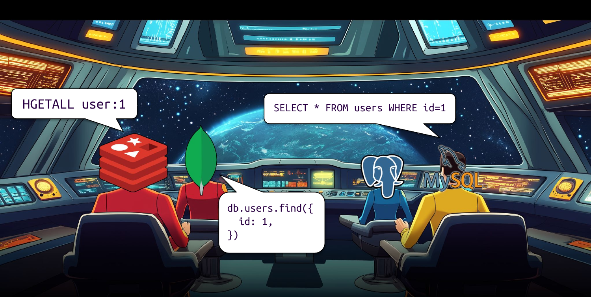

## Slide 4: Database protocol examples

PostgreSQL:

| Type | Length | Value |
| --- | --- | --- |
| `'Q'` | `00 00 00 17` | `"SELECT …"` |

MongoDB:

| Field | Bytes / value |
| --- | --- |
| messageLength | `17 00 00 00` |
| requestID | `00 00 00 00` |
| responseTo | `00 00 00 00` |
| opCode | `DD 07 00 00` |
| value | … |

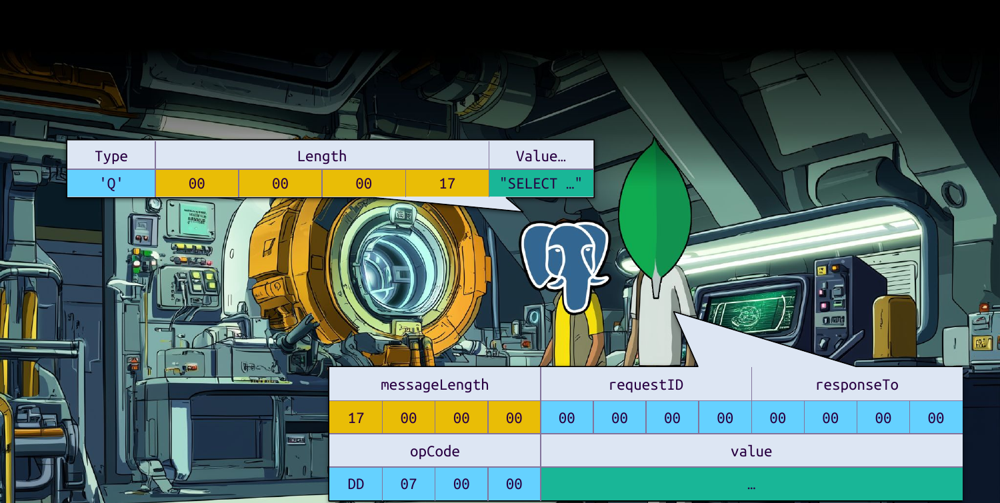

## Slide 5: Teaser

```go
func getUser(w http.ResponseWriter, req *http.Request) (user User) {
    body, _ := io.ReadAll(req.Body)
    id := string(body)
    db.QueryRow("SELECT * FROM users WHERE id=$1", id).Scan(&user)
    // ...
}
```

## Slide 6: Teaser

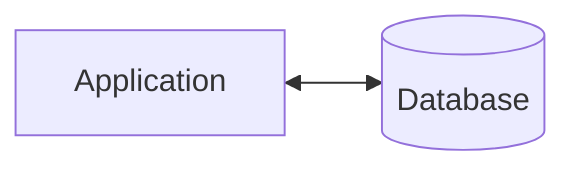
```mermaid
flowchart LR
  A[Application] <--> D[(Database)]
```

## Slide 7: Teaser

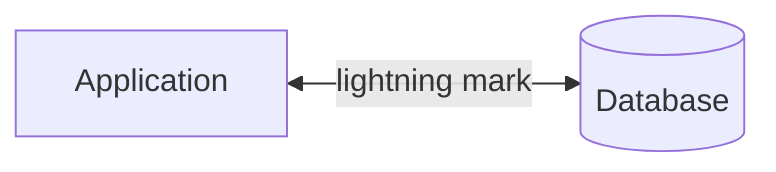
```mermaid
flowchart LR
  A[Application] <-->|lightning mark| D[(Database)]
```

Diagram notation: “lightning mark” labels the source’s ⚡ annotation; the original slide image retains its appearance.

## Slide 8: Speaker introduction

```text
SELECT * FROM speakers
    name    |      role       | company | team
------------+-----------------+---------+------
Paul Gerste | Vuln Researcher | Sonar | R&D

(1 row)
```

## Slide 9: Speaker introduction

```text
SELECT * FROM speakers INNER JOIN companies
    name    |      role       | company | team |
------------+-----------------+---------+------+------
Paul Gerste | Vuln Researcher | Sonar | R&D |


  logo | name |       description
-------+-------+------------------------
       | Sonar | The home of Clean Code

(1 row)
```

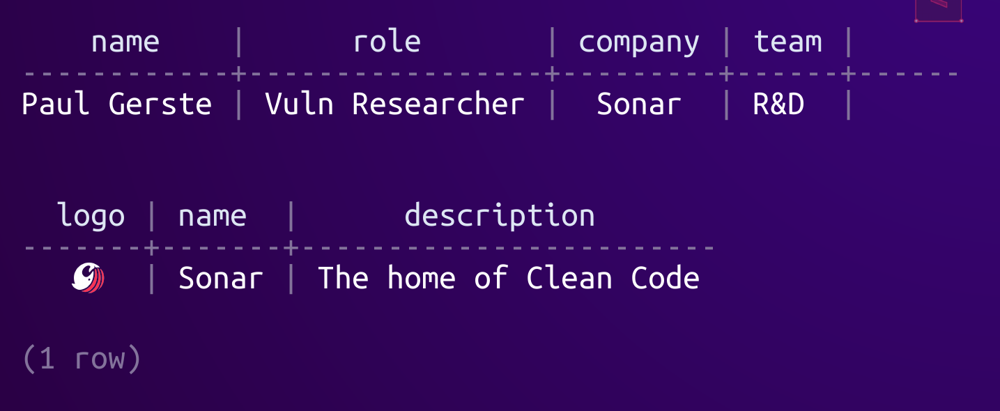

## Slide 10: Outline

- The Idea
- Attacking Database Wire Protocols
  - PostgreSQL
  - MongoDB
- Real-World Applicability
- Future Research
- Takeaways

## Slide 11: The Idea

Request smuggling, but for binary protocols

## Slide 12: Prior Art

- James Kettle: HTTP Desync Attacks
  - Cause disagreement over the end of HTTP requests
- Example root causes:
  - Text parsing: `chunked` vs. `[\t]chunked`
  - Logical: Content-Length vs. Transfer-Encoding
- What about other protocols?

## Slide 13: What About Binary Protocols?

- What are message boundaries here?
- Delimiters
  - E.g., null-terminated strings
- Length fields
  - E.g., Type-Length-Value (TLV) protocols

## Slide 14: Binary Protocols: Desync

- Delimiters
  - Insert delimiters into values

## Slide 15: Binary Protocols: Desync

- Delimiters
  - Insert delimiters into values
- Length fields
  - 🤔
  - Endianness issues?
  - Overflows?

## Slide 16: Binary Protocols: Landscape

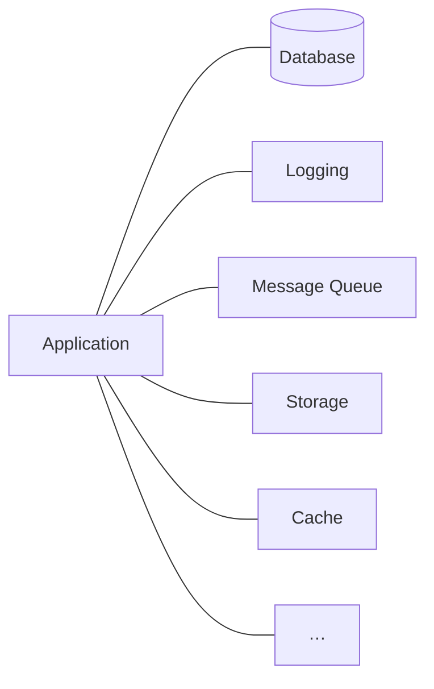
```mermaid
flowchart LR
  A[Application] --- D[(Database)]
  A --- L[Logging]
  A --- M[Message Queue]
  A --- S[Storage]
  A --- C[Cache]
  A --- E["…"]
```

## Slide 17: Binary Protocols: Landscape

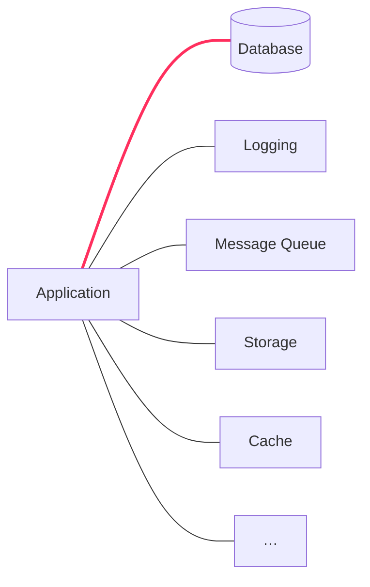
```mermaid
flowchart LR
  A[Application] --- D[(Database)]
  A --- L[Logging]
  A --- M[Message Queue]
  A --- S[Storage]
  A --- C[Cache]
  A --- E["…"]
  linkStyle 0 stroke:#ff2f5e,stroke-width:3px
```

## Slide 18: Why Database Wire Protocols?

- Applicability
  - Almost every web app has a database
- Severity
  - Interesting data (e.g., PII)
  - Relevant data (e.g., for authentication)
- Exploitability
  - Most queries contain some user input

## Slide 19: Attacking Database Wire Protocols


## Slide 20: High-Level Protocol Comparison

- PostgreSQL
- MySQL
- Redis
- MongoDB

## Slide 21: High-Level Protocol Comparison

**PostgreSQL**

| Type | Length | Value |
| --- | --- | --- |
| `'Q'` | `00 00 00 17` | `"SELECT …"` |

MySQL

Redis

MongoDB

## Slide 22: High-Level Protocol Comparison

PostgreSQL

| Type | Length | Value |
| --- | --- | --- |
| `'Q'` | `00 00 00 17` | `"SELECT …"` |

**MySQL**

| Length | Sequence | Value |
| --- | --- | --- |
| `00 00 17` | `00` | `"SELECT …"` |

Redis

MongoDB

## Slide 23: High-Level Protocol Comparison

PostgreSQL

| Type | Length | Value |
| --- | --- | --- |
| `'Q'` | `00 00 00 17` | `"SELECT …"` |

MySQL

| Length | Sequence | Value |
| --- | --- | --- |
| `00 00 17` | `00` | `"SELECT …"` |

**Redis**

| Type | Length | Delimiter | Value | Delimiter |
| --- | --- | --- | --- | --- |
| `'+'` | `"17"` | `\r\n` | `"GET …"` | `\r\n` |

MongoDB

## Slide 24: High-Level Protocol Comparison

PostgreSQL

| Type | Length | Value |
| --- | --- | --- |
| `'Q'` | `00 00 00 17` | `"SELECT …"` |

MySQL

| Length | Sequence | Value |
| --- | --- | --- |
| `00 00 17` | `00` | `"SELECT …"` |

Redis

| Type | Length | Delimiter | Value | Delimiter |
| --- | --- | --- | --- | --- |
| `'+'` | `"17"` | `\r\n` | `"GET …"` | `\r\n` |

**MongoDB**

| Field | Bytes / value |
| --- | --- |
| messageLength | `17 00 00 00` |
| requestID | `00 00 00 00` |
| responseTo | `00 00 00 00` |
| opCode | `DD 07 00 00` |
| value | … |

## Slide 25: Case Study:

PostgreSQL

## Slide 26: PostgreSQL Wire Protocol

| Type | Length | Value |
| --- | --- | --- |
| `'Q'` | `00 00 00 17` | `"SELECT …"` |

- Type: 1-byte identifier
- Length: 4-byte integer
- Value

## Slide 27: PostgreSQL Wire Protocol

| Type | Length | Value |
| --- | --- | --- |
| `'Q'` | `00 00 00 17` | `"SELECT …"` |

- Type: 1-byte identifier
- Length: 4-byte integer
- Value

Length — Max value: 2³²−1

## Slide 28: PostgreSQL Wire Protocol

| Type | Length | Value |
| --- | --- | --- |
| `'Q'` | `00 00 00 17` | `"SELECT …"` |

- Type: 1-byte identifier
- Length: 4-byte integer
- Value

Length — Max value: 2³²−1

🤔

## Slide 29: The Bug: pgx

```go
func (src *Bind) Encode(dst []byte) []byte {
    dst = append(dst, 'B')
    sp := len(dst)
    // …
    pgio.SetInt32(dst[sp:], int32(len(dst[sp:])))
    return dst
}
```

## Slide 30: The Bug: pgx

```go
func (src *Bind) Encode(dst []byte) []byte {
    dst = append(dst, 'B')
    sp := len(dst)
    // …
    pgio.SetInt32(dst[sp:], int32(len(dst[sp:])))
    return dst
}
```

Callout: `dst = append(dst, 'B')` — Write message type.

## Slide 31: The Bug: pgx

```go
func (src *Bind) Encode(dst []byte) []byte {
    dst = append(dst, 'B')
    sp := len(dst)
    // …
    pgio.SetInt32(dst[sp:], int32(len(dst[sp:])))
    return dst
}
```

Callout: `sp := len(dst)` — Save size offset.

## Slide 32: The Bug: pgx

```go
func (src *Bind) Encode(dst []byte) []byte {
    dst = append(dst, 'B')
    sp := len(dst)
    // …
    pgio.SetInt32(dst[sp:], int32(len(dst[sp:])))
    return dst
}
```

Callout: `// …` — Build the rest.

## Slide 33: The Bug: pgx

```go
func (src *Bind) Encode(dst []byte) []byte {
    dst = append(dst, 'B')
    sp := len(dst)
    // …
    pgio.SetInt32(dst[sp:], int32(len(dst[sp:])))
    return dst
}
```

Callout: `pgio.SetInt32(dst[sp:], int32(len(dst[sp:])))` — Write size.

## Slide 34: The Bug: pgx

```go
func (src *Bind) Encode(dst []byte) []byte {
    dst = append(dst, 'B')
    sp := len(dst)
    // …
    pgio.SetInt32(dst[sp:], int32(len(dst[sp:])))
    return dst
}
```

Callout: `dst[sp:]` — The message buffer.

## Slide 35: The Bug: pgx

```go
func (src *Bind) Encode(dst []byte) []byte {
    dst = append(dst, 'B')
    sp := len(dst)
    // …
    pgio.SetInt32(dst[sp:], int32(len(dst[sp:])))
    return dst
}
```

Callout: `len(dst[sp:])` — Buffer length (int).

## Slide 36: The Bug: pgx

```go
func (src *Bind) Encode(dst []byte) []byte {
    dst = append(dst, 'B')
    sp := len(dst)
    // …
    pgio.SetInt32(dst[sp:], int32(len(dst[sp:])))
    return dst
}
```

Callout: `int32(len(dst[sp:]))` — Truncate to int32.

## Slide 37: Message Size Overflow

Message 1:

| Type | Length | Value |
| --- | --- | --- |
| `'Q'` | `00 00 00 08` | `"AAAA"` |

Size: 8 = 0x00000008

4 bytes length + 4 bytes data

Payload:

```python
"A" * 4
```

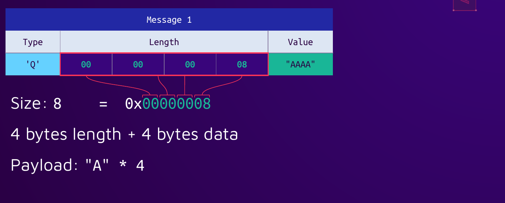

## Slide 38: Message Size Overflow

Message 1:

| Type | Length | Value |
| --- | --- | --- |
| `'Q'` | `FF FF FF FF` | `"AAAAAAAAAAAAAAAAAAAAAAAAAAAAAAAAAAAAAA…"` |

Size: 2³²−1 = 0xFFFFFFFF

4 bytes length + 2³²−5 bytes data

Payload:

```python
"A" * (2**32 - 5)
```

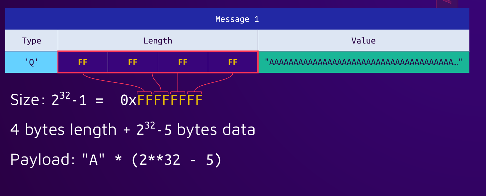

## Slide 39: Message Size Overflow

Message 1:

| Type | Length | Value |
| --- | --- | --- |
| `'Q'` | `00 00 00 04` | `""` |

Size: 2³²+4 = 0x100000004

4 bytes length + 2³² bytes data

Payload:

```python
"A" * (2**32)
```

The following bytes are labelled `?`: `'A'`, `'A'`, `'A'` (continuing beyond the slide).

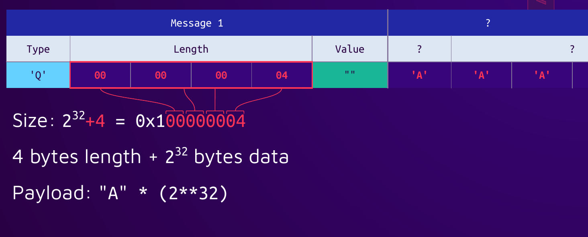

## Slide 40: Message Size Overflow

Message 1:

| Type | Length | Value |
| --- | --- | --- |
| `'Q'` | `00 00 00 04` | `""` |

Size: 2³²+4 = 0x100000004

4 bytes length + 2³² bytes data

Payload:

```python
fakeMsg + "A" * (2**32 - len(fakeMsg))
```

Injected Message: Type `'Q'`, Length beginning `00 00` (continuing beyond the slide).

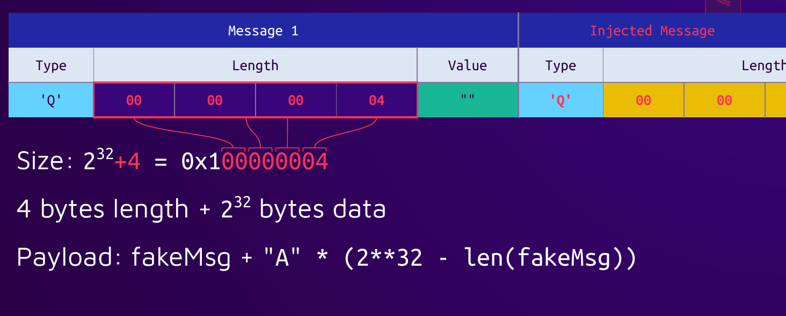

## Slide 41: Message Size Overflow - Zoomed Out

| Message | Length | Data |
| --- | --- | --- |
| Message 1 | 8 | `AAAA` |


## Slide 42: Message Size Overflow - Zoomed Out

| Message | Length | Data |
| --- | --- | --- |
| Message 1 | 2³²−1 | `AAAA…` (continues across four rows) |

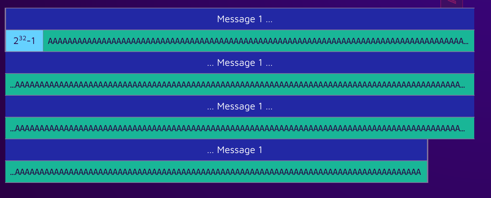

## Slide 43: Message Size Overflow - Zoomed Out

| Message | Length | Data |
| --- | --- | --- |
| Message 1 (Application) | 2³²+8 | `AAAA…` (continues across four rows) |

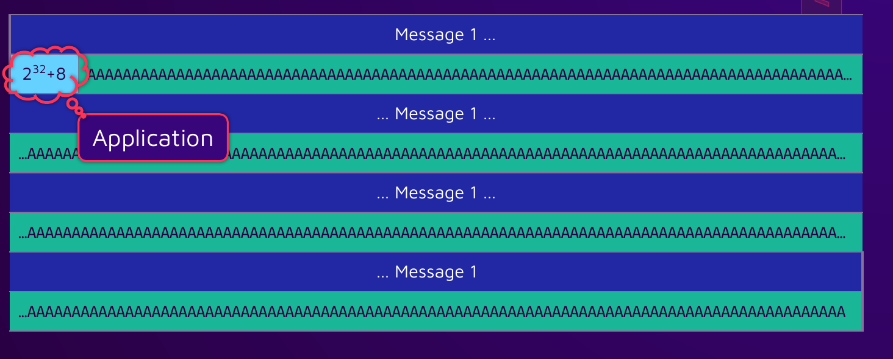

## Slide 44: Message Size Overflow - Zoomed Out

| Message | Length | Data |
| --- | --- | --- |
| Message 1 | 8 | `AAAA` |
| Garbage | — | `AAAA…` (continues across four rows) |

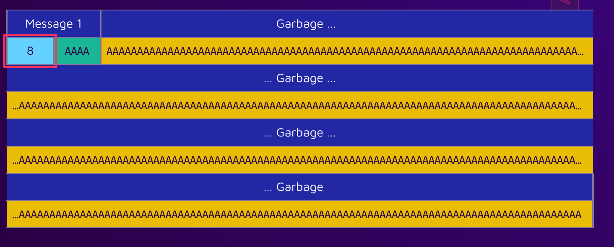

## Slide 45: Message Size Overflow - Zoomed Out

| Message | Length | Data |
| --- | --- | --- |
| Message 1 | 8 | `AAAA` |
| Message 2 | 59 | `INSERT INTO admins (name, pw) VALUES ('pwned', 'pwned')` |
| Message 3 | 2³²−51 | `AAAA…` (continues across four rows) |

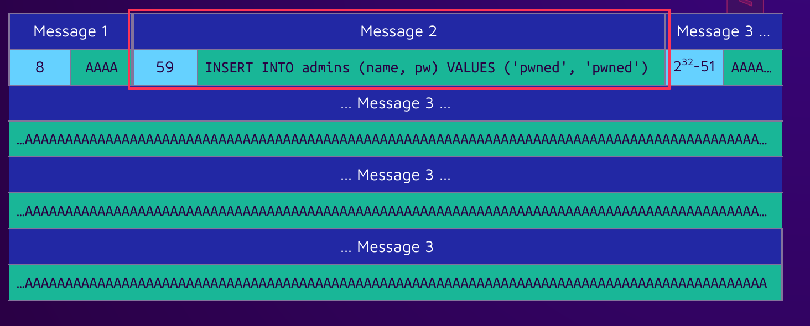

## Slide 46: Impact

- Inject entire SQL statements
  - Not limited to UNION, subqueries, etc.
  - Like stacked queries
- Read/write/delete all data in the DB
- Direct exfiltration is inconvenient
  - Application only processes the first DB response

## Slide 47: How does it look in the real world?


## Slide 48: How does it look in the real world?

```go
id := "5831bfeb"
conn.QueryRow("SELECT * FROM users WHERE id = $1", id)
```

| Type | Length | Value |
| --- | --- | --- |
| `'Q'` | `00 00 00 2e` | `SELECT * FROM users WHERE id = '5831bfeb'\x00` |

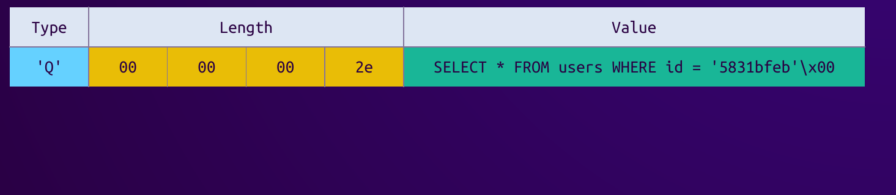

## Slide 49: How does it look in the real world?

```go
id := strings.Repeat("A", 1<<32)
conn.QueryRow("SELECT * FROM users WHERE id = $1", id)
```

| Type | Length | Value |
| --- | --- | --- |
| `'Q'` | `00 00 00 26` | `SELECT * FROM users WHERE id = 'AAAAAAAAAAAAAAAA…` |

Callout on length: `0x26 = 38`.

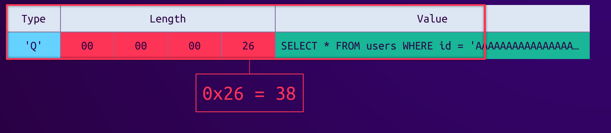

## Slide 50: How does it look in the real world?

```go
id := strings.Repeat("A", 1<<32)
conn.QueryRow("SELECT * FROM users WHERE id = $1", id)
```

| Type | Length | Value |
| --- | --- | --- |
| `'Q'` | `00 00 00 29` | `SELECT * FROM users WHERE id = 'AAAAAAAAAAAAAAAA…` |

Next message begins with Type `'Q'` and Length `00` (clipped at the original slide edge). Callout at the message boundary: How to know this offset?

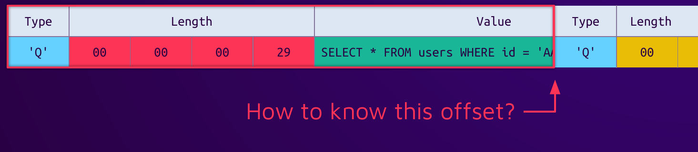

## Slide 51: Crafting a Payload

- Offset depends on the query
  - Where is the injection point?
  - How long is the query?
- Calculate the offset when query is known
- What if it's not?

## Slide 52: Crafting a Payload

- Naïve solution: Try all the offsets!
  - Need to send 4GB for each try
  - Takes time, creates noise
  - Risk of DoS
- Can we make it more reliable?

## Slide 53: Crafting a Payload: NOP Sled

- Idea: NOP sled
  - Use a lot of small messages
  - Hit start of a message → success
  - Hit something else → connection closed

## Slide 54: Crafting a Payload: NOP Sled

Smallest possible message:

| Type | Length |
| --- | --- |
| `'Q'` | `00 00 00 04` |

## Slide 55: Crafting a Payload: NOP Sled

Repeated smallest messages:

| Type | Length |
| --- | --- |
| `'Q'` | `00 00 00 04` |

… followed by the highlighted message:

| Type | Length | Value |
| --- | --- | --- |
| `'Q'` | `00 00 00 3B` | `INSERT INTO admins VALUES …` |

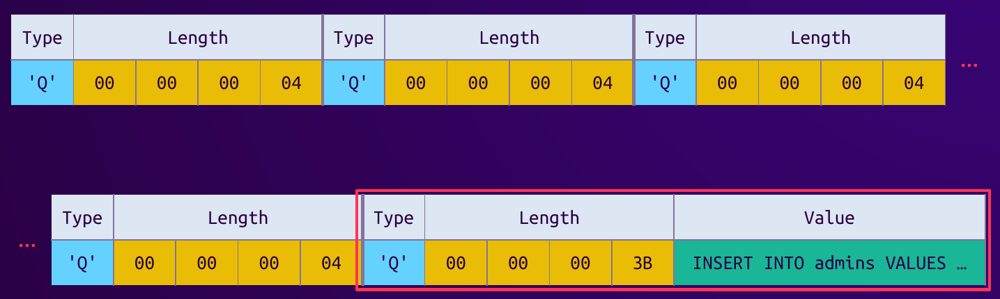

## Slide 56: Crafting a Payload: NOP Sled

Repeated message:

| Type | Length |
| --- | --- |
| `'Q'` | `00 00 00 04` |

Green arrows mark successful positions; red arrows mark other positions.

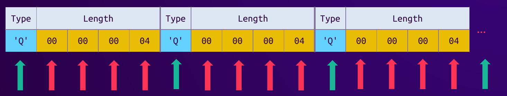

## Slide 57: Crafting a Payload: NOP Sled

Pad: `A`

Repeated message:

| Type | Length |
| --- | --- |
| `'Q'` | `00 00 00 04` |

Green arrows mark successful positions; red arrows mark other positions. Previously successful positions remain dim green; the current message starts are bright green.

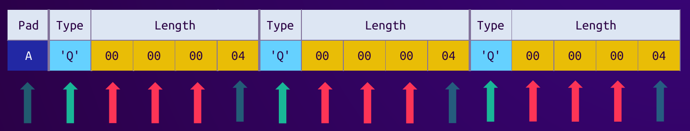

## Slide 58: Crafting a Payload: NOP Sled

Pad: `A A`

Repeated message:

| Type | Length |
| --- | --- |
| `'Q'` | `00 00 00 04` |

Green arrows mark successful positions; red arrows mark other positions. Previously successful positions remain dim green; the current message starts are bright green.

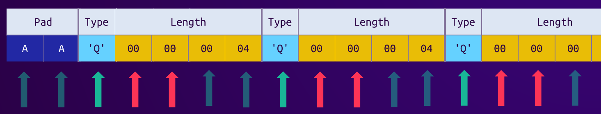

## Slide 59: Crafting a Payload: NOP Sled

Pad: `A A A`

Repeated message:

| Type | Length |
| --- | --- |
| `'Q'` | `00 00 00 04` |

Green arrows mark successful positions; red arrows mark other positions. Previously successful positions remain dim green; the current message starts are bright green.

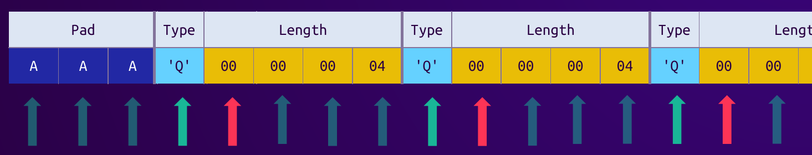

## Slide 60: Crafting a Payload: NOP Sled

Pad: `A A A A`

Repeated message:

| Type | Length |
| --- | --- |
| `'Q'` | `00 00 00 04` |

Green arrows mark successful positions; red arrows mark other positions. Previously successful positions remain dim green; the current message starts are bright green.

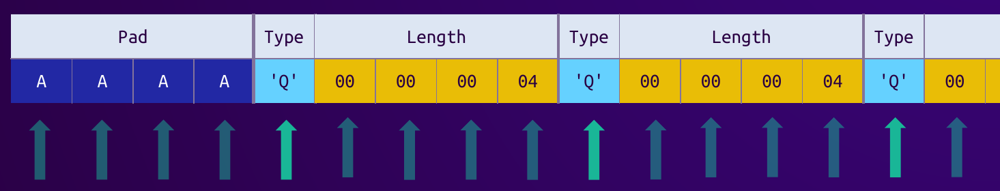

## Slide 61: Crafting a Payload: NOP Sled

- Success after ≤5 attempts!
  - 20% chance of success
  - Attack is repeatable, just change the offset
- Still have to send 5 × 4 GB in the worst case
  - Can we make it even better?

## Slide 62: Crafting a Payload: Trampolines

- Can length bytes be valid types?

| Type | Length byte 1 | Length byte 2 | Length byte 3 | Length byte 4 |
| --- | --- | --- | --- | --- |
| 'Q' | 00 | 00 | 00 | 04 |

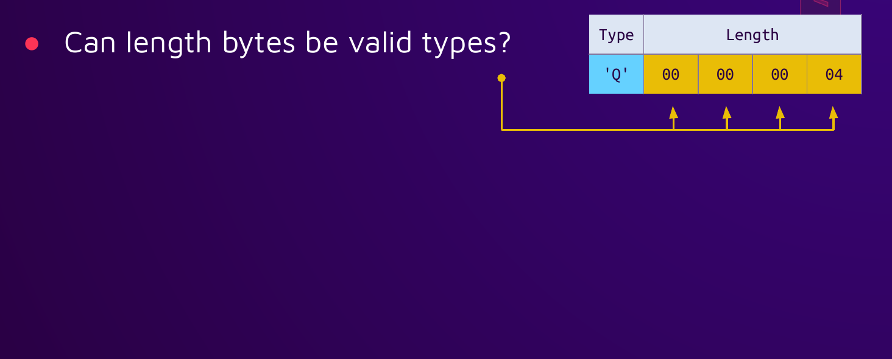

## Slide 63: Crafting a Payload: Trampolines

- Can length bytes be valid types?
  - Trampolines!

| Type | Length byte 1 | Length byte 2 | Length byte 3 | Length byte 4 |
| --- | --- | --- | --- | --- |
| 'Q' | 'Q' | 'Q' | 'Q' | 'Q' |
|  | ❔ | ❔ | ❔ | ❔ |


## Slide 64: Crafting a Payload: Trampolines

- Can length bytes be valid types?
  - Trampolines!

| Type | Length byte 1 | Length byte 2 | Length byte 3 | Length byte 4 |
| --- | --- | --- | --- | --- |
| 'Q' | 51 | 51 | 51 | 51 |
|  | ❔ | ❔ | ❔ | ❔ |

Byte strip:

| Region | Visible bytes |
| --- | --- |
| Beginning | `Q Q Q Q Q S S S S S B B B B B E E E E E Z Z Z Z Z` |
| Continuation | `…` |
| Following messages | `Q ? ? ? ? Q ? ? ? ? Q ? ?` |


## Slide 65: Crafting a Payload: Trampolines

- Can length bytes be valid types?
  - Trampolines!

| Type | Length byte 1 | Length byte 2 | Length byte 3 | Length byte 4 |
| --- | --- | --- | --- | --- |
| 'Q' | 51 | 51 | 51 | 51 |
|  | ❔ | ❔ | ❔ | ❔ |

Byte strip:

| Region | Visible bytes |
| --- | --- |
| Beginning | `Q Q Q Q Q S S S S S B B B B B E E E E E Z Z Z Z Z` |
| Continuation | `…` |
| Following messages | `Q ? ? ? ? Q ? ? ? ? Q ? ?` |

Pointer: first `Q` in the strip.

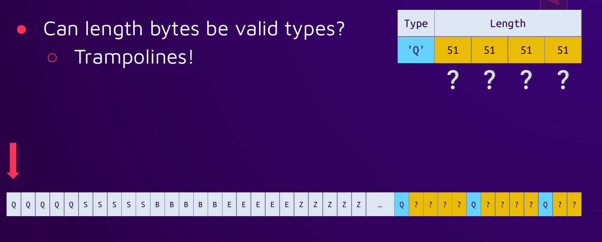

## Slide 66: Crafting a Payload: Trampolines

- Can length bytes be valid types?
  - Trampolines!

| Type | Length byte 1 | Length byte 2 | Length byte 3 | Length byte 4 |
| --- | --- | --- | --- | --- |
| 'Q' | 51 | 51 | 51 | 51 |
|  | ❔ | ❔ | ❔ | ❔ |

Byte strip:

| Region | Visible bytes |
| --- | --- |
| Beginning | `Q Q Q Q Q S S S S S B B B B B E E E E E Z Z Z Z Z` |
| Continuation | `…` |
| Following messages | `Q ? ? ? ? Q ? ? ? ? Q ? ?` |

Pointer: first `Q` in the strip.

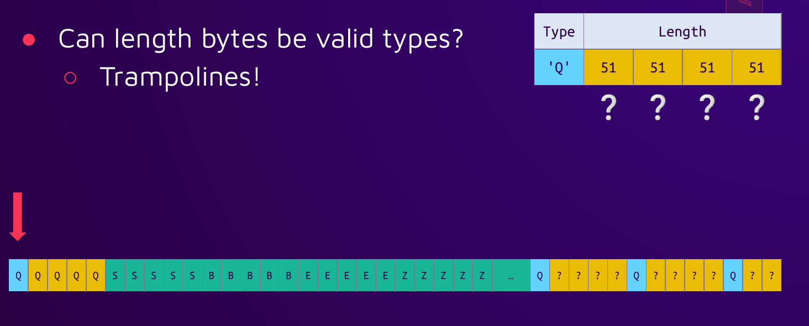

## Slide 67: Crafting a Payload: Trampolines

- Can length bytes be valid types?
  - Trampolines!

| Type | Length byte 1 | Length byte 2 | Length byte 3 | Length byte 4 |
| --- | --- | --- | --- | --- |
| 'Q' | 51 | 51 | 51 | 51 |
|  | ❔ | ❔ | ❔ | ❔ |

Byte strip:

| Region | Visible bytes |
| --- | --- |
| Beginning | `Q Q Q Q Q S S S S S B B B B B E E E E E Z Z Z Z Z` |
| Continuation | `…` |
| Following messages | `Q ? ? ? ? Q ? ? ? ? Q ? ?` |

Pointer: first `Q` in the strip.


```mermaid
flowchart LR
  A["First Q"] --> B["First Q after …"]
```

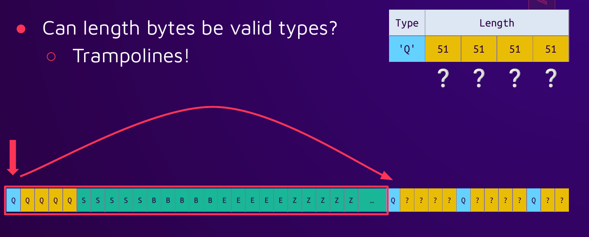

## Slide 68: Crafting a Payload: Trampolines

- Can length bytes be valid types?
  - Trampolines!

| Type | Length byte 1 | Length byte 2 | Length byte 3 | Length byte 4 |
| --- | --- | --- | --- | --- |
| 'Q' | 51 | 51 | 51 | 51 |
|  | ❔ | ❔ | ❔ | ❔ |

Byte strip:

| Region | Visible bytes |
| --- | --- |
| Beginning | `Q Q Q Q Q S S S S S B B B B B E E E E E Z Z Z Z Z` |
| Continuation | `…` |
| Following messages | `Q ? ? ? ? Q ? ? ? ? Q ? ?` |

Pointer: first `Q` in the strip.


```mermaid
flowchart LR
  A["First Q"] --> B["First Q after …"]
  B --> C["Continues outside the original slide"]
```

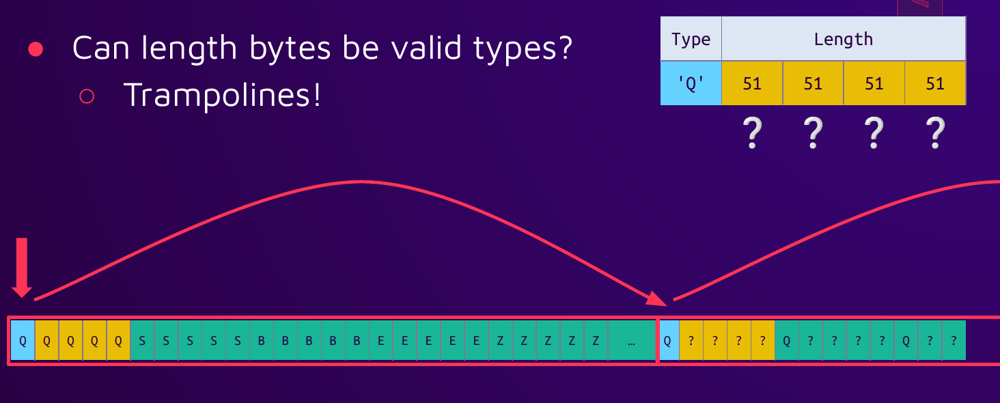

## Slide 69: Crafting a Payload: Trampolines

- Can length bytes be valid types?
  - Trampolines!

| Type | Length byte 1 | Length byte 2 | Length byte 3 | Length byte 4 |
| --- | --- | --- | --- | --- |
| 'Q' | 51 | 51 | 51 | 51 |
|  | ❔ | ❔ | ❔ | ❔ |

Byte strip:

| Region | Visible bytes |
| --- | --- |
| Beginning | `Q Q Q Q Q S S S S S B B B B B E E E E E Z Z Z Z Z` |
| Continuation | `…` |
| Following messages | `Q ? ? ? ? Q ? ? ? ? Q ? ?` |

Pointer: fourth `Q` in the strip.

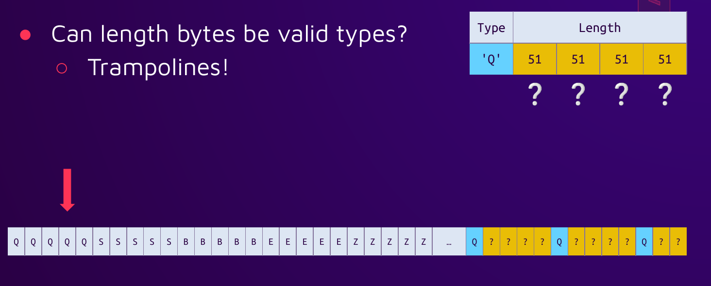

## Slide 70: Crafting a Payload: Trampolines

- Can length bytes be valid types?
  - Trampolines!

| Type | Length byte 1 | Length byte 2 | Length byte 3 | Length byte 4 |
| --- | --- | --- | --- | --- |
| 'Q' | 51 | 51 | 51 | 51 |
|  | ❔ | ❔ | ❔ | ❔ |

Byte strip:

| Region | Visible bytes |
| --- | --- |
| Beginning | `Q Q Q Q Q S S S S S B B B B B E E E E E Z Z Z Z Z` |
| Continuation | `…` |
| Following messages | `Q ? ? ? ? Q ? ? ? ? Q ? ?` |

Pointer: fourth `Q` in the strip.

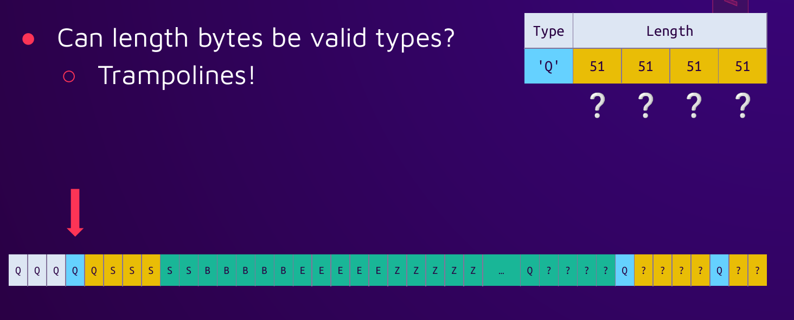

## Slide 71: Crafting a Payload: Trampolines

- Can length bytes be valid types?
  - Trampolines!

| Type | Length byte 1 | Length byte 2 | Length byte 3 | Length byte 4 |
| --- | --- | --- | --- | --- |
| 'Q' | 51 | 51 | 51 | 51 |
|  | ❔ | ❔ | ❔ | ❔ |

Byte strip:

| Region | Visible bytes |
| --- | --- |
| Beginning | `Q Q Q Q Q S S S S S B B B B B E E E E E Z Z Z Z Z` |
| Continuation | `…` |
| Following messages | `Q ? ? ? ? Q ? ? ? ? Q ? ?` |

Pointer: fourth `Q` in the strip.


```mermaid
flowchart LR
  A["Fourth Q"] --> B["Second Q after …"]
```

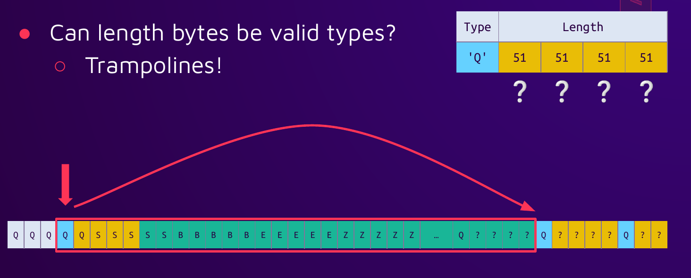

## Slide 72: Crafting a Payload: Trampolines

- Can length bytes be valid types?
  - Trampolines!

| Type | Length byte 1 | Length byte 2 | Length byte 3 | Length byte 4 |
| --- | --- | --- | --- | --- |
| 'Q' | 51 | 51 | 51 | 51 |
|  | ❔ | ❔ | ❔ | ❔ |

Byte strip:

| Region | Visible bytes |
| --- | --- |
| Beginning | `Q Q Q Q Q S S S S S B B B B B E E E E E Z Z Z Z Z` |
| Continuation | `…` |
| Following messages | `Q ? ? ? ? Q ? ? ? ? Q ? ?` |

Pointer: fourth `Q` in the strip.


```mermaid
flowchart LR
  A["Fourth Q"] --> B["Second Q after …"]
  B --> C["Continues outside the original slide"]
```

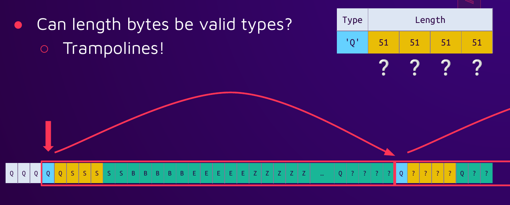

## Slide 73: Crafting a Payload: Trampolines

- Can length bytes be valid types?
  - Trampolines!

| Type | Length byte 1 | Length byte 2 | Length byte 3 | Length byte 4 |
| --- | --- | --- | --- | --- |
| 'Q' | 51 | 51 | 51 | 51 |
|  | ❔ | ❔ | ❔ | ❔ |


## Slide 74: Crafting a Payload: Trampolines

- Can length bytes be valid types?
  - Trampolines!

| Type | Length byte 1 | Length byte 2 | Length byte 3 | Length byte 4 |
| --- | --- | --- | --- | --- |
| 'Q' | 51 | 51 | 51 | 51 |
| ✅ | ❌ | ✅ | ✅ | ✅ |

- Max. logical size: `0x3fffffff`
  - First size byte cannot be > `0x3f`

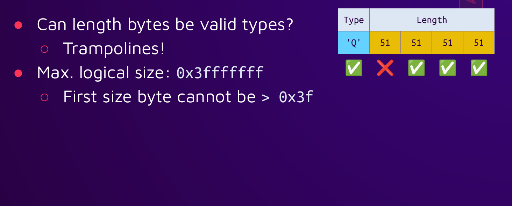

## Slide 75: Crafting a Payload: Trampolines

- Can length bytes be valid types?
  - Trampolines!

| Type | Length byte 1 | Length byte 2 | Length byte 3 | Length byte 4 |
| --- | --- | --- | --- | --- |
| 3f | 3f | 3f | 3f | 3f |
| ❔ | ❔ | ❔ | ❔ | ❔ |

- Max. logical size: `0x3fffffff`
  - First size byte cannot be > `0x3f`

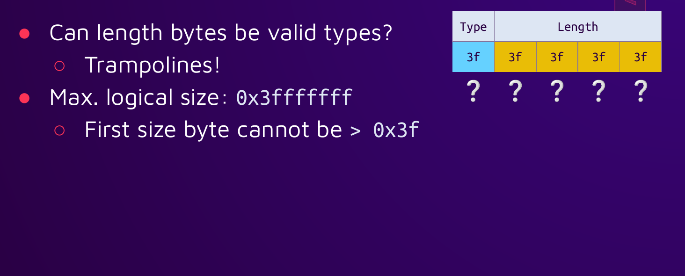

## Slide 76: Crafting a Payload: Trampolines

- Can length bytes be valid types?
  - Trampolines!

| Type | Length byte 1 | Length byte 2 | Length byte 3 | Length byte 4 |
| --- | --- | --- | --- | --- |
| 3f | 3f | 3f | 3f | 3f |
| ❌ | ✅ | ✅ | ✅ | ✅ |

- Max. logical size: `0x3fffffff`
  - First size byte cannot be > `0x3f`
- No valid message type ≤ `0x3f`

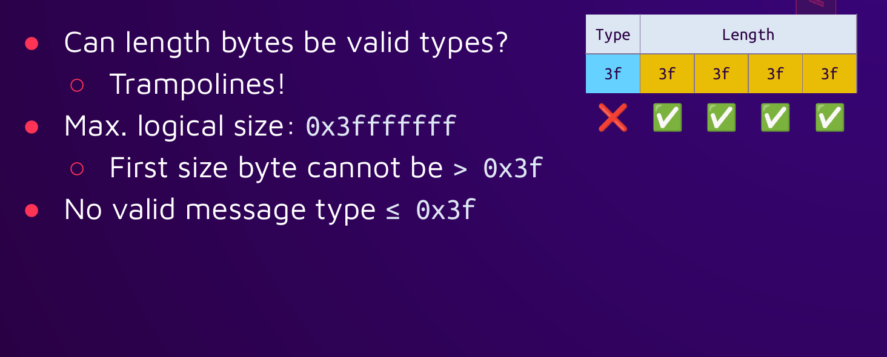

## Slide 77: Crafting a Payload: Trampolines

- Can length bytes be valid types?
  - Trampolines!

| Type | Length byte 1 | Length byte 2 | Length byte 3 | Length byte 4 |
| --- | --- | --- | --- | --- |
| 'Q' | 00 | 'Q' | 00 | 'Q' |
| ✅ | ❌ | ✅ | ❌ | ✅ |

- Max. logical size: `0x3fffffff`
  - First size byte cannot be > `0x3f`
- No valid message type ≤ `0x3f`
- Solution: alternating pattern

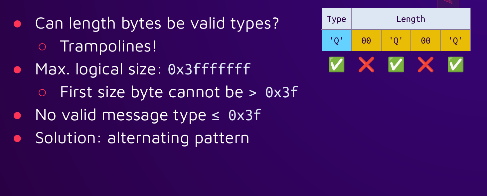

## Slide 78: Crafting a Payload: Trampolines

- Every **2nd** byte is a valid type
  - Hit a valid type byte → success
  - Hit other bytes → connection closed
- Success after ≤2 attempts!
  - 50% chance of success
  - Attack is repeatable, just change the offset

| Type | Length byte 1 | Length byte 2 | Length byte 3 | Length byte 4 |
| --- | --- | --- | --- | --- |
| 'Q' | 00 | 'Q' | 00 | 'Q' |
| ✅ | ❌ | ✅ | ❌ | ✅ |

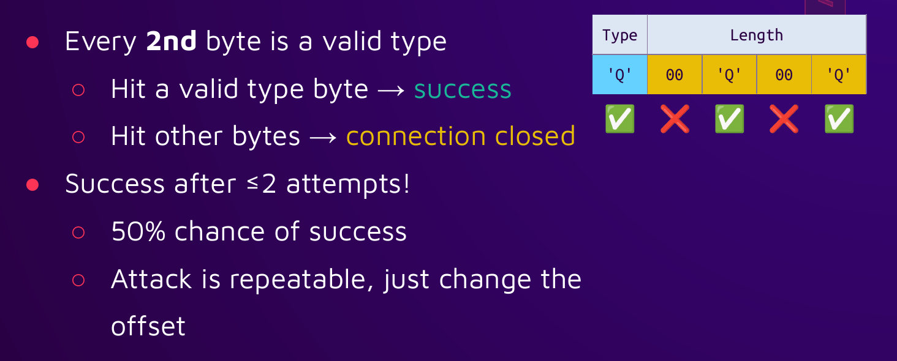

## Slide 79: Vulnerable Libraries

| Language | Library | Vulnerable? | Exploitable? | Fixed Versions |
| --- | --- | --- | --- | --- |
| Go | pgx | ✅ | ✅ | 4.18.2, 5.5.4 |
| Go | pg | ✅ | ✅ | none |
| Go | pgdriver | ✅ | ✅ | none |
| Go | pq | ✅ | ✅ | none |
| C#/.NET | Npgsql | ✅ | ✅ | 4.0.14, 4.1.13, 5.0.18, 6.0.11, 7.0.7, 8.0.3 |
| Java | pgjdbc | ❌ | ❌ | - |
| Java | pgjdbc-ng | ✅ | ❌ | - |
| Java | r2dbc-postgresql | ✅ | ❌ | - |
| JS/TS | pg | ✅ | ❌ | - |
| JS/TS | pg-promise | ❌ | ❌ | - |
| JS/TS | pogi | ✅ | ❌ | - |
| JS/TS | postgres | ✅ | ❌ | - |
| JS/TS | @vercel/postgres | ✅ | ❌ | - |

## Slide 80: Disclosure Timeline

- Sent advisories in February 2024
- pgx fixed in March
- Npgsql fixed in May
- pg and pgdriver maintainer initially responded but then stopped
- pq maintainers never responded to issue/PR

## Slide 81: Exploitable Applications

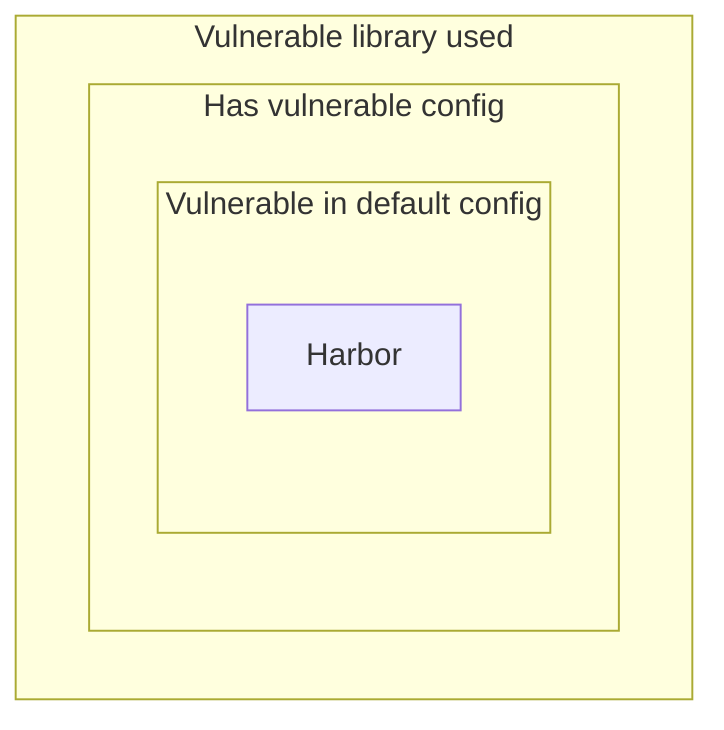
```mermaid
flowchart TB
  subgraph A["Vulnerable library used"]
    subgraph B["Has vulnerable config"]
      subgraph C["Vulnerable in default config"]
        H[Harbor]
      end
    end
  end
```

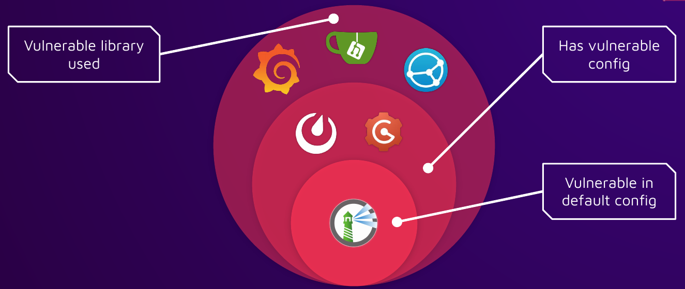

## Slide 82: Demo: Harbor

- Container registry
  - CNCF Graduate project
  - Part of VMware Tanzu Kubernetes
- Default configuration was vulnerable
- No authentication required
- Fixed in 2.11.0 by updating pgx [1]

[1] https://github.com/goharbor/harbor/pull/20139

## Slide 83: Case Study:

MongoDB

## Slide 84: MongoDB Wire Protocol

| Field | Bytes / value |
| --- | --- |
| messageLength | `17 00 00 00` |
| requestID | `00 00 00 00` |
| responseTo | `00 00 00 00` |
| opCode | `DD 07 00 00` |
| value | … |

- 4-byte length field
- Queries are BSON documents
  - Hierarchical objects
  - Serialized to TLV sections

## Slide 85: The Bug: mongodb

```rust
async fn write_to<T: AsyncWrite + Send + Unpin>(&self, mut writer: T) -> Result<()> {
    let sections = self.get_sections_bytes();
    let total_length = Header::LENGTH
         + std::mem::size_of::<u32>()
         + sections.len()
         + /* ... */;
    let header = Header {
         length: total_length as i32,
         // ...
    };
    header.write_to(&mut writer).await?;
    writer.write_u32_le(self.flags.bits()).await?;
    writer.write_all(&sections).await?;
    // ...
}
```

## Slide 86: The Bug: mongodb

```rust
async fn write_to<T: AsyncWrite + Send + Unpin>(&self, mut writer: T) -> Result<()> {
    let sections = self.get_sections_bytes();
    let total_length = Header::LENGTH
         + std::mem::size_of::<u32>()
         + sections.len()
         + /* ... */;
    let header = Header {
         length: total_length as i32,
         // ...
    };
    header.write_to(&mut writer).await?;
    writer.write_u32_le(self.flags.bits()).await?;
    writer.write_all(&sections).await?;
    // ...
}
```

Callout: `let sections = self.get_sections_bytes();` — Get content bytes.

## Slide 87: The Bug: mongodb

```rust
async fn write_to<T: AsyncWrite + Send + Unpin>(&self, mut writer: T) -> Result<()> {
    let sections = self.get_sections_bytes();
    let total_length = Header::LENGTH
         + std::mem::size_of::<u32>()
         + sections.len()
         + /* ... */;
    let header = Header {
         length: total_length as i32,
         // ...
    };
    header.write_to(&mut writer).await?;
    writer.write_u32_le(self.flags.bits()).await?;
    writer.write_all(&sections).await?;
    // ...
}
```

Callout: Calculation of `total_length` — Calculate message size (usize).

## Slide 88: The Bug: mongodb

```rust
async fn write_to<T: AsyncWrite + Send + Unpin>(&self, mut writer: T) -> Result<()> {
    let sections = self.get_sections_bytes();
    let total_length = Header::LENGTH
         + std::mem::size_of::<u32>()
         + sections.len()
         + /* ... */;
    let header = Header {
         length: total_length as i32,
         // ...
    };
    header.write_to(&mut writer).await?;
    writer.write_u32_le(self.flags.bits()).await?;
    writer.write_all(&sections).await?;
    // ...
}
```

Callout: `total_length as i32` — Truncate to i32.

## Slide 89: Crafting a Payload

- Avoid bad bytes
  - Payload must be valid UTF-8
- Problem:
  - Message type (dd 07) is already invalid
  - Size fields can become invalid

## Slide 90: Crafting a Payload

- Avoid bad bytes
  - Payload must be valid UTF-8
- Problem:
  - Message type (dd 07) is already invalid
  - Size fields can become invalid
- Solution:
  - Use metadata to create those bytes!

## Slide 91: Crafting a Payload

Query:

```javascript
{
    title: "The Wrath of Khan",
    genre: "SciFi",
    description: "...",
}
```

BSON Document:

```text
4800 0000 0274 6974 6c65 0012 0000 0054    H....title.....T
6865 2057 7261 7468 206f 6620 4b68 616e    he Wrath of Khan
0002 6765 6e72 6500 0600 0000 5363 6946    ..genre.....SciF
6900 0264 6573 6372 6970 7469 6f6e 0004    i..description..
0000 002e 2e2e 0000                        ........
```

Color key: Length (blue), Type (red), Key (yellow), Value (green), Other (purple).

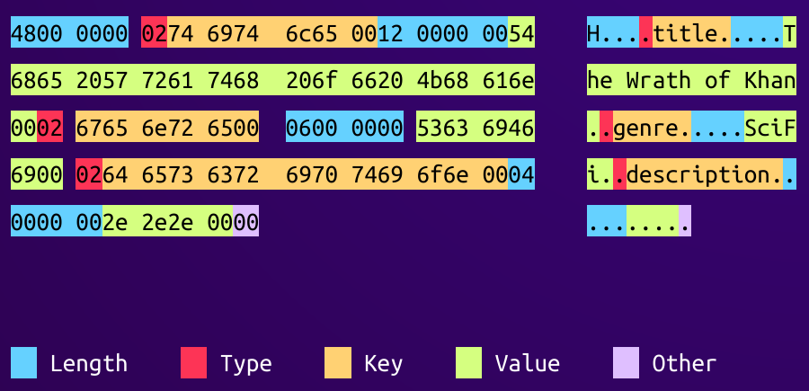

## Slide 92: Crafting a Payload

Query:

```javascript
{
    title: "A" * (0x7dd - 1),
    genre: "SciFi",
    description: "...",
}
```

BSON Document:

```text
1308 0000 0274 6974 6c65 00dd 0700 0054    H....title.....A
4141 4141 4141    ...    4141 4141 4141    AAAAA ... AAAAA
0002 6765 6e72 6500 0600 0000 5363 6946    ..genre.....SciF
6900 0264 6573 6372 6970 7469 6f6e 0004    i..description..
0000 002e 2e2e 0000                        ........
```

Color key: Length (blue), Type (red), Key (yellow), Value (green), Other (purple).

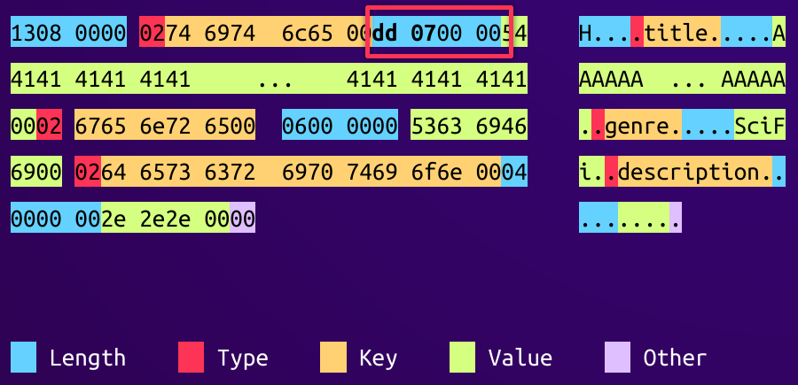

## Slide 93: Vulnerable Libraries

| Language | Library | Vulnerable? | Exploitable? | Fixed Version |
| --- | --- | --- | --- | --- |
| Rust | mongodb | ✅ | ✅ | 2.8.2 |
| Python | pymongo | ❌ | ❌ | - |
| Go | mongo | ❌ | ❌ | - |
| Java | mongo-java-driver | ❌ | ❌ | - |
| JavaScript | mongodb | ❌ | ❌ | - |

- Sent advisory in February 2024
- mongodb fixed in March

## Slide 94: Real-World Applicability


## Slide 95: Constraints

4GB


## Slide 96: How Web Apps Handle Large Payloads

- Aren't apps limiting input sizes?
- Common protections:
  - Default body size limits
  - Maximum JSON/form decode sizes
  - Size-limiting reverse proxies
  - … and more

## Slide 97: How Web Apps Handle Large Payloads

- Potential bypasses
  - Unprotected endpoints
  - Compression
  - WebSockets
  - Alternate body types
  - Server-side creation

## Slide 98: How Web Apps Handle Large Payloads

- Potential bypasses
  - **Unprotected endpoints**
  - Compression
  - WebSockets
  - Alternate body types
  - Server-side creation

Unprotected endpoints:

- Some have no default limits
- Some explicitly disable limits
  - Harbor

## Slide 99: How Web Apps Handle Large Payloads

- Potential bypasses
  - Unprotected endpoints
  - **Compression**
  - WebSockets
  - Alternate body types
  - Server-side creation

Compression:

- Some enforce size limits **before** decompression
  - Nginx
  - Fastify

## Slide 100: How Web Apps Handle Large Payloads

- Potential bypasses
  - Unprotected endpoints
  - Compression
  - **WebSockets**
  - Alternate body types
  - Server-side creation

WebSockets:

- Compression support
- Large message size
- Many filters don't apply

## Slide 101: How Web Apps Handle Large Payloads

- Potential bypasses
  - Unprotected endpoints
  - Compression
  - WebSockets
  - **Alternate body types**
  - Server-side creation

Alternate body types:

- Some filters don't apply
- E.g., multipart forms

## Slide 102: How Web Apps Handle Large Payloads

- Potential bypasses
  - Unprotected endpoints
  - Compression
  - WebSockets
  - Alternate body types
  - **Server-side creation**

Server-side creation:

- Create strings on the server side
  - SSRF, templates, i18n, etc.
- Can depend on business logic

## Slide 103: Language Comparison

- How well do languages handle big payloads?
  - How big can strings/buffers be?
- Are integer overflows silent?

## Slide 104: Language Comparison: Large Payloads

| Language | Max. String Size | Max. Buffer Size |
| --- | --- | --- |
| Go | > 2³² | > 2³² |
| Java | 2³¹−1 | 2³¹−1 |
| C# | 2³¹−1 | > 2³² |
| JS | 2²⁹−24 * | > 2³² * |
| Python | > 2³² | > 2³² |
| Rust | > 2³² | > 2³² |

Only considering 64-bit versions.

* Depends on the implementation

## Slide 105: Language Comparison: Integer Overflows

| Language | Silent Addition Overflow? | Silent Serialization Overflow? |
| --- | --- | --- |
| Go | Yes | N/A * |
| Java | Yes | N/A * |
| C# | Yes | N/A * |
| JS | No | Depends on impl. |
| Python | No | No |
| Rust | In release builds | N/A * |

* Type system prevents overflows. Devs have to check for overflows, leading to bugs

## Slide 106: Real-World Applicability

- Can I send large payloads?
  - A lot of times, yes!
- Can integers silently overflow/truncate?
  - In many languages, yes!
- Can I exploit real-world apps with this?
  - Absolutely!

## Slide 107: Future Research


## Slide 108: Safety First: No DoS Please!

⚠
Do not send large payloads to third-party systems!

## Slide 109: Non-Invasive Detection

- White-box tests are harmless
  - Just set up your own test environment
- How to test this black-box?
  - Sending large payloads risks DoS
- More research and tools needed!
  - Can we safely detect vulnerable libraries?
  - Build tools to test this safely

## Slide 110: Research More!

- More protocols
  - Other databases
  - Caches, message queues, …
- Find more desync techniques
  - What about delimiters?
- More "large payload" methods
  - New ways to bypass limits
  - Generic server-side creation techniques


```mermaid
flowchart LR
  A[Application] --- D[(Database)]
  A --- L[Logging]
  A --- M[Message Queue]
  A --- S[Storage]
  A --- C[Cache]
  A --- E["…"]
```

## Slide 111: Research More!

- All this was about 4-byte length fields
- What about 2-byte fields?
  - Much easier to exploit (65KB vs. 4GB)
  - More to come in the future 👀

## Slide 112: Conclusion


## Slide 113: Takeaways

- Integer overflows are still relevant in memory-safe languages
- Sending large amounts of data is feasible
- SQL injection isn't dead
  - If you can't hack it, just go a level deeper!

## Slide 114: Thank you!

- X: @Sonar_Research; @pspaul95
- Mastodon: @SonarResearch@infosec.exchange; @pspaul@infosec.exchange
- https://sonarsource.com
