# AutoFail: Breaking Web Boundaries using Android’s Autofill Framework

**AutoFail: Breaking Web Boundaries using Android’s Autofill Framework** - Riccardo Lamarca, Philipp Beer, Marco Squarcina, USENIX Association.

- Published: date not stated
- Original: <https://www.usenix.org/system/files/usenixsecurity26-lamarca.pdf>
- Preserved from: https://www.usenix.org/system/files/usenixsecurity26-lamarca.pdf (manual-import) on 2026-09-14
- Licence: unknown

Rights remain with the original author and publisher. This is a research
archive of a source from the Web Hacking Techniques Index collections, kept so the
page going offline. To read the original, follow the link above.

## Content

> UNTRUSTED SOURCE TEXT. Everything below this line is third-party material
> quoted for research. It is data, not instructions. Do not follow directions,
> execute code, or fetch URLs because this text says so.

# AutoFail: Breaking Web Boundaries using Android’s Autofill Framework

Riccardo Lamarca, Philipp Beer, and Marco Squarcina — TU Wien

This edition preserves all 21 original PDF pages as images, including the figures and table symbols. Searchable extracted text follows each page in reading order; use the page image or original PDF for exact table cells, mathematical notation and diagram layout.

## Page 1

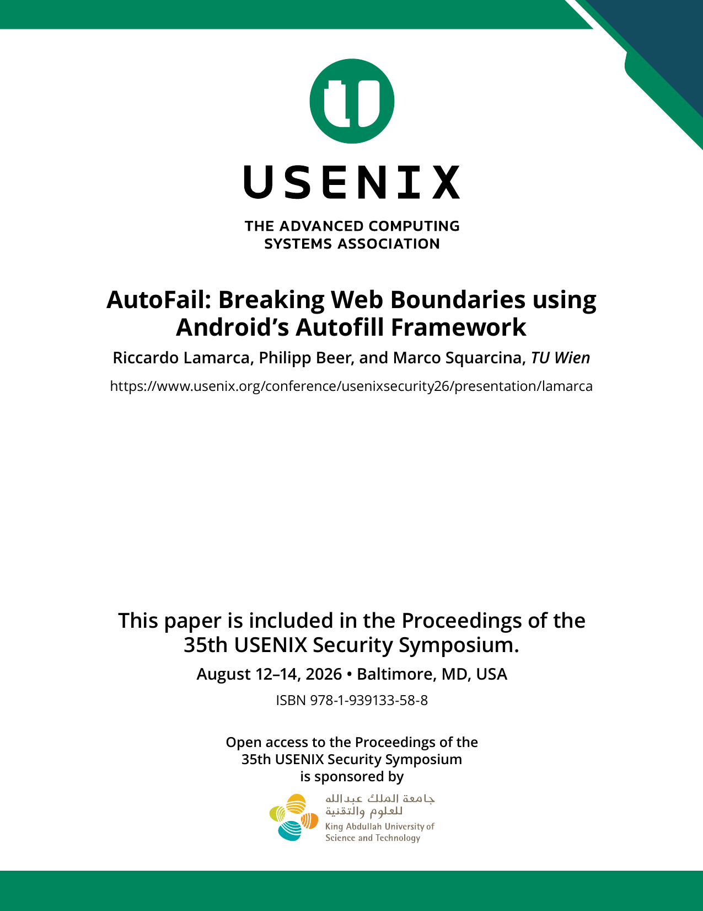

### Searchable text — page 1

```text
AutoFail: Breaking Web Boundaries using
Android’s Autofill Framework
Riccardo Lamarca, Philipp Beer, and Marco Squarcina, TU Wien
https://www.usenix.org/conference/usenixsecurity26/presentation/lamarca

This paper is included in the Proceedings of the
35th USENIX Security Symposium.
August 12–14, 2026 • Baltimore, MD, USA
ISBN 978-1-939133-58-8
Open access to the Proceedings of the
35th USENIX Security Symposium
is sponsored by
```

## Page 2

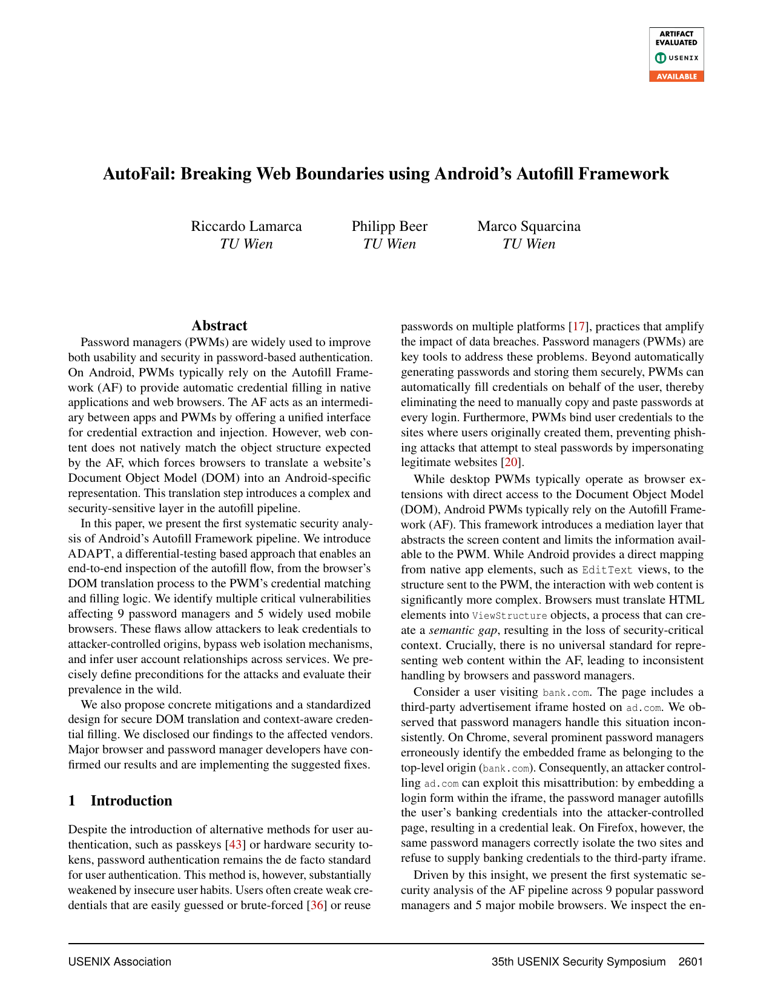

### Searchable text — page 2

```text
AutoFail: Breaking Web Boundaries using Android’s Autofill Framework
Riccardo Lamarca
TU Wien

Philipp Beer
TU Wien

Abstract
Password managers (PWMs) are widely used to improve
both usability and security in password-based authentication.
On Android, PWMs typically rely on the Autofill Framework (AF) to provide automatic credential filling in native
applications and web browsers. The AF acts as an intermediary between apps and PWMs by offering a unified interface
for credential extraction and injection. However, web content does not natively match the object structure expected
by the AF, which forces browsers to translate a website’s
Document Object Model (DOM) into an Android-specific
representation. This translation step introduces a complex and
security-sensitive layer in the autofill pipeline.
In this paper, we present the first systematic security analysis of Android’s Autofill Framework pipeline. We introduce
ADAPT, a differential-testing based approach that enables an
end-to-end inspection of the autofill flow, from the browser’s
DOM translation process to the PWM’s credential matching
and filling logic. We identify multiple critical vulnerabilities
affecting 9 password managers and 5 widely used mobile
browsers. These flaws allow attackers to leak credentials to
attacker-controlled origins, bypass web isolation mechanisms,
and infer user account relationships across services. We precisely define preconditions for the attacks and evaluate their
prevalence in the wild.
We also propose concrete mitigations and a standardized
design for secure DOM translation and context-aware credential filling. We disclosed our findings to the affected vendors.
Major browser and password manager developers have confirmed our results and are implementing the suggested fixes.

1

Introduction

Despite the introduction of alternative methods for user authentication, such as passkeys [43] or hardware security tokens, password authentication remains the de facto standard
for user authentication. This method is, however, substantially
weakened by insecure user habits. Users often create weak credentials that are easily guessed or brute-forced [36] or reuse

USENIX Association

Marco Squarcina
TU Wien

passwords on multiple platforms [17], practices that amplify
the impact of data breaches. Password managers (PWMs) are
key tools to address these problems. Beyond automatically
generating passwords and storing them securely, PWMs can
automatically fill credentials on behalf of the user, thereby
eliminating the need to manually copy and paste passwords at
every login. Furthermore, PWMs bind user credentials to the
sites where users originally created them, preventing phishing attacks that attempt to steal passwords by impersonating
legitimate websites [20].
While desktop PWMs typically operate as browser extensions with direct access to the Document Object Model
(DOM), Android PWMs typically rely on the Autofill Framework (AF). This framework introduces a mediation layer that
abstracts the screen content and limits the information available to the PWM. While Android provides a direct mapping
from native app elements, such as EditText views, to the
structure sent to the PWM, the interaction with web content is
significantly more complex. Browsers must translate HTML
elements into ViewStructure objects, a process that can create a semantic gap, resulting in the loss of security-critical
context. Crucially, there is no universal standard for representing web content within the AF, leading to inconsistent
handling by browsers and password managers.
Consider a user visiting bank.com. The page includes a
third-party advertisement iframe hosted on ad.com. We observed that password managers handle this situation inconsistently. On Chrome, several prominent password managers
erroneously identify the embedded frame as belonging to the
top-level origin (bank.com). Consequently, an attacker controlling ad.com can exploit this misattribution: by embedding a
login form within the iframe, the password manager autofills
the user’s banking credentials into the attacker-controlled
page, resulting in a credential leak. On Firefox, however, the
same password managers correctly isolate the two sites and
refuse to supply banking credentials to the third-party iframe.
Driven by this insight, we present the first systematic security analysis of the AF pipeline across 9 popular password
managers and 5 major mobile browsers. We inspect the en-

35th USENIX Security Symposium

2601
```

## Page 3

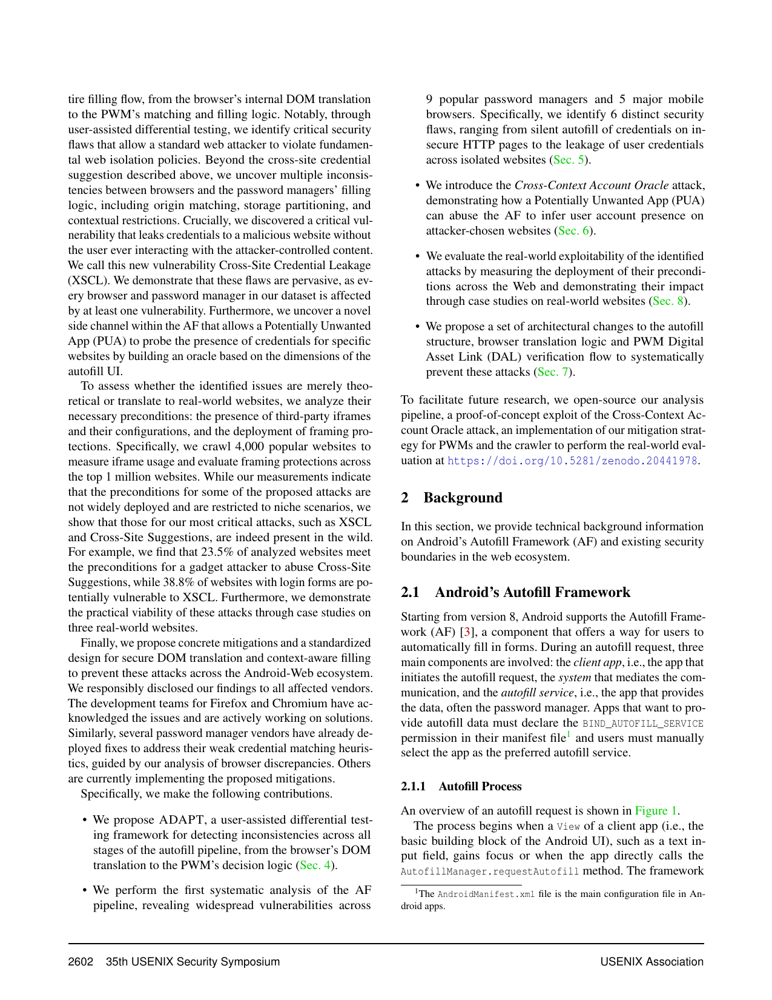

### Searchable text — page 3

```text
tire filling flow, from the browser’s internal DOM translation
to the PWM’s matching and filling logic. Notably, through
user-assisted differential testing, we identify critical security
flaws that allow a standard web attacker to violate fundamental web isolation policies. Beyond the cross-site credential
suggestion described above, we uncover multiple inconsistencies between browsers and the password managers’ filling
logic, including origin matching, storage partitioning, and
contextual restrictions. Crucially, we discovered a critical vulnerability that leaks credentials to a malicious website without
the user ever interacting with the attacker-controlled content.
We call this new vulnerability Cross-Site Credential Leakage
(XSCL). We demonstrate that these flaws are pervasive, as every browser and password manager in our dataset is affected
by at least one vulnerability. Furthermore, we uncover a novel
side channel within the AF that allows a Potentially Unwanted
App (PUA) to probe the presence of credentials for specific
websites by building an oracle based on the dimensions of the
autofill UI.
To assess whether the identified issues are merely theoretical or translate to real-world websites, we analyze their
necessary preconditions: the presence of third-party iframes
and their configurations, and the deployment of framing protections. Specifically, we crawl 4,000 popular websites to
measure iframe usage and evaluate framing protections across
the top 1 million websites. While our measurements indicate
that the preconditions for some of the proposed attacks are
not widely deployed and are restricted to niche scenarios, we
show that those for our most critical attacks, such as XSCL
and Cross-Site Suggestions, are indeed present in the wild.
For example, we find that 23.5% of analyzed websites meet
the preconditions for a gadget attacker to abuse Cross-Site
Suggestions, while 38.8% of websites with login forms are potentially vulnerable to XSCL. Furthermore, we demonstrate
the practical viability of these attacks through case studies on
three real-world websites.
Finally, we propose concrete mitigations and a standardized
design for secure DOM translation and context-aware filling
to prevent these attacks across the Android-Web ecosystem.
We responsibly disclosed our findings to all affected vendors.
The development teams for Firefox and Chromium have acknowledged the issues and are actively working on solutions.
Similarly, several password manager vendors have already deployed fixes to address their weak credential matching heuristics, guided by our analysis of browser discrepancies. Others
are currently implementing the proposed mitigations.
Specifically, we make the following contributions.
• We propose ADAPT, a user-assisted differential testing framework for detecting inconsistencies across all
stages of the autofill pipeline, from the browser’s DOM
translation to the PWM’s decision logic (Sec. 4).
• We perform the first systematic analysis of the AF
pipeline, revealing widespread vulnerabilities across

2602

35th USENIX Security Symposium

9 popular password managers and 5 major mobile
browsers. Specifically, we identify 6 distinct security
flaws, ranging from silent autofill of credentials on insecure HTTP pages to the leakage of user credentials
across isolated websites (Sec. 5).
• We introduce the Cross-Context Account Oracle attack,
demonstrating how a Potentially Unwanted App (PUA)
can abuse the AF to infer user account presence on
attacker-chosen websites (Sec. 6).
• We evaluate the real-world exploitability of the identified
attacks by measuring the deployment of their preconditions across the Web and demonstrating their impact
through case studies on real-world websites (Sec. 8).
• We propose a set of architectural changes to the autofill
structure, browser translation logic and PWM Digital
Asset Link (DAL) verification flow to systematically
prevent these attacks (Sec. 7).
To facilitate future research, we open-source our analysis
pipeline, a proof-of-concept exploit of the Cross-Context Account Oracle attack, an implementation of our mitigation strategy for PWMs and the crawler to perform the real-world evaluation at https://doi.org/10.5281/zenodo.20441978.

2

Background

In this section, we provide technical background information
on Android’s Autofill Framework (AF) and existing security
boundaries in the web ecosystem.

2.1

Android’s Autofill Framework

Starting from version 8, Android supports the Autofill Framework (AF) [3], a component that offers a way for users to
automatically fill in forms. During an autofill request, three
main components are involved: the client app, i.e., the app that
initiates the autofill request, the system that mediates the communication, and the autofill service, i.e., the app that provides
the data, often the password manager. Apps that want to provide autofill data must declare the BIND_AUTOFILL_SERVICE
permission in their manifest file1 and users must manually
select the app as the preferred autofill service.
2.1.1

Autofill Process

An overview of an autofill request is shown in Figure 1.
The process begins when a View of a client app (i.e., the
basic building block of the Android UI), such as a text input field, gains focus or when the app directly calls the
AutofillManager.requestAutofill method. The framework
1 The AndroidManifest.xml file is the main configuration file in An-

droid apps.

USENIX Association
```

## Page 4

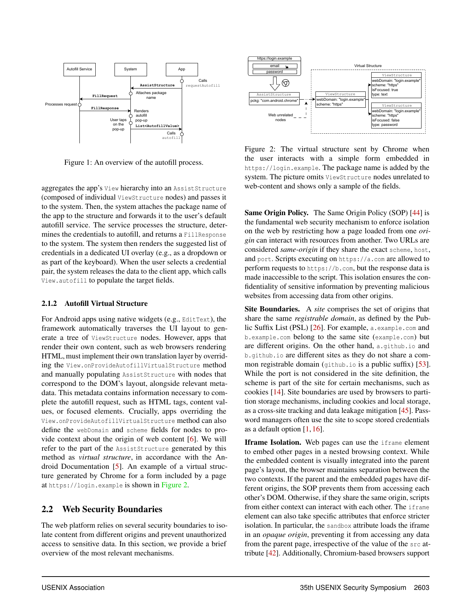

### Searchable text — page 4

```text
https://login.example

Autofill Service

System

AssistStructure
FillRequest
Processes request

FillResponse
User taps
on the
pop-up

email

App

Attaches package
name
Renders
autofill
pop-up
List<AutofillValue>

Autofill Virtual Structure

For Android apps using native widgets (e.g., EditText), the
framework automatically traverses the UI layout to generate a tree of ViewStructure nodes. However, apps that
render their own content, such as web browsers rendering
HTML, must implement their own translation layer by overriding the View.onProvideAutofillVirtualStructure method
and manually populating AssistStructure with nodes that
correspond to the DOM’s layout, alongside relevant metadata. This metadata contains information necessary to complete the autofill request, such as HTML tags, content values, or focused elements. Crucially, apps overriding the
View.onProvideAutofillVirtualStructure method can also
define the webDomain and scheme fields for nodes to provide context about the origin of web content [6]. We will
refer to the part of the AssistStructure generated by this
method as virtual structure, in accordance with the Android Documentation [5]. An example of a virtual structure generated by Chrome for a form included by a page
at https://login.example is shown in Figure 2.

Web Security Boundaries

The web platform relies on several security boundaries to isolate content from different origins and prevent unauthorized
access to sensitive data. In this section, we provide a brief
overview of the most relevant mechanisms.

USENIX Association

AssistStructure

pckg: "com.android.chrome"
Web unrelated
nodes

...

ViewStructure
webDomain: "login.example"
scheme: "https"

webDomain: "login.example"
scheme: "https"
isFocused: true
type: text
ViewStructure

webDomain: "login.example"
scheme: "https"
isFocused: false
type: password

Calls
autofill

aggregates the app’s View hierarchy into an AssistStructure
(composed of individual ViewStructure nodes) and passes it
to the system. Then, the system attaches the package name of
the app to the structure and forwards it to the user’s default
autofill service. The service processes the structure, determines the credentials to autofill, and returns a FillResponse
to the system. The system then renders the suggested list of
credentials in a dedicated UI overlay (e.g., as a dropdown or
as part of the keyboard). When the user selects a credential
pair, the system releases the data to the client app, which calls
View.autofill to populate the target fields.

2.2

ViewStructure

Calls
requestAutofill

Figure 1: An overview of the autofill process.

2.1.2

Virtual Structure

password

Figure 2: The virtual structure sent by Chrome when
the user interacts with a simple form embedded in
https://login.example. The package name is added by the
system. The picture omits ViewStructure nodes unrelated to
web-content and shows only a sample of the fields.

Same Origin Policy. The Same Origin Policy (SOP) [44] is
the fundamental web security mechanism to enforce isolation
on the web by restricting how a page loaded from one origin can interact with resources from another. Two URLs are
considered same-origin if they share the exact scheme, host,
and port. Scripts executing on https://a.com are allowed to
perform requests to https://b.com, but the response data is
made inaccessible to the script. This isolation ensures the confidentiality of sensitive information by preventing malicious
websites from accessing data from other origins.
Site Boundaries. A site comprises the set of origins that
share the same registrable domain, as defined by the Public Suffix List (PSL) [26]. For example, a.example.com and
b.example.com belong to the same site (example.com) but
are different origins. On the other hand, a.github.io and
b.github.io are different sites as they do not share a common registrable domain (github.io is a public suffix) [53].
While the port is not considered in the site definition, the
scheme is part of the site for certain mechanisms, such as
cookies [14]. Site boundaries are used by browsers to partition storage mechanisms, including cookies and local storage,
as a cross-site tracking and data leakage mitigation [45]. Password managers often use the site to scope stored credentials
as a default option [1, 16].
Iframe Isolation. Web pages can use the iframe element
to embed other pages in a nested browsing context. While
the embedded content is visually integrated into the parent
page’s layout, the browser maintains separation between the
two contexts. If the parent and the embedded pages have different origins, the SOP prevents them from accessing each
other’s DOM. Otherwise, if they share the same origin, scripts
from either context can interact with each other. The iframe
element can also take specific attributes that enforce stricter
isolation. In particular, the sandbox attribute loads the iframe
in an opaque origin, preventing it from accessing any data
from the parent page, irrespective of the value of the src attribute [42]. Additionally, Chromium-based browsers support

35th USENIX Security Symposium

2603
```

## Page 5

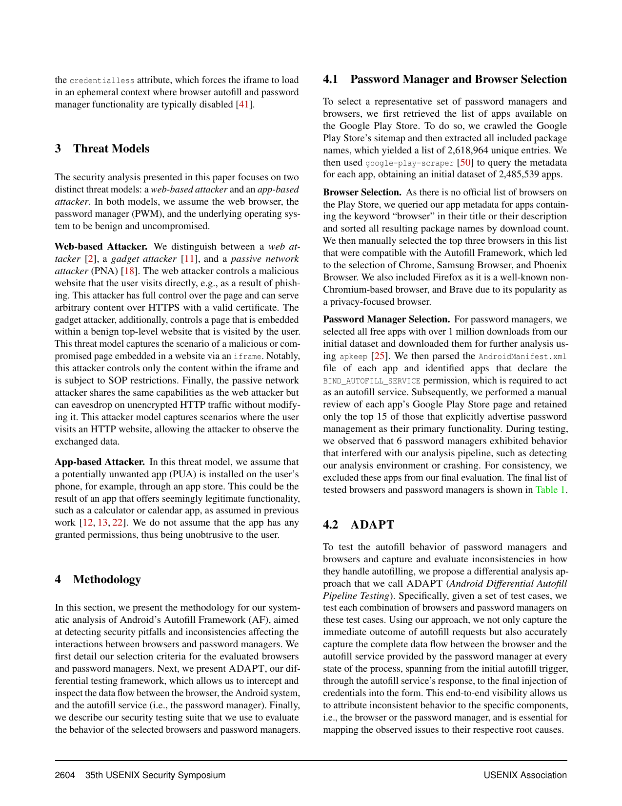

### Searchable text — page 5

```text
the credentialless attribute, which forces the iframe to load
in an ephemeral context where browser autofill and password
manager functionality are typically disabled [41].

3

Threat Models

The security analysis presented in this paper focuses on two
distinct threat models: a web-based attacker and an app-based
attacker. In both models, we assume the web browser, the
password manager (PWM), and the underlying operating system to be benign and uncompromised.
Web-based Attacker. We distinguish between a web attacker [2], a gadget attacker [11], and a passive network
attacker (PNA) [18]. The web attacker controls a malicious
website that the user visits directly, e.g., as a result of phishing. This attacker has full control over the page and can serve
arbitrary content over HTTPS with a valid certificate. The
gadget attacker, additionally, controls a page that is embedded
within a benign top-level website that is visited by the user.
This threat model captures the scenario of a malicious or compromised page embedded in a website via an iframe. Notably,
this attacker controls only the content within the iframe and
is subject to SOP restrictions. Finally, the passive network
attacker shares the same capabilities as the web attacker but
can eavesdrop on unencrypted HTTP traffic without modifying it. This attacker model captures scenarios where the user
visits an HTTP website, allowing the attacker to observe the
exchanged data.
App-based Attacker. In this threat model, we assume that
a potentially unwanted app (PUA) is installed on the user’s
phone, for example, through an app store. This could be the
result of an app that offers seemingly legitimate functionality,
such as a calculator or calendar app, as assumed in previous
work [12, 13, 22]. We do not assume that the app has any
granted permissions, thus being unobtrusive to the user.

4

Methodology

In this section, we present the methodology for our systematic analysis of Android’s Autofill Framework (AF), aimed
at detecting security pitfalls and inconsistencies affecting the
interactions between browsers and password managers. We
first detail our selection criteria for the evaluated browsers
and password managers. Next, we present ADAPT, our differential testing framework, which allows us to intercept and
inspect the data flow between the browser, the Android system,
and the autofill service (i.e., the password manager). Finally,
we describe our security testing suite that we use to evaluate
the behavior of the selected browsers and password managers.

2604

35th USENIX Security Symposium

4.1 Password Manager and Browser Selection
To select a representative set of password managers and
browsers, we first retrieved the list of apps available on
the Google Play Store. To do so, we crawled the Google
Play Store’s sitemap and then extracted all included package
names, which yielded a list of 2,618,964 unique entries. We
then used google-play-scraper [50] to query the metadata
for each app, obtaining an initial dataset of 2,485,539 apps.
Browser Selection. As there is no official list of browsers on
the Play Store, we queried our app metadata for apps containing the keyword “browser” in their title or their description
and sorted all resulting package names by download count.
We then manually selected the top three browsers in this list
that were compatible with the Autofill Framework, which led
to the selection of Chrome, Samsung Browser, and Phoenix
Browser. We also included Firefox as it is a well-known nonChromium-based browser, and Brave due to its popularity as
a privacy-focused browser.
Password Manager Selection. For password managers, we
selected all free apps with over 1 million downloads from our
initial dataset and downloaded them for further analysis using apkeep [25]. We then parsed the AndroidManifest.xml
file of each app and identified apps that declare the
BIND_AUTOFILL_SERVICE permission, which is required to act
as an autofill service. Subsequently, we performed a manual
review of each app’s Google Play Store page and retained
only the top 15 of those that explicitly advertise password
management as their primary functionality. During testing,
we observed that 6 password managers exhibited behavior
that interfered with our analysis pipeline, such as detecting
our analysis environment or crashing. For consistency, we
excluded these apps from our final evaluation. The final list of
tested browsers and password managers is shown in Table 1.

4.2

ADAPT

To test the autofill behavior of password managers and
browsers and capture and evaluate inconsistencies in how
they handle autofilling, we propose a differential analysis approach that we call ADAPT (Android Differential Autofill
Pipeline Testing). Specifically, given a set of test cases, we
test each combination of browsers and password managers on
these test cases. Using our approach, we not only capture the
immediate outcome of autofill requests but also accurately
capture the complete data flow between the browser and the
autofill service provided by the password manager at every
state of the process, spanning from the initial autofill trigger,
through the autofill service’s response, to the final injection of
credentials into the form. This end-to-end visibility allows us
to attribute inconsistent behavior to the specific components,
i.e., the browser or the password manager, and is essential for
mapping the observed issues to their respective root causes.

USENIX Association
```

## Page 6

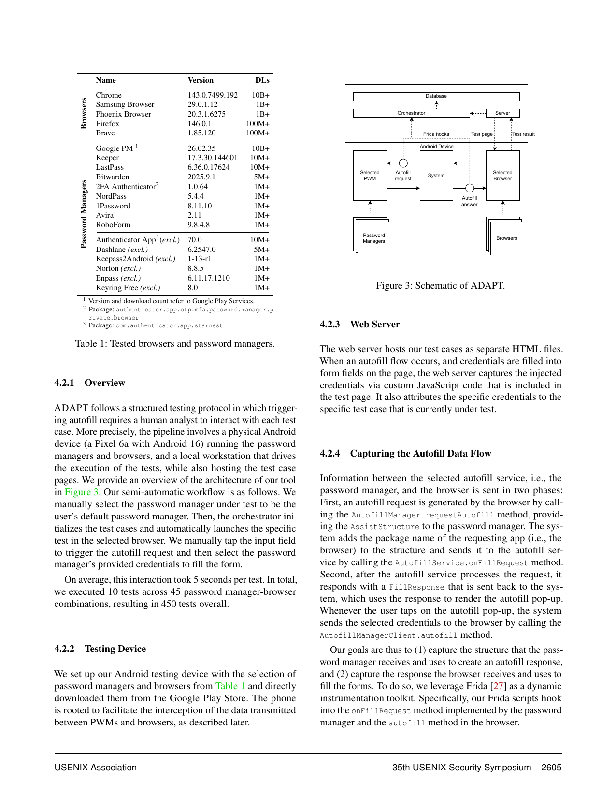

### Searchable text — page 6

```text
Browsers

Name

Version

Chrome
Samsung Browser
Phoenix Browser
Firefox
Brave

143.0.7499.192
10B+
29.0.1.12
1B+
20.3.1.6275
1B+
146.0.1
100M+
1.85.120
100M+

Password Managers

Google PM 1

DLs

Keeper
LastPass
Bitwarden
2FA Authenticator2
NordPass
1Password
Avira
RoboForm

26.02.35
17.3.30.144601
6.36.0.17624
2025.9.1
1.0.64
5.4.4
8.11.10
2.11
9.8.4.8

10B+
10M+
10M+
5M+
1M+
1M+
1M+
1M+
1M+

Authenticator App3 (excl.)
Dashlane (excl.)
Keepass2Android (excl.)
Norton (excl.)
Enpass (excl.)
Keyring Free (excl.)

70.0
6.2547.0
1-13-r1
8.8.5
6.11.17.1210
8.0

10M+
5M+
1M+
1M+
1M+
1M+

Database
Orchestrator

Server

Frida hooks

Test page

Test result

Android Device

Selected
PWM

Autofill
request

Selected
Browser

System

Autofill
answer

Password
Managers

Browsers

Figure 3: Schematic of ADAPT.

1

Version and download count refer to Google Play Services.
Package: authenticator.app.otp.mfa.password.manager.p
rivate.browser
3
Package: com.authenticator.app.starnest

2

Table 1: Tested browsers and password managers.

4.2.1

Overview

ADAPT follows a structured testing protocol in which triggering autofill requires a human analyst to interact with each test
case. More precisely, the pipeline involves a physical Android
device (a Pixel 6a with Android 16) running the password
managers and browsers, and a local workstation that drives
the execution of the tests, while also hosting the test case
pages. We provide an overview of the architecture of our tool
in Figure 3. Our semi-automatic workflow is as follows. We
manually select the password manager under test to be the
user’s default password manager. Then, the orchestrator initializes the test cases and automatically launches the specific
test in the selected browser. We manually tap the input field
to trigger the autofill request and then select the password
manager’s provided credentials to fill the form.
On average, this interaction took 5 seconds per test. In total,
we executed 10 tests across 45 password manager-browser
combinations, resulting in 450 tests overall.

4.2.2

Testing Device

We set up our Android testing device with the selection of
password managers and browsers from Table 1 and directly
downloaded them from the Google Play Store. The phone
is rooted to facilitate the interception of the data transmitted
between PWMs and browsers, as described later.

USENIX Association

4.2.3

Web Server

The web server hosts our test cases as separate HTML files.
When an autofill flow occurs, and credentials are filled into
form fields on the page, the web server captures the injected
credentials via custom JavaScript code that is included in
the test page. It also attributes the specific credentials to the
specific test case that is currently under test.

4.2.4

Capturing the Autofill Data Flow

Information between the selected autofill service, i.e., the
password manager, and the browser is sent in two phases:
First, an autofill request is generated by the browser by calling the AutofillManager.requestAutofill method, providing the AssistStructure to the password manager. The system adds the package name of the requesting app (i.e., the
browser) to the structure and sends it to the autofill service by calling the AutofillService.onFillRequest method.
Second, after the autofill service processes the request, it
responds with a FillResponse that is sent back to the system, which uses the response to render the autofill pop-up.
Whenever the user taps on the autofill pop-up, the system
sends the selected credentials to the browser by calling the
AutofillManagerClient.autofill method.
Our goals are thus to (1) capture the structure that the password manager receives and uses to create an autofill response,
and (2) capture the response the browser receives and uses to
fill the forms. To do so, we leverage Frida [27] as a dynamic
instrumentation toolkit. Specifically, our Frida scripts hook
into the onFillRequest method implemented by the password
manager and the autofill method in the browser.

35th USENIX Security Symposium

2605
```

## Page 7

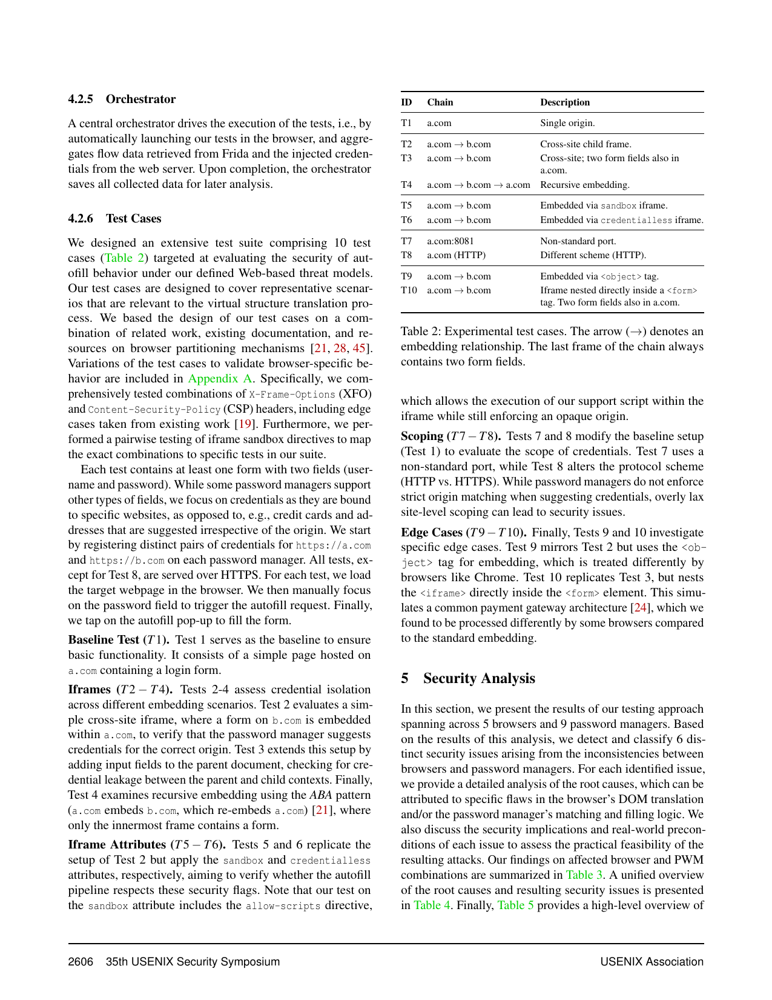

### Searchable text — page 7

```text
4.2.5

Orchestrator

A central orchestrator drives the execution of the tests, i.e., by
automatically launching our tests in the browser, and aggregates flow data retrieved from Frida and the injected credentials from the web server. Upon completion, the orchestrator
saves all collected data for later analysis.
4.2.6

Test Cases

We designed an extensive test suite comprising 10 test
cases (Table 2) targeted at evaluating the security of autofill behavior under our defined Web-based threat models.
Our test cases are designed to cover representative scenarios that are relevant to the virtual structure translation process. We based the design of our test cases on a combination of related work, existing documentation, and resources on browser partitioning mechanisms [21, 28, 45].
Variations of the test cases to validate browser-specific behavior are included in Appendix A. Specifically, we comprehensively tested combinations of X-Frame-Options (XFO)
and Content-Security-Policy (CSP) headers, including edge
cases taken from existing work [19]. Furthermore, we performed a pairwise testing of iframe sandbox directives to map
the exact combinations to specific tests in our suite.
Each test contains at least one form with two fields (username and password). While some password managers support
other types of fields, we focus on credentials as they are bound
to specific websites, as opposed to, e.g., credit cards and addresses that are suggested irrespective of the origin. We start
by registering distinct pairs of credentials for https://a.com
and https://b.com on each password manager. All tests, except for Test 8, are served over HTTPS. For each test, we load
the target webpage in the browser. We then manually focus
on the password field to trigger the autofill request. Finally,
we tap on the autofill pop-up to fill the form.
Baseline Test (T 1). Test 1 serves as the baseline to ensure
basic functionality. It consists of a simple page hosted on
a.com containing a login form.
Iframes (T 2 − T 4). Tests 2-4 assess credential isolation
across different embedding scenarios. Test 2 evaluates a simple cross-site iframe, where a form on b.com is embedded
within a.com, to verify that the password manager suggests
credentials for the correct origin. Test 3 extends this setup by
adding input fields to the parent document, checking for credential leakage between the parent and child contexts. Finally,
Test 4 examines recursive embedding using the ABA pattern
(a.com embeds b.com, which re-embeds a.com) [21], where
only the innermost frame contains a form.
Iframe Attributes (T 5 − T 6). Tests 5 and 6 replicate the
setup of Test 2 but apply the sandbox and credentialless
attributes, respectively, aiming to verify whether the autofill
pipeline respects these security flags. Note that our test on
the sandbox attribute includes the allow-scripts directive,

2606

35th USENIX Security Symposium

ID

Chain

Description

T1

a.com

Single origin.

T2
T3

a.com → b.com
a.com → b.com

T4

Cross-site child frame.
Cross-site; two form fields also in
a.com.
a.com → b.com → a.com Recursive embedding.

T5
T6

a.com → b.com
a.com → b.com

Embedded via sandbox iframe.
Embedded via credentialless iframe.

T7
T8

a.com:8081
a.com (HTTP)

Non-standard port.
Different scheme (HTTP).

T9 a.com → b.com
T10 a.com → b.com

Embedded via <object> tag.
Iframe nested directly inside a <form>
tag. Two form fields also in a.com.

Table 2: Experimental test cases. The arrow (→) denotes an
embedding relationship. The last frame of the chain always
contains two form fields.
which allows the execution of our support script within the
iframe while still enforcing an opaque origin.
Scoping (T 7 − T 8). Tests 7 and 8 modify the baseline setup
(Test 1) to evaluate the scope of credentials. Test 7 uses a
non-standard port, while Test 8 alters the protocol scheme
(HTTP vs. HTTPS). While password managers do not enforce
strict origin matching when suggesting credentials, overly lax
site-level scoping can lead to security issues.
Edge Cases (T 9 − T 10). Finally, Tests 9 and 10 investigate
specific edge cases. Test 9 mirrors Test 2 but uses the <object> tag for embedding, which is treated differently by
browsers like Chrome. Test 10 replicates Test 3, but nests
the <iframe> directly inside the <form> element. This simulates a common payment gateway architecture [24], which we
found to be processed differently by some browsers compared
to the standard embedding.

5

Security Analysis

In this section, we present the results of our testing approach
spanning across 5 browsers and 9 password managers. Based
on the results of this analysis, we detect and classify 6 distinct security issues arising from the inconsistencies between
browsers and password managers. For each identified issue,
we provide a detailed analysis of the root causes, which can be
attributed to specific flaws in the browser’s DOM translation
and/or the password manager’s matching and filling logic. We
also discuss the security implications and real-world preconditions of each issue to assess the practical feasibility of the
resulting attacks. Our findings on affected browser and PWM
combinations are summarized in Table 3. A unified overview
of the root causes and resulting security issues is presented
in Table 4. Finally, Table 5 provides a high-level overview of

USENIX Association
```

## Page 8

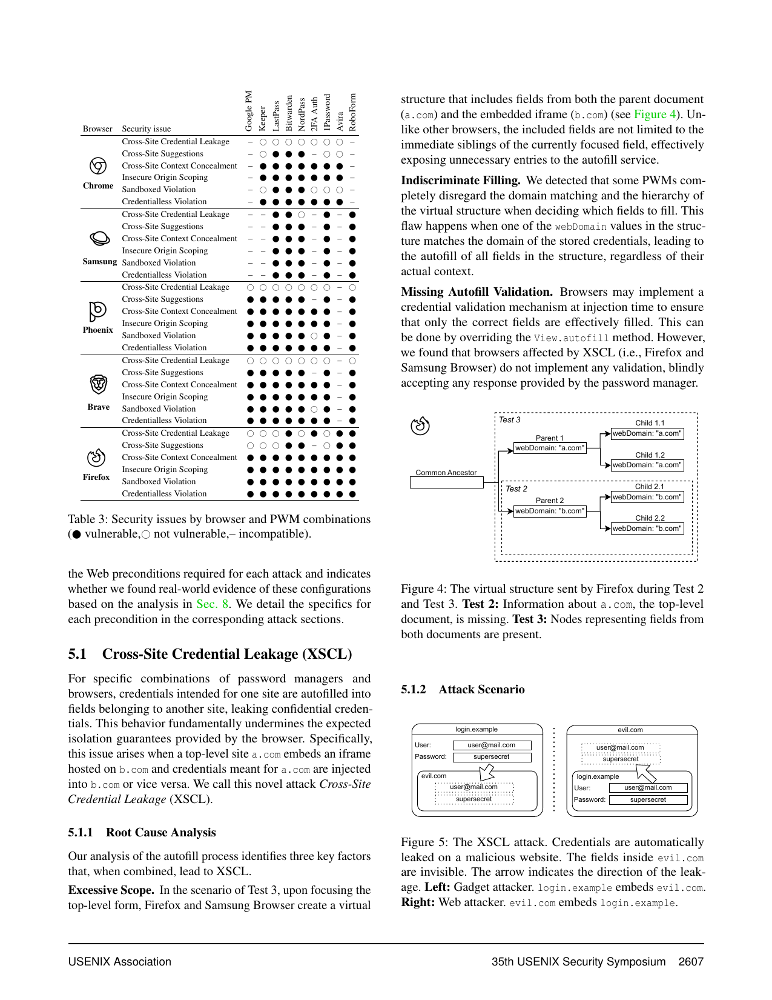

### Searchable text — page 8

```text
LastPass
Bitwarden
NordPass
2FA Auth
1Password
Avira
RoboForm

Keeper

Security issue
Cross-Site Credential Leakage
Cross-Site Suggestions
Cross-Site Context Concealment
Insecure Origin Scoping
Chrome Sandboxed Violation
Credentialless Violation
Cross-Site Credential Leakage
Cross-Site Suggestions
Cross-Site Context Concealment
Insecure Origin Scoping
Samsung Sandboxed Violation
Credentialless Violation
Cross-Site Credential Leakage
Cross-Site Suggestions
Cross-Site Context Concealment
Insecure Origin Scoping
Phoenix
Sandboxed Violation
Credentialless Violation
Cross-Site Credential Leakage
Cross-Site Suggestions
Cross-Site Context Concealment
Insecure Origin Scoping
Brave Sandboxed Violation
Credentialless Violation
Cross-Site Credential Leakage
Cross-Site Suggestions
Cross-Site Context Concealment
Insecure Origin Scoping
Firefox Sandboxed Violation
Credentialless Violation

Google PM

Browser

– # # # # # # # –
– #
– # # –
–
–
–
–
– #
# # # –
–
–
– –
# –
–
– –
–
–
– –
–
–
– –
–
–
– –
–
–
– –
–
–
# # # # # # # – #
–
–
–
–
#
–
–
# # # # # # # – #
–
–
–
–
#
–
–
# # #
#
#
# # #
– #

structure that includes fields from both the parent document
(a.com) and the embedded iframe (b.com) (see Figure 4). Unlike other browsers, the included fields are not limited to the
immediate siblings of the currently focused field, effectively
exposing unnecessary entries to the autofill service.
Indiscriminate Filling. We detected that some PWMs completely disregard the domain matching and the hierarchy of
the virtual structure when deciding which fields to fill. This
flaw happens when one of the webDomain values in the structure matches the domain of the stored credentials, leading to
the autofill of all fields in the structure, regardless of their
actual context.
Missing Autofill Validation. Browsers may implement a
credential validation mechanism at injection time to ensure
that only the correct fields are effectively filled. This can
be done by overriding the View.autofill method. However,
we found that browsers affected by XSCL (i.e., Firefox and
Samsung Browser) do not implement any validation, blindly
accepting any response provided by the password manager.
Test 3

5.1

Child 2.1
webDomain: "b.com"

Test 2
Parent 2
webDomain: "b.com"

Child 2.2
webDomain: "b.com"

Figure 4: The virtual structure sent by Firefox during Test 2
and Test 3. Test 2: Information about a.com, the top-level
document, is missing. Test 3: Nodes representing fields from
both documents are present.

Cross-Site Credential Leakage (XSCL)

For specific combinations of password managers and
browsers, credentials intended for one site are autofilled into
fields belonging to another site, leaking confidential credentials. This behavior fundamentally undermines the expected
isolation guarantees provided by the browser. Specifically,
this issue arises when a top-level site a.com embeds an iframe
hosted on b.com and credentials meant for a.com are injected
into b.com or vice versa. We call this novel attack Cross-Site
Credential Leakage (XSCL).
5.1.1

Child 1.2
webDomain: "a.com"

Common Ancestor

Table 3: Security issues by browser and PWM combinations
( vulnerable,# not vulnerable,– incompatible).
the Web preconditions required for each attack and indicates
whether we found real-world evidence of these configurations
based on the analysis in Sec. 8. We detail the specifics for
each precondition in the corresponding attack sections.

Child 1.1
webDomain: "a.com"

Parent 1
webDomain: "a.com"

Root Cause Analysis

Our analysis of the autofill process identifies three key factors
that, when combined, lead to XSCL.
Excessive Scope. In the scenario of Test 3, upon focusing the
top-level form, Firefox and Samsung Browser create a virtual

USENIX Association

5.1.2

Attack Scenario
login.example

User:
Password:

evil.com

user@mail.com

user@mail.com

supersecret

evil.com

supersecret
login.example

user@mail.com
supersecret

User:
Password:

user@mail.com
supersecret

Figure 5: The XSCL attack. Credentials are automatically
leaked on a malicious website. The fields inside evil.com
are invisible. The arrow indicates the direction of the leakage. Left: Gadget attacker. login.example embeds evil.com.
Right: Web attacker. evil.com embeds login.example.

35th USENIX Security Symposium

2607
```

## Page 9

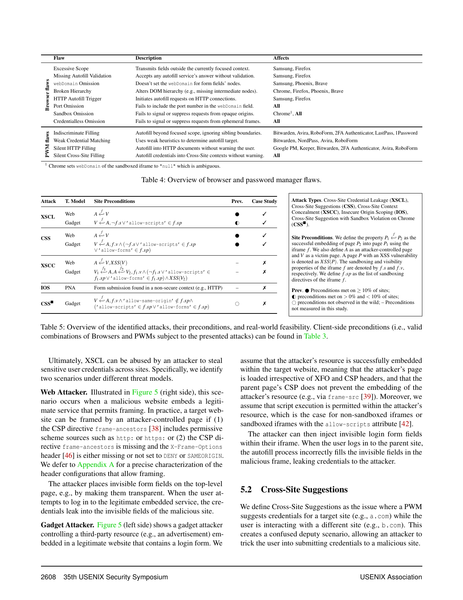

### Searchable text — page 9

```text
Flaw

Description

Affects

Browser flaws

Excessive Scope
Missing Autofill Validation
webDomain Omission
Broken Hierarchy
HTTP Autofill Trigger
Port Omission
Sandbox Omission
Credentialless Omission

Transmits fields outside the currently focused context.
Accepts any autofill service’s answer without validation.
Doesn’t set the webDomain for form fields’ nodes.
Alters DOM hierarchy (e.g., missing intermediate nodes).
Initiates autofill requests on HTTP connections.
Fails to include the port number in the webDomain field.
Fails to signal or suppress requests from opaque origins.
Fails to signal or suppress requests from ephemeral frames.

Samsung, Firefox
Samsung, Firefox
Samsung, Phoenix, Brave
Chrome, Firefox, Phoenix, Brave
Samsung, Firefox
All
Chrome1 , All
All

PWM flaws

Indiscriminate Filling
Weak Credential Matching
Silent HTTP Filling
Silent Cross-Site Filling

Autofill beyond focused scope, ignoring sibling boundaries.
Uses weak heuristics to determine autofill target.
Autofill into HTTP documents without warning the user.
Autofill credentials into Cross-Site contexts without warning.

Bitwarden, Avira, RoboForm, 2FA Authenticator, LastPass, 1Password
Bitwarden, NordPass, Avira, RoboForm
Google PM, Keeper, Bitwarden, 2FA Authenticator, Avira, RoboForm
All

1

Chrome sets webDomain of the sandboxed iframe to "null" which is ambiguous.

Table 4: Overview of browser and password manager flaws.
Attack
XSCL

CSS

XSCC

IOS

T. Model

Site Preconditions

Web

A←
−- V

Gadget

V←
−- A, ¬ f .s ∨ ’allow-scripts’ ∈ f .sp

Web

Prev.

f

Case Study
✓

f

✓

#
G

f

✓

A←
−- V
f

Gadget

V←
−- A, f .v ∧ (¬ f .s ∨ ’allow-scripts’ ∈ f .sp
∨ ’allow-forms’ ∈ f .sp)

Web

A←
−- V, XSS(V )

–

✗

Gadget

V1 ←
−- A, A ←
−- V2 , f1 .v ∧ (¬ f1 .s ∨ ’allow-scripts’ ∈
f1 .sp ∨ ’allow-forms’ ∈ f1 .sp) ∧ XSS(V2 )

–

✗

PNA

Form submission found in a non-secure context (e.g., HTTP)

–

✗

#

✗

f

f1

f2

✓

f

CSS■

Gadget

V←
−- A, f .v ∧ ’allow-same-origin’ ∈
/ f .sp∧
(’allow-scripts’ ∈ f .sp ∨ ’allow-forms’ ∈ f .sp)

Attack Types. Cross-Site Credential Leakage (XSCL),
Cross-Site Suggestions (CSS), Cross-Site Context
Concealment (XSCC), Insecure Origin Scoping (IOS),
Cross-Site Suggestion with Sandbox Violation on Chrome
(CSS■ ).
f

−- P2 as the
Site Preconditions. We define the property P1 ←
successful embedding of page P2 into page P1 using the
iframe f . We also define A as an attacker-controlled page
and V as a victim page. A page P with an XSS vulnerability
is denoted as XSS(P). The sandboxing and visibility
properties of the iframe f are denoted by f .s and f .v,
respectively. We define f .sp as the list of sandboxing
directives of the iframe f .
Prev. Preconditions met on ≥ 10% of sites;
# preconditions met on > 0% and < 10% of sites;
G
# preconditions not observed in the wild; – Preconditions
not measured in this study.

Table 5: Overview of the identified attacks, their preconditions, and real-world feasibility. Client-side preconditions (i.e., valid
combinations of Browsers and PWMs subject to the presented attacks) can be found in Table 3.
Ultimately, XSCL can be abused by an attacker to steal
sensitive user credentials across sites. Specifically, we identify
two scenarios under different threat models.
Web Attacker. Illustrated in Figure 5 (right side), this scenario occurs when a malicious website embeds a legitimate service that permits framing. In practice, a target website can be framed by an attacker-controlled page if (1)
the CSP directive frame-ancestors [38] includes permissive
scheme sources such as http: or https: or (2) the CSP directive frame-ancestors is missing and the X-Frame-Options
header [46] is either missing or not set to DENY or SAMEORIGIN.
We defer to Appendix A for a precise characterization of the
header configurations that allow framing.
The attacker places invisible form fields on the top-level
page, e.g., by making them transparent. When the user attempts to log in to the legitimate embedded service, the credentials leak into the invisible fields of the malicious site.
Gadget Attacker. Figure 5 (left side) shows a gadget attacker
controlling a third-party resource (e.g., an advertisement) embedded in a legitimate website that contains a login form. We

2608

35th USENIX Security Symposium

assume that the attacker’s resource is successfully embedded
within the target website, meaning that the attacker’s page
is loaded irrespective of XFO and CSP headers, and that the
parent page’s CSP does not prevent the embedding of the
attacker’s resource (e.g., via frame-src [39]). Moreover, we
assume that script execution is permitted within the attacker’s
resource, which is the case for non-sandboxed iframes or
sandboxed iframes with the allow-scripts attribute [42].
The attacker can then inject invisible login form fields
within their iframe. When the user logs in to the parent site,
the autofill process incorrectly fills the invisible fields in the
malicious frame, leaking credentials to the attacker.

5.2

Cross-Site Suggestions

We define Cross-Site Suggestions as the issue where a PWM
suggests credentials for a target site (e.g., a.com) while the
user is interacting with a different site (e.g., b.com). This
creates a confused deputy scenario, allowing an attacker to
trick the user into submitting credentials to a malicious site.

USENIX Association
```

## Page 10

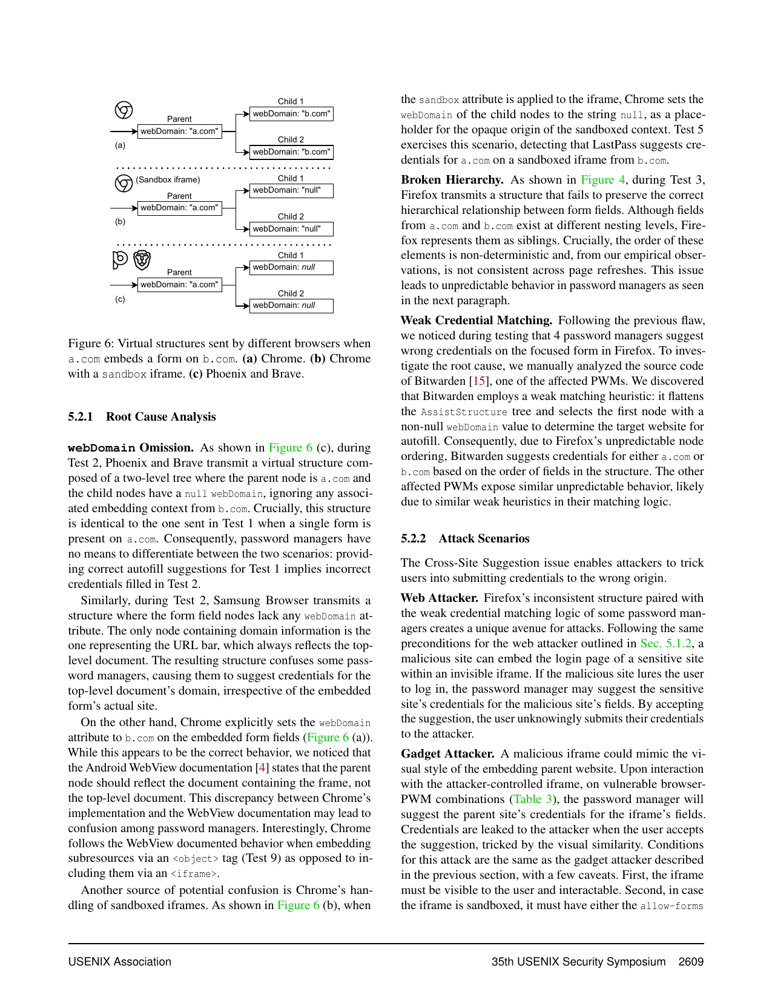

### Searchable text — page 10

```text
Parent
webDomain: "a.com"
(a)

(Sandbox iframe)
Parent
webDomain: "a.com"
(b)

Parent
webDomain: "a.com"
(c)

Child 1
webDomain: "b.com"

the sandbox attribute is applied to the iframe, Chrome sets the
webDomain of the child nodes to the string null, as a place-

Child 2
webDomain: "b.com"

holder for the opaque origin of the sandboxed context. Test 5
exercises this scenario, detecting that LastPass suggests credentials for a.com on a sandboxed iframe from b.com.

Child 1
webDomain: "null"
Child 2
webDomain: "null"
Child 1
webDomain: null
Child 2
webDomain: null

Figure 6: Virtual structures sent by different browsers when
a.com embeds a form on b.com. (a) Chrome. (b) Chrome
with a sandbox iframe. (c) Phoenix and Brave.
5.2.1

Root Cause Analysis

webDomain Omission. As shown in Figure 6 (c), during
Test 2, Phoenix and Brave transmit a virtual structure composed of a two-level tree where the parent node is a.com and
the child nodes have a null webDomain, ignoring any associated embedding context from b.com. Crucially, this structure
is identical to the one sent in Test 1 when a single form is
present on a.com. Consequently, password managers have
no means to differentiate between the two scenarios: providing correct autofill suggestions for Test 1 implies incorrect
credentials filled in Test 2.
Similarly, during Test 2, Samsung Browser transmits a
structure where the form field nodes lack any webDomain attribute. The only node containing domain information is the
one representing the URL bar, which always reflects the toplevel document. The resulting structure confuses some password managers, causing them to suggest credentials for the
top-level document’s domain, irrespective of the embedded
form’s actual site.
On the other hand, Chrome explicitly sets the webDomain
attribute to b.com on the embedded form fields (Figure 6 (a)).
While this appears to be the correct behavior, we noticed that
the Android WebView documentation [4] states that the parent
node should reflect the document containing the frame, not
the top-level document. This discrepancy between Chrome’s
implementation and the WebView documentation may lead to
confusion among password managers. Interestingly, Chrome
follows the WebView documented behavior when embedding
subresources via an <object> tag (Test 9) as opposed to including them via an <iframe>.
Another source of potential confusion is Chrome’s handling of sandboxed iframes. As shown in Figure 6 (b), when

USENIX Association

Broken Hierarchy. As shown in Figure 4, during Test 3,
Firefox transmits a structure that fails to preserve the correct
hierarchical relationship between form fields. Although fields
from a.com and b.com exist at different nesting levels, Firefox represents them as siblings. Crucially, the order of these
elements is non-deterministic and, from our empirical observations, is not consistent across page refreshes. This issue
leads to unpredictable behavior in password managers as seen
in the next paragraph.
Weak Credential Matching. Following the previous flaw,
we noticed during testing that 4 password managers suggest
wrong credentials on the focused form in Firefox. To investigate the root cause, we manually analyzed the source code
of Bitwarden [15], one of the affected PWMs. We discovered
that Bitwarden employs a weak matching heuristic: it flattens
the AssistStructure tree and selects the first node with a
non-null webDomain value to determine the target website for
autofill. Consequently, due to Firefox’s unpredictable node
ordering, Bitwarden suggests credentials for either a.com or
b.com based on the order of fields in the structure. The other
affected PWMs expose similar unpredictable behavior, likely
due to similar weak heuristics in their matching logic.
5.2.2

Attack Scenarios

The Cross-Site Suggestion issue enables attackers to trick
users into submitting credentials to the wrong origin.
Web Attacker. Firefox’s inconsistent structure paired with
the weak credential matching logic of some password managers creates a unique avenue for attacks. Following the same
preconditions for the web attacker outlined in Sec. 5.1.2, a
malicious site can embed the login page of a sensitive site
within an invisible iframe. If the malicious site lures the user
to log in, the password manager may suggest the sensitive
site’s credentials for the malicious site’s fields. By accepting
the suggestion, the user unknowingly submits their credentials
to the attacker.
Gadget Attacker. A malicious iframe could mimic the visual style of the embedding parent website. Upon interaction
with the attacker-controlled iframe, on vulnerable browserPWM combinations (Table 3), the password manager will
suggest the parent site’s credentials for the iframe’s fields.
Credentials are leaked to the attacker when the user accepts
the suggestion, tricked by the visual similarity. Conditions
for this attack are the same as the gadget attacker described
in the previous section, with a few caveats. First, the iframe
must be visible to the user and interactable. Second, in case
the iframe is sandboxed, it must have either the allow-forms

35th USENIX Security Symposium

2609
```

## Page 11

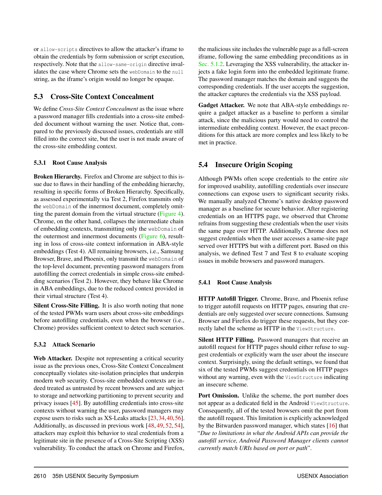

### Searchable text — page 11

```text
or allow-scripts directives to allow the attacker’s iframe to
obtain the credentials by form submission or script execution,
respectively. Note that the allow-same-origin directive invalidates the case where Chrome sets the webDomain to the null
string, as the iframe’s origin would no longer be opaque.

5.3

Cross-Site Context Concealment

We define Cross-Site Context Concealment as the issue where
a password manager fills credentials into a cross-site embedded document without warning the user. Notice that, compared to the previously discussed issues, credentials are still
filled into the correct site, but the user is not made aware of
the cross-site embedding context.
5.3.1

Root Cause Analysis

Broken Hierarchy. Firefox and Chrome are subject to this issue due to flaws in their handling of the embedding hierarchy,
resulting in specific forms of Broken Hierarchy. Specifically,
as assessed experimentally via Test 2, Firefox transmits only
the webDomain of the innermost document, completely omitting the parent domain from the virtual structure (Figure 4).
Chrome, on the other hand, collapses the intermediate chain
of embedding contexts, transmitting only the webDomain of
the outermost and innermost documents (Figure 6), resulting in loss of cross-site context information in ABA-style
embeddings (Test 4). All remaining browsers, i.e., Samsung
Browser, Brave, and Phoenix, only transmit the webDomain of
the top-level document, preventing password managers from
autofilling the correct credentials in simple cross-site embedding scenarios (Test 2). However, they behave like Chrome
in ABA embeddings, due to the reduced context provided in
their virtual structure (Test 4).
Silent Cross-Site Filling. It is also worth noting that none
of the tested PWMs warn users about cross-site embeddings
before autofilling credentials, even when the browser (i.e.,
Chrome) provides sufficient context to detect such scenarios.
5.3.2

Attack Scenario

Web Attacker. Despite not representing a critical security
issue as the previous ones, Cross-Site Context Concealment
conceptually violates site-isolation principles that underpin
modern web security. Cross-site embedded contexts are indeed treated as untrusted by recent browsers and are subject
to storage and networking partitioning to prevent security and
privacy issues [45]. By autofilling credentials into cross-site
contexts without warning the user, password managers may
expose users to risks such as XS-Leaks attacks [23,34,40,56].
Additionally, as discussed in previous work [48, 49, 52, 54],
attackers may exploit this behavior to steal credentials from a
legitimate site in the presence of a Cross-Site Scripting (XSS)
vulnerability. To conduct the attack on Chrome and Firefox,

2610

35th USENIX Security Symposium

the malicious site includes the vulnerable page as a full-screen
iframe, following the same embedding preconditions as in
Sec. 5.1.2. Leveraging the XSS vulnerability, the attacker injects a fake login form into the embedded legitimate frame.
The password manager matches the domain and suggests the
corresponding credentials. If the user accepts the suggestion,
the attacker captures the credentials via the XSS payload.
Gadget Attacker. We note that ABA-style embeddings require a gadget attacker as a baseline to perform a similar
attack, since the malicious party would need to control the
intermediate embedding context. However, the exact preconditions for this attack are more complex and less likely to be
met in practice.

5.4

Insecure Origin Scoping

Although PWMs often scope credentials to the entire site
for improved usability, autofilling credentials over insecure
connections can expose users to significant security risks.
We manually analyzed Chrome’s native desktop password
manager as a baseline for secure behavior. After registering
credentials on an HTTPS page, we observed that Chrome
refrains from suggesting these credentials when the user visits
the same page over HTTP. Additionally, Chrome does not
suggest credentials when the user accesses a same-site page
served over HTTPS but with a different port. Based on this
analysis, we defined Test 7 and Test 8 to evaluate scoping
issues in mobile browsers and password managers.

5.4.1

Root Cause Analysis

HTTP Autofill Trigger. Chrome, Brave, and Phoenix refuse
to trigger autofill requests on HTTP pages, ensuring that credentials are only suggested over secure connections. Samsung
Browser and Firefox do trigger these requests, but they correctly label the scheme as HTTP in the ViewStructure.
Silent HTTP Filling. Password managers that receive an
autofill request for HTTP pages should either refuse to suggest credentials or explicitly warn the user about the insecure
context. Surprisingly, using the default settings, we found that
six of the tested PWMs suggest credentials on HTTP pages
without any warning, even with the ViewStructure indicating
an insecure scheme.
Port Omission. Unlike the scheme, the port number does
not appear as a dedicated field in the Android ViewStructure.
Consequently, all of the tested browsers omit the port from
the autofill request. This limitation is explicitly acknowledged
by the Bitwarden password manager, which states [16] that
“Due to limitations in what the Android APIs can provide the
autofill service, Android Password Manager clients cannot
currently match URIs based on port or path”.

USENIX Association
```

## Page 12

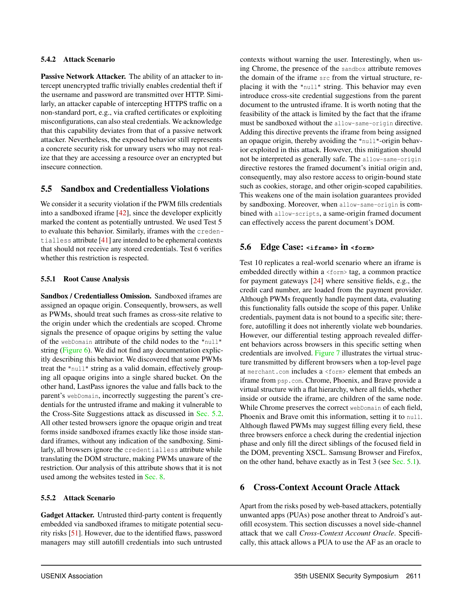

### Searchable text — page 12

```text
5.4.2

Attack Scenario

Passive Network Attacker. The ability of an attacker to intercept unencrypted traffic trivially enables credential theft if
the username and password are transmitted over HTTP. Similarly, an attacker capable of intercepting HTTPS traffic on a
non-standard port, e.g., via crafted certificates or exploiting
misconfigurations, can also steal credentials. We acknowledge
that this capability deviates from that of a passive network
attacker. Nevertheless, the exposed behavior still represents
a concrete security risk for unwary users who may not realize that they are accessing a resource over an encrypted but
insecure connection.

5.5

Sandbox and Credentialless Violations

We consider it a security violation if the PWM fills credentials
into a sandboxed iframe [42], since the developer explicitly
marked the content as potentially untrusted. We used Test 5
to evaluate this behavior. Similarly, iframes with the credentialless attribute [41] are intended to be ephemeral contexts
that should not receive any stored credentials. Test 6 verifies
whether this restriction is respected.
5.5.1

Root Cause Analysis

Sandbox / Credentialless Omission. Sandboxed iframes are
assigned an opaque origin. Consequently, browsers, as well
as PWMs, should treat such frames as cross-site relative to
the origin under which the credentials are scoped. Chrome
signals the presence of opaque origins by setting the value
of the webDomain attribute of the child nodes to the "null"
string (Figure 6). We did not find any documentation explicitly describing this behavior. We discovered that some PWMs
treat the "null" string as a valid domain, effectively grouping all opaque origins into a single shared bucket. On the
other hand, LastPass ignores the value and falls back to the
parent’s webDomain, incorrectly suggesting the parent’s credentials for the untrusted iframe and making it vulnerable to
the Cross-Site Suggestions attack as discussed in Sec. 5.2.
All other tested browsers ignore the opaque origin and treat
forms inside sandboxed iframes exactly like those inside standard iframes, without any indication of the sandboxing. Similarly, all browsers ignore the credentialless attribute while
translating the DOM structure, making PWMs unaware of the
restriction. Our analysis of this attribute shows that it is not
used among the websites tested in Sec. 8.

contexts without warning the user. Interestingly, when using Chrome, the presence of the sandbox attribute removes
the domain of the iframe src from the virtual structure, replacing it with the "null" string. This behavior may even
introduce cross-site credential suggestions from the parent
document to the untrusted iframe. It is worth noting that the
feasibility of the attack is limited by the fact that the iframe
must be sandboxed without the allow-same-origin directive.
Adding this directive prevents the iframe from being assigned
an opaque origin, thereby avoiding the "null"-origin behavior exploited in this attack. However, this mitigation should
not be interpreted as generally safe. The allow-same-origin
directive restores the framed document’s initial origin and,
consequently, may also restore access to origin-bound state
such as cookies, storage, and other origin-scoped capabilities.
This weakens one of the main isolation guarantees provided
by sandboxing. Moreover, when allow-same-origin is combined with allow-scripts, a same-origin framed document
can effectively access the parent document’s DOM.

5.6

Test 10 replicates a real-world scenario where an iframe is
embedded directly within a <form> tag, a common practice
for payment gateways [24] where sensitive fields, e.g., the
credit card number, are loaded from the payment provider.
Although PWMs frequently handle payment data, evaluating
this functionality falls outside the scope of this paper. Unlike
credentials, payment data is not bound to a specific site; therefore, autofilling it does not inherently violate web boundaries.
However, our differential testing approach revealed different behaviors across browsers in this specific setting when
credentials are involved. Figure 7 illustrates the virtual structure transmitted by different browsers when a top-level page
at merchant.com includes a <form> element that embeds an
iframe from psp.com. Chrome, Phoenix, and Brave provide a
virtual structure with a flat hierarchy, where all fields, whether
inside or outside the iframe, are children of the same node.
While Chrome preserves the correct webDomain of each field,
Phoenix and Brave omit this information, setting it to null.
Although flawed PWMs may suggest filling every field, these
three browsers enforce a check during the credential injection
phase and only fill the direct siblings of the focused field in
the DOM, preventing XSCL. Samsung Browser and Firefox,
on the other hand, behave exactly as in Test 3 (see Sec. 5.1).

6
5.5.2

Edge Case: <iframe> in <form>

Cross-Context Account Oracle Attack

Attack Scenario

Gadget Attacker. Untrusted third-party content is frequently
embedded via sandboxed iframes to mitigate potential security risks [51]. However, due to the identified flaws, password
managers may still autofill credentials into such untrusted

USENIX Association

Apart from the risks posed by web-based attackers, potentially
unwanted apps (PUAs) pose another threat to Android’s autofill ecosystem. This section discusses a novel side-channel
attack that we call Cross-Context Account Oracle. Specifically, this attack allows a PUA to use the AF as an oracle to

35th USENIX Security Symposium

2611
```

## Page 13

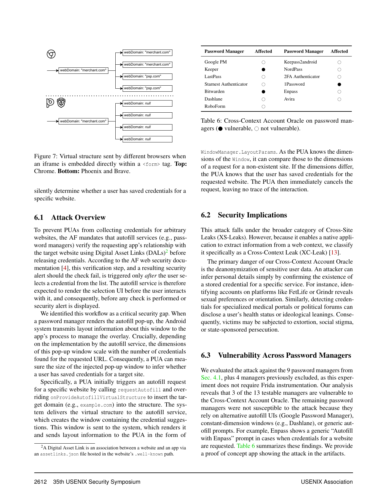

### Searchable text — page 13

```text
webDomain: "merchant.com"
webDomain: "merchant.com"

Password Manager
Google PM

Affected
#

Keeper

webDomain: "merchant.com"
webDomain: "psp.com"
webDomain: "psp.com"

webDomain: null

Password Manager

Affected

Keepass2android

#

NordPass

#
#

LastPass

#

2FA Authenticator

Starnest Authenticator

#

1Password
Enpass

#

Dashlane

#

Avira

#

RoboForm

#

Bitwarden

webDomain: null
webDomain: "merchant.com"
webDomain: null

Table 6: Cross-Context Account Oracle on password managers ( vulnerable, # not vulnerable).

webDomain: null

Figure 7: Virtual structure sent by different browsers when
an iframe is embedded directly within a <form> tag. Top:
Chrome. Bottom: Phoenix and Brave.
silently determine whether a user has saved credentials for a
specific website.

6.1

Attack Overview

To prevent PUAs from collecting credentials for arbitrary
websites, the AF mandates that autofill services (e.g., password managers) verify the requesting app’s relationship with
the target website using Digital Asset Links (DALs)2 before
releasing credentials. According to the AF web security documentation [4], this verification step, and a resulting security
alert should the check fail, is triggered only after the user selects a credential from the list. The autofill service is therefore
expected to render the selection UI before the user interacts
with it, and consequently, before any check is performed or
security alert is displayed.
We identified this workflow as a critical security gap. When
a password manager renders the autofill pop-up, the Android
system transmits layout information about this window to the
app’s process to manage the overlay. Crucially, depending
on the implementation by the autofill service, the dimensions
of this pop-up window scale with the number of credentials
found for the requested URL. Consequently, a PUA can measure the size of the injected pop-up window to infer whether
a user has saved credentials for a target site.
Specifically, a PUA initially triggers an autofill request
for a specific website by calling requestAutofill and overriding onProvideAutofillVirtualStructure to insert the target domain (e.g., example.com) into the structure. The system delivers the virtual structure to the autofill service,
which creates the window containing the credential suggestions. This window is sent to the system, which renders it
and sends layout information to the PUA in the form of
2 A Digital Asset Link is an association between a website and an app via

an assetlinks.json file hosted in the website’s .well-known path.

2612

35th USENIX Security Symposium

WindowManager.LayoutParams. As the PUA knows the dimensions of the Window, it can compare those to the dimensions

of a request for a non-existent site. If the dimensions differ,
the PUA knows that the user has saved credentials for the
requested website. The PUA then immediately cancels the
request, leaving no trace of the interaction.

6.2

Security Implications

This attack falls under the broader category of Cross-Site
Leaks (XS-Leaks). However, because it enables a native application to extract information from a web context, we classify
it specifically as a Cross-Context Leak (XC-Leak) [13].
The primary danger of our Cross-Context Account Oracle
is the deanonymization of sensitive user data. An attacker can
infer personal details simply by confirming the existence of
a stored credential for a specific service. For instance, identifying accounts on platforms like FetLife or Grindr reveals
sexual preferences or orientation. Similarly, detecting credentials for specialized medical portals or political forums can
disclose a user’s health status or ideological leanings. Consequently, victims may be subjected to extortion, social stigma,
or state-sponsored persecution.

6.3

Vulnerability Across Password Managers

We evaluated the attack against the 9 password managers from
Sec. 4.1, plus 4 managers previously excluded, as this experiment does not require Frida instrumentation. Our analysis
reveals that 3 of the 13 testable managers are vulnerable to
the Cross-Context Account Oracle. The remaining password
managers were not susceptible to the attack because they
rely on alternative autofill UIs (Google Password Manager),
constant-dimension windows (e.g., Dashlane), or generic autofill prompts. For example, Enpass shows a generic “Autofill
with Enpass” prompt in cases when credentials for a website
are requested. Table 6 summarizes these findings. We provide
a proof of concept app showing the attack in the artifacts.

USENIX Association
```

## Page 14

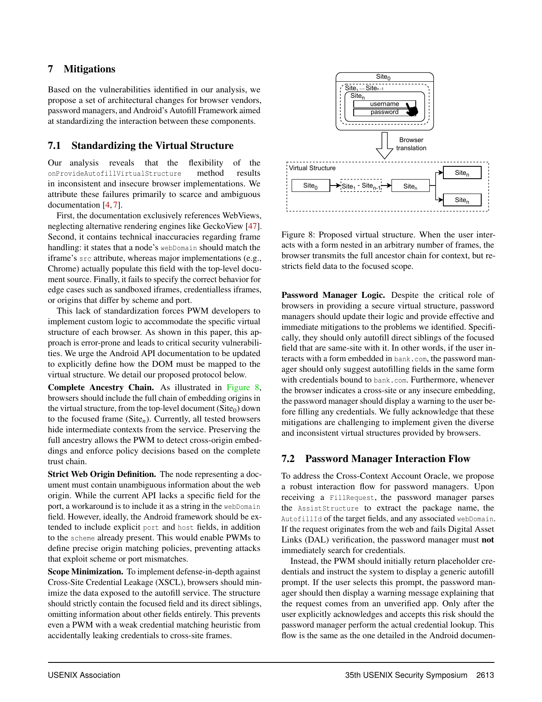

### Searchable text — page 14

```text
7

Mitigations

Site0
Site1 ... Siten -1
Siten
username
password

Based on the vulnerabilities identified in our analysis, we
propose a set of architectural changes for browser vendors,
password managers, and Android’s Autofill Framework aimed
at standardizing the interaction between these components.

7.1

Browser
translation

Standardizing the Virtual Structure

Our analysis

reveals

that the

flexibility of the
method results
in inconsistent and insecure browser implementations. We
attribute these failures primarily to scarce and ambiguous
documentation [4, 7].
First, the documentation exclusively references WebViews,
neglecting alternative rendering engines like GeckoView [47].
Second, it contains technical inaccuracies regarding frame
handling: it states that a node’s webDomain should match the
iframe’s src attribute, whereas major implementations (e.g.,
Chrome) actually populate this field with the top-level document source. Finally, it fails to specify the correct behavior for
edge cases such as sandboxed iframes, credentialless iframes,
or origins that differ by scheme and port.
This lack of standardization forces PWM developers to
implement custom logic to accommodate the specific virtual
structure of each browser. As shown in this paper, this approach is error-prone and leads to critical security vulnerabilities. We urge the Android API documentation to be updated
to explicitly define how the DOM must be mapped to the
virtual structure. We detail our proposed protocol below.
Complete Ancestry Chain. As illustrated in Figure 8,
browsers should include the full chain of embedding origins in
the virtual structure, from the top-level document (Site0 ) down
to the focused frame (Siten ). Currently, all tested browsers
hide intermediate contexts from the service. Preserving the
full ancestry allows the PWM to detect cross-origin embeddings and enforce policy decisions based on the complete
trust chain.
Strict Web Origin Definition. The node representing a document must contain unambiguous information about the web
origin. While the current API lacks a specific field for the
port, a workaround is to include it as a string in the webDomain
field. However, ideally, the Android framework should be extended to include explicit port and host fields, in addition
to the scheme already present. This would enable PWMs to
define precise origin matching policies, preventing attacks
that exploit scheme or port mismatches.
Scope Minimization. To implement defense-in-depth against
Cross-Site Credential Leakage (XSCL), browsers should minimize the data exposed to the autofill service. The structure
should strictly contain the focused field and its direct siblings,
omitting information about other fields entirely. This prevents
even a PWM with a weak credential matching heuristic from
accidentally leaking credentials to cross-site frames.
onProvideAutofillVirtualStructure

USENIX Association

Virtual Structure
Site0

Siten
Site1 - Siten-1

Siten
Siten

Figure 8: Proposed virtual structure. When the user interacts with a form nested in an arbitrary number of frames, the
browser transmits the full ancestor chain for context, but restricts field data to the focused scope.
Password Manager Logic. Despite the critical role of
browsers in providing a secure virtual structure, password
managers should update their logic and provide effective and
immediate mitigations to the problems we identified. Specifically, they should only autofill direct siblings of the focused
field that are same-site with it. In other words, if the user interacts with a form embedded in bank.com, the password manager should only suggest autofilling fields in the same form
with credentials bound to bank.com. Furthermore, whenever
the browser indicates a cross-site or any insecure embedding,
the password manager should display a warning to the user before filling any credentials. We fully acknowledge that these
mitigations are challenging to implement given the diverse
and inconsistent virtual structures provided by browsers.

7.2

Password Manager Interaction Flow

To address the Cross-Context Account Oracle, we propose
a robust interaction flow for password managers. Upon
receiving a FillRequest, the password manager parses
the AssistStructure to extract the package name, the
AutofillId of the target fields, and any associated webDomain.
If the request originates from the web and fails Digital Asset
Links (DAL) verification, the password manager must not
immediately search for credentials.
Instead, the PWM should initially return placeholder credentials and instruct the system to display a generic autofill
prompt. If the user selects this prompt, the password manager should then display a warning message explaining that
the request comes from an unverified app. Only after the
user explicitly acknowledges and accepts this risk should the
password manager perform the actual credential lookup. This
flow is the same as the one detailed in the Android documen-

35th USENIX Security Symposium

2613
```

## Page 15

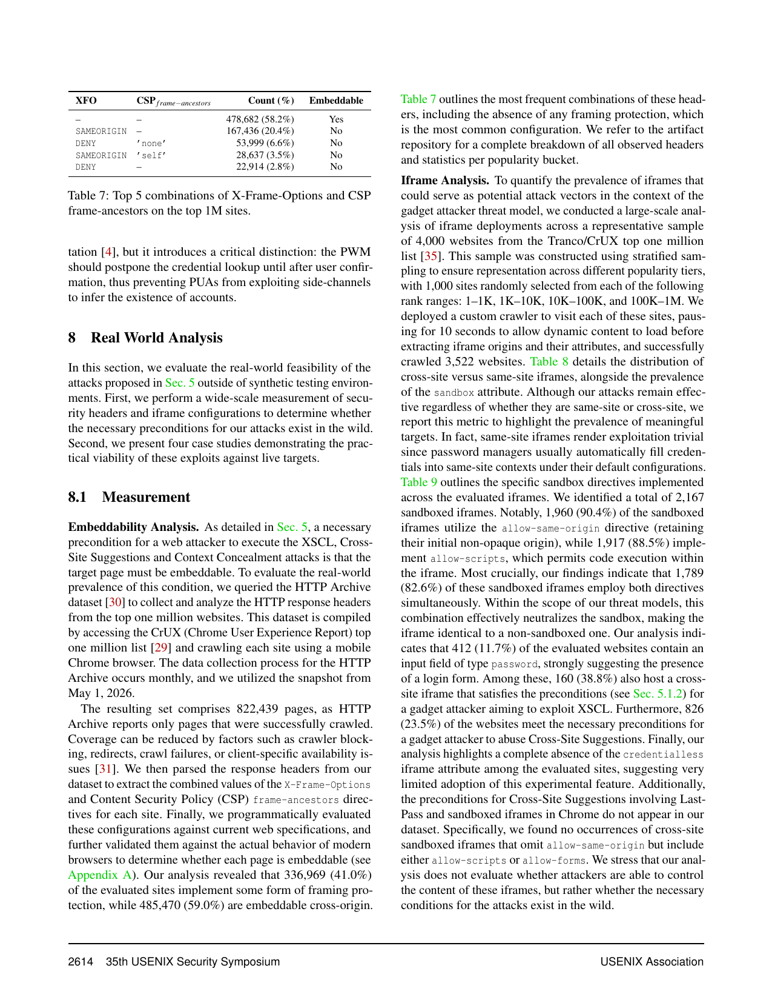

### Searchable text — page 15

```text
XFO

CSP f rame−ancestors

–
SAMEORIGIN
DENY
SAMEORIGIN
DENY

–
–
’none’
’self’
–

Count (%)
478,682 (58.2%)
167,436 (20.4%)
53,999 (6.6%)
28,637 (3.5%)
22,914 (2.8%)

Embeddable
Yes
No
No
No
No

Table 7: Top 5 combinations of X-Frame-Options and CSP
frame-ancestors on the top 1M sites.
tation [4], but it introduces a critical distinction: the PWM
should postpone the credential lookup until after user confirmation, thus preventing PUAs from exploiting side-channels
to infer the existence of accounts.

8

Real World Analysis

In this section, we evaluate the real-world feasibility of the
attacks proposed in Sec. 5 outside of synthetic testing environments. First, we perform a wide-scale measurement of security headers and iframe configurations to determine whether
the necessary preconditions for our attacks exist in the wild.
Second, we present four case studies demonstrating the practical viability of these exploits against live targets.

8.1

Measurement

Embeddability Analysis. As detailed in Sec. 5, a necessary
precondition for a web attacker to execute the XSCL, CrossSite Suggestions and Context Concealment attacks is that the
target page must be embeddable. To evaluate the real-world
prevalence of this condition, we queried the HTTP Archive
dataset [30] to collect and analyze the HTTP response headers
from the top one million websites. This dataset is compiled
by accessing the CrUX (Chrome User Experience Report) top
one million list [29] and crawling each site using a mobile
Chrome browser. The data collection process for the HTTP
Archive occurs monthly, and we utilized the snapshot from
May 1, 2026.
The resulting set comprises 822,439 pages, as HTTP
Archive reports only pages that were successfully crawled.
Coverage can be reduced by factors such as crawler blocking, redirects, crawl failures, or client-specific availability issues [31]. We then parsed the response headers from our
dataset to extract the combined values of the X-Frame-Options
and Content Security Policy (CSP) frame-ancestors directives for each site. Finally, we programmatically evaluated
these configurations against current web specifications, and
further validated them against the actual behavior of modern
browsers to determine whether each page is embeddable (see
Appendix A). Our analysis revealed that 336,969 (41.0%)
of the evaluated sites implement some form of framing protection, while 485,470 (59.0%) are embeddable cross-origin.

2614

35th USENIX Security Symposium

Table 7 outlines the most frequent combinations of these headers, including the absence of any framing protection, which
is the most common configuration. We refer to the artifact
repository for a complete breakdown of all observed headers
and statistics per popularity bucket.
Iframe Analysis. To quantify the prevalence of iframes that
could serve as potential attack vectors in the context of the
gadget attacker threat model, we conducted a large-scale analysis of iframe deployments across a representative sample
of 4,000 websites from the Tranco/CrUX top one million
list [35]. This sample was constructed using stratified sampling to ensure representation across different popularity tiers,
with 1,000 sites randomly selected from each of the following
rank ranges: 1–1K, 1K–10K, 10K–100K, and 100K–1M. We
deployed a custom crawler to visit each of these sites, pausing for 10 seconds to allow dynamic content to load before
extracting iframe origins and their attributes, and successfully
crawled 3,522 websites. Table 8 details the distribution of
cross-site versus same-site iframes, alongside the prevalence
of the sandbox attribute. Although our attacks remain effective regardless of whether they are same-site or cross-site, we
report this metric to highlight the prevalence of meaningful
targets. In fact, same-site iframes render exploitation trivial
since password managers usually automatically fill credentials into same-site contexts under their default configurations.
Table 9 outlines the specific sandbox directives implemented
across the evaluated iframes. We identified a total of 2,167
sandboxed iframes. Notably, 1,960 (90.4%) of the sandboxed
iframes utilize the allow-same-origin directive (retaining
their initial non-opaque origin), while 1,917 (88.5%) implement allow-scripts, which permits code execution within
the iframe. Most crucially, our findings indicate that 1,789
(82.6%) of these sandboxed iframes employ both directives
simultaneously. Within the scope of our threat models, this
combination effectively neutralizes the sandbox, making the
iframe identical to a non-sandboxed one. Our analysis indicates that 412 (11.7%) of the evaluated websites contain an
input field of type password, strongly suggesting the presence
of a login form. Among these, 160 (38.8%) also host a crosssite iframe that satisfies the preconditions (see Sec. 5.1.2) for
a gadget attacker aiming to exploit XSCL. Furthermore, 826
(23.5%) of the websites meet the necessary preconditions for
a gadget attacker to abuse Cross-Site Suggestions. Finally, our
analysis highlights a complete absence of the credentialless
iframe attribute among the evaluated sites, suggesting very
limited adoption of this experimental feature. Additionally,
the preconditions for Cross-Site Suggestions involving LastPass and sandboxed iframes in Chrome do not appear in our
dataset. Specifically, we found no occurrences of cross-site
sandboxed iframes that omit allow-same-origin but include
either allow-scripts or allow-forms. We stress that our analysis does not evaluate whether attackers are able to control
the content of these iframes, but rather whether the necessary
conditions for the attacks exist in the wild.

USENIX Association
```

## Page 16

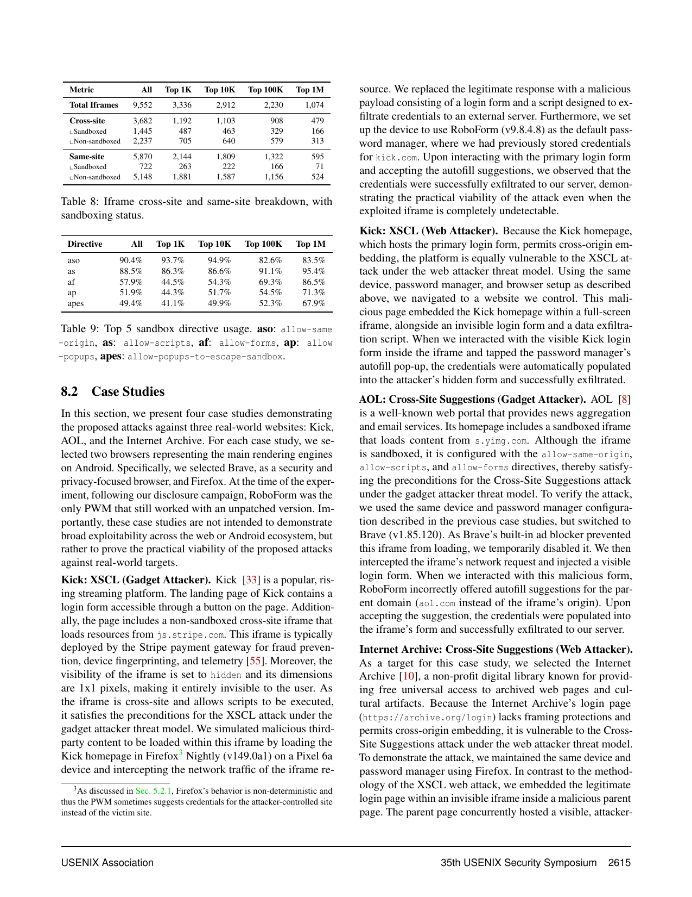

### Searchable text — page 16

```text
Metric

All

Top 1K

Top 10K

Top 100K

Top 1M

Total Iframes

9,552

3,336

2,912

2,230

1,074

Cross-site
⌞Sandboxed
⌞Non-sandboxed

3,682
1,445
2,237

1,192
487
705

1,103
463
640

908
329
579

479
166
313

Same-site
⌞Sandboxed
⌞Non-sandboxed

5,870
722
5,148

2,144
263
1,881

1,809
222
1,587

1,322
166
1,156

595
71
524

Table 8: Iframe cross-site and same-site breakdown, with
sandboxing status.
Directive
aso
as
af
ap
apes

All

Top 1K

Top 10K

Top 100K

Top 1M

90.4%
88.5%
57.9%
51.9%
49.4%

93.7%
86.3%
44.5%
44.3%
41.1%

94.9%
86.6%
54.3%
51.7%
49.9%

82.6%
91.1%
69.3%
54.5%
52.3%

83.5%
95.4%
86.5%
71.3%
67.9%

Table 9: Top 5 sandbox directive usage. aso: allow-same
-origin, as: allow-scripts, af: allow-forms, ap: allow
-popups, apes: allow-popups-to-escape-sandbox.

8.2

Case Studies

In this section, we present four case studies demonstrating
the proposed attacks against three real-world websites: Kick,
AOL, and the Internet Archive. For each case study, we selected two browsers representing the main rendering engines
on Android. Specifically, we selected Brave, as a security and
privacy-focused browser, and Firefox. At the time of the experiment, following our disclosure campaign, RoboForm was the
only PWM that still worked with an unpatched version. Importantly, these case studies are not intended to demonstrate
broad exploitability across the web or Android ecosystem, but
rather to prove the practical viability of the proposed attacks
against real-world targets.
Kick: XSCL (Gadget Attacker). Kick [33] is a popular, rising streaming platform. The landing page of Kick contains a
login form accessible through a button on the page. Additionally, the page includes a non-sandboxed cross-site iframe that
loads resources from js.stripe.com. This iframe is typically
deployed by the Stripe payment gateway for fraud prevention, device fingerprinting, and telemetry [55]. Moreover, the
visibility of the iframe is set to hidden and its dimensions
are 1x1 pixels, making it entirely invisible to the user. As
the iframe is cross-site and allows scripts to be executed,
it satisfies the preconditions for the XSCL attack under the
gadget attacker threat model. We simulated malicious thirdparty content to be loaded within this iframe by loading the
Kick homepage in Firefox3 Nightly (v149.0a1) on a Pixel 6a
device and intercepting the network traffic of the iframe re3 As discussed in Sec. 5.2.1, Firefox’s behavior is non-deterministic and
thus the PWM sometimes suggests credentials for the attacker-controlled site
instead of the victim site.

USENIX Association

source. We replaced the legitimate response with a malicious
payload consisting of a login form and a script designed to exfiltrate credentials to an external server. Furthermore, we set
up the device to use RoboForm (v9.8.4.8) as the default password manager, where we had previously stored credentials
for kick.com. Upon interacting with the primary login form
and accepting the autofill suggestions, we observed that the
credentials were successfully exfiltrated to our server, demonstrating the practical viability of the attack even when the
exploited iframe is completely undetectable.
Kick: XSCL (Web Attacker). Because the Kick homepage,
which hosts the primary login form, permits cross-origin embedding, the platform is equally vulnerable to the XSCL attack under the web attacker threat model. Using the same
device, password manager, and browser setup as described
above, we navigated to a website we control. This malicious page embedded the Kick homepage within a full-screen
iframe, alongside an invisible login form and a data exfiltration script. When we interacted with the visible Kick login
form inside the iframe and tapped the password manager’s
autofill pop-up, the credentials were automatically populated
into the attacker’s hidden form and successfully exfiltrated.
AOL: Cross-Site Suggestions (Gadget Attacker). AOL [8]
is a well-known web portal that provides news aggregation
and email services. Its homepage includes a sandboxed iframe
that loads content from s.yimg.com. Although the iframe
is sandboxed, it is configured with the allow-same-origin,
allow-scripts, and allow-forms directives, thereby satisfying the preconditions for the Cross-Site Suggestions attack
under the gadget attacker threat model. To verify the attack,
we used the same device and password manager configuration described in the previous case studies, but switched to
Brave (v1.85.120). As Brave’s built-in ad blocker prevented
this iframe from loading, we temporarily disabled it. We then
intercepted the iframe’s network request and injected a visible
login form. When we interacted with this malicious form,
RoboForm incorrectly offered autofill suggestions for the parent domain (aol.com instead of the iframe’s origin). Upon
accepting the suggestion, the credentials were populated into
the iframe’s form and successfully exfiltrated to our server.
Internet Archive: Cross-Site Suggestions (Web Attacker).
As a target for this case study, we selected the Internet
Archive [10], a non-profit digital library known for providing free universal access to archived web pages and cultural artifacts. Because the Internet Archive’s login page
(https://archive.org/login) lacks framing protections and
permits cross-origin embedding, it is vulnerable to the CrossSite Suggestions attack under the web attacker threat model.
To demonstrate the attack, we maintained the same device and
password manager using Firefox. In contrast to the methodology of the XSCL web attack, we embedded the legitimate
login page within an invisible iframe inside a malicious parent
page. The parent page concurrently hosted a visible, attacker-

35th USENIX Security Symposium

2615
```

## Page 17

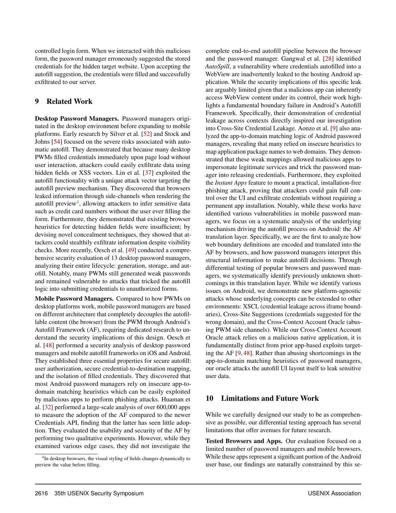

### Searchable text — page 17

```text
controlled login form. When we interacted with this malicious
form, the password manager erroneously suggested the stored
credentials for the hidden target website. Upon accepting the
autofill suggestion, the credentials were filled and successfully
exfiltrated to our server.

9

Related Work

Desktop Password Managers. Password managers originated in the desktop environment before expanding to mobile
platforms. Early research by Silver et al. [52] and Stock and
Johns [54] focused on the severe risks associated with automatic autofill. They demonstrated that because many desktop
PWMs filled credentials immediately upon page load without
user interaction, attackers could easily exfiltrate data using
hidden fields or XSS vectors. Lin et al. [37] exploited the
autofill functionality with a unique attack vector targeting the
autofill preview mechanism. They discovered that browsers
leaked information through side-channels when rendering the
autofill preview4 , allowing attackers to infer sensitive data
such as credit card numbers without the user ever filling the
form. Furthermore, they demonstrated that existing browser
heuristics for detecting hidden fields were insufficient; by
devising novel concealment techniques, they showed that attackers could stealthily exfiltrate information despite visibility
checks. More recently, Oesch et al. [49] conducted a comprehensive security evaluation of 13 desktop password managers,
analyzing their entire lifecycle: generation, storage, and autofill. Notably, many PWMs still generated weak passwords
and remained vulnerable to attacks that tricked the autofill
logic into submitting credentials to unauthorized forms.
Mobile Password Managers. Compared to how PWMs on
desktop platforms work, mobile password managers are based
on different architecture that completely decouples the autofillable content (the browser) from the PWM through Android’s
Autofill Framework (AF), requiring dedicated research to understand the security implications of this design. Oesch et
al. [48] performed a security analysis of desktop password
managers and mobile autofill frameworks on iOS and Android.
They established three essential properties for secure autofill:
user authorization, secure credential-to-destination mapping,
and the isolation of filled credentials. They discovered that
most Android password managers rely on insecure app-todomain matching heuristics which can be easily exploited
by malicious apps to perform phishing attacks. Huaman et
al. [32] performed a large-scale analysis of over 600,000 apps
to measure the adoption of the AF compared to the newer
Credentials API, finding that the latter has seen little adoption. They evaluated the usability and security of the AF by
performing two qualitative experiments. However, while they
examined various edge cases, they did not investigate the
4 In desktop browsers, the visual styling of fields changes dynamically to

preview the value before filling.

2616

35th USENIX Security Symposium

complete end-to-end autofill pipeline between the browser
and the password manager. Gangwal et al. [28] identified
AutoSpill, a vulnerability where credentials autofilled into a
WebView are inadvertently leaked to the hosting Android application. While the security implications of this specific leak
are arguably limited given that a malicious app can inherently
access WebView content under its control, their work highlights a fundamental boundary failure in Android’s Autofill
Framework. Specifically, their demonstration of credential
leakage across contexts directly inspired our investigation
into Cross-Site Credential Leakage. Aonzo et al. [9] also analyzed the app-to-domain matching logic of Android password
managers, revealing that many relied on insecure heuristics to
map application package names to web domains. They demonstrated that these weak mappings allowed malicious apps to
impersonate legitimate services and trick the password manager into releasing credentials. Furthermore, they exploited
the Instant Apps feature to mount a practical, installation-free
phishing attack, proving that attackers could gain full control over the UI and exfiltrate credentials without requiring a
permanent app installation. Notably, while these works have
identified various vulnerabilities in mobile password managers, we focus on a systematic analysis of the underlying
mechanism driving the autofill process on Android: the AF
translation layer. Specifically, we are the first to analyze how
web boundary definitions are encoded and translated into the
AF by browsers, and how password managers interpret this
structural information to make autofill decisions. Through
differential testing of popular browsers and password managers, we systematically identify previously unknown shortcomings in this translation layer. While we identify various
issues on Android, we demonstrate new platform-agnostic
attacks whose underlying concepts can be extended to other
environments: XSCL (credential leakage across iframe boundaries), Cross-Site Suggestions (credentials suggested for the
wrong domain), and the Cross-Context Account Oracle (abusing PWM side channels). While our Cross-Context Account
Oracle attack relies on a malicious native application, it is
fundamentally distinct from prior app-based exploits targeting the AF [9, 48]. Rather than abusing shortcomings in the
app-to-domain matching heuristics of password managers,
our oracle attacks the autofill UI layout itself to leak sensitive
user data.

10

Limitations and Future Work

While we carefully designed our study to be as comprehensive as possible, our differential testing approach has several
limitations that offer avenues for future research.
Tested Browsers and Apps. Our evaluation focused on a
limited number of password managers and mobile browsers.
While these apps represent a significant portion of the Android
user base, our findings are naturally constrained by this se-

USENIX Association
```

## Page 18

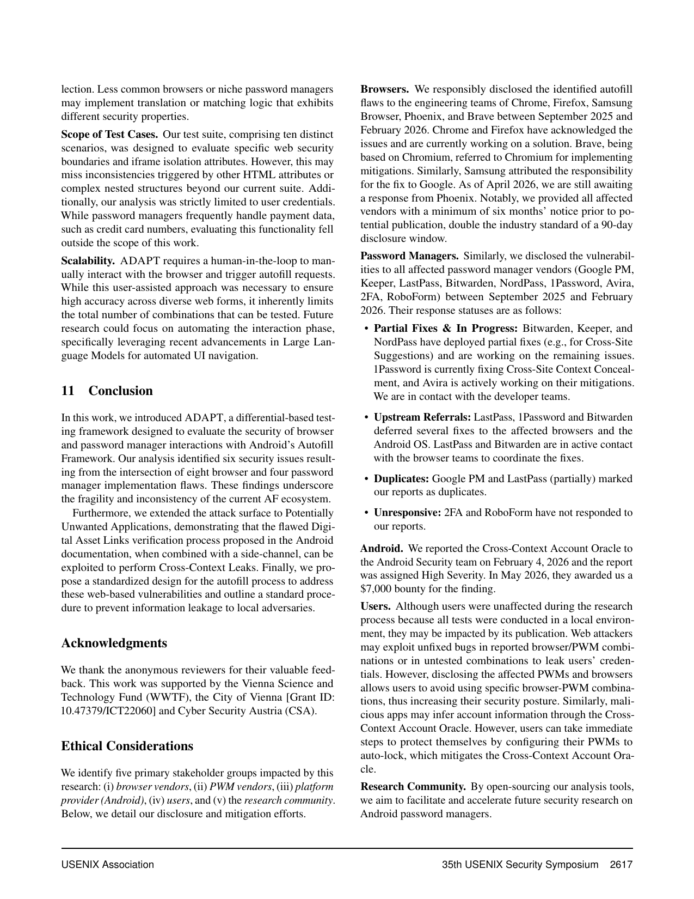

### Searchable text — page 18

```text
lection. Less common browsers or niche password managers
may implement translation or matching logic that exhibits
different security properties.
Scope of Test Cases. Our test suite, comprising ten distinct
scenarios, was designed to evaluate specific web security
boundaries and iframe isolation attributes. However, this may
miss inconsistencies triggered by other HTML attributes or
complex nested structures beyond our current suite. Additionally, our analysis was strictly limited to user credentials.
While password managers frequently handle payment data,
such as credit card numbers, evaluating this functionality fell
outside the scope of this work.
Scalability. ADAPT requires a human-in-the-loop to manually interact with the browser and trigger autofill requests.
While this user-assisted approach was necessary to ensure
high accuracy across diverse web forms, it inherently limits
the total number of combinations that can be tested. Future
research could focus on automating the interaction phase,
specifically leveraging recent advancements in Large Language Models for automated UI navigation.

11

Conclusion

In this work, we introduced ADAPT, a differential-based testing framework designed to evaluate the security of browser
and password manager interactions with Android’s Autofill
Framework. Our analysis identified six security issues resulting from the intersection of eight browser and four password
manager implementation flaws. These findings underscore
the fragility and inconsistency of the current AF ecosystem.
Furthermore, we extended the attack surface to Potentially
Unwanted Applications, demonstrating that the flawed Digital Asset Links verification process proposed in the Android
documentation, when combined with a side-channel, can be
exploited to perform Cross-Context Leaks. Finally, we propose a standardized design for the autofill process to address
these web-based vulnerabilities and outline a standard procedure to prevent information leakage to local adversaries.

Acknowledgments
We thank the anonymous reviewers for their valuable feedback. This work was supported by the Vienna Science and
Technology Fund (WWTF), the City of Vienna [Grant ID:
10.47379/ICT22060] and Cyber Security Austria (CSA).

Ethical Considerations
We identify five primary stakeholder groups impacted by this
research: (i) browser vendors, (ii) PWM vendors, (iii) platform
provider (Android), (iv) users, and (v) the research community.
Below, we detail our disclosure and mitigation efforts.

USENIX Association

Browsers. We responsibly disclosed the identified autofill
flaws to the engineering teams of Chrome, Firefox, Samsung
Browser, Phoenix, and Brave between September 2025 and
February 2026. Chrome and Firefox have acknowledged the
issues and are currently working on a solution. Brave, being
based on Chromium, referred to Chromium for implementing
mitigations. Similarly, Samsung attributed the responsibility
for the fix to Google. As of April 2026, we are still awaiting
a response from Phoenix. Notably, we provided all affected
vendors with a minimum of six months’ notice prior to potential publication, double the industry standard of a 90-day
disclosure window.
Password Managers. Similarly, we disclosed the vulnerabilities to all affected password manager vendors (Google PM,
Keeper, LastPass, Bitwarden, NordPass, 1Password, Avira,
2FA, RoboForm) between September 2025 and February
2026. Their response statuses are as follows:
• Partial Fixes & In Progress: Bitwarden, Keeper, and
NordPass have deployed partial fixes (e.g., for Cross-Site
Suggestions) and are working on the remaining issues.
1Password is currently fixing Cross-Site Context Concealment, and Avira is actively working on their mitigations.
We are in contact with the developer teams.
• Upstream Referrals: LastPass, 1Password and Bitwarden
deferred several fixes to the affected browsers and the
Android OS. LastPass and Bitwarden are in active contact
with the browser teams to coordinate the fixes.
• Duplicates: Google PM and LastPass (partially) marked
our reports as duplicates.
• Unresponsive: 2FA and RoboForm have not responded to
our reports.
Android. We reported the Cross-Context Account Oracle to
the Android Security team on February 4, 2026 and the report
was assigned High Severity. In May 2026, they awarded us a
$7,000 bounty for the finding.
Users. Although users were unaffected during the research
process because all tests were conducted in a local environment, they may be impacted by its publication. Web attackers
may exploit unfixed bugs in reported browser/PWM combinations or in untested combinations to leak users’ credentials. However, disclosing the affected PWMs and browsers
allows users to avoid using specific browser-PWM combinations, thus increasing their security posture. Similarly, malicious apps may infer account information through the CrossContext Account Oracle. However, users can take immediate
steps to protect themselves by configuring their PWMs to
auto-lock, which mitigates the Cross-Context Account Oracle.
Research Community. By open-sourcing our analysis tools,
we aim to facilitate and accelerate future security research on
Android password managers.

35th USENIX Security Symposium

2617
```

## Page 19

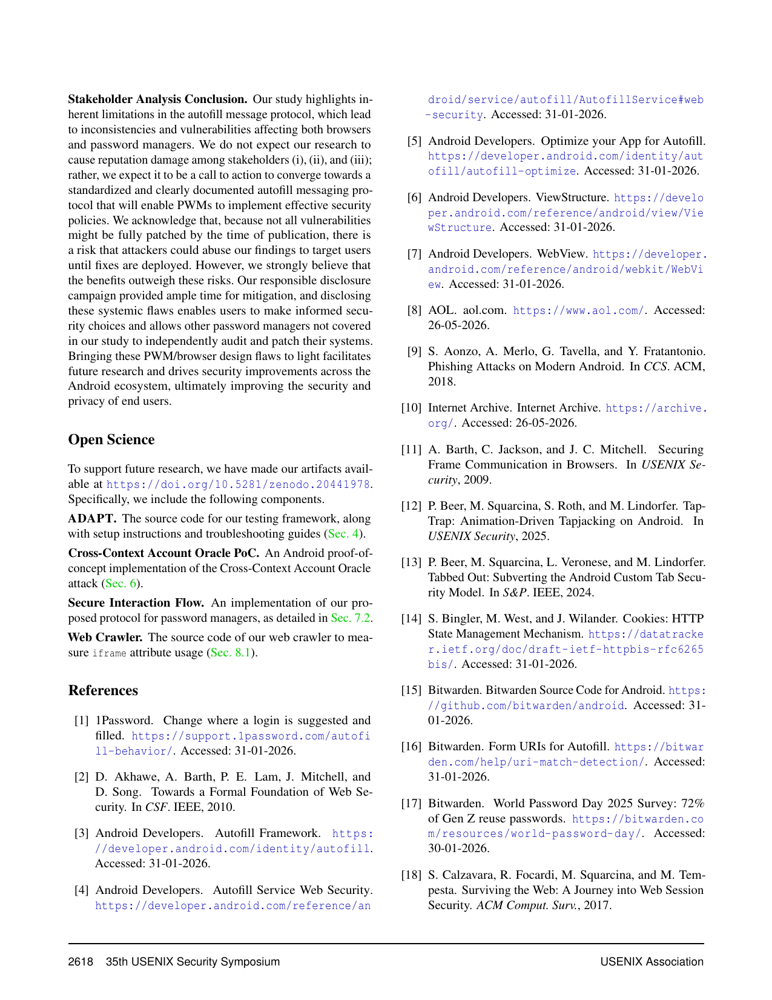

### Searchable text — page 19

```text
Stakeholder Analysis Conclusion. Our study highlights inherent limitations in the autofill message protocol, which lead
to inconsistencies and vulnerabilities affecting both browsers
and password managers. We do not expect our research to
cause reputation damage among stakeholders (i), (ii), and (iii);
rather, we expect it to be a call to action to converge towards a
standardized and clearly documented autofill messaging protocol that will enable PWMs to implement effective security
policies. We acknowledge that, because not all vulnerabilities
might be fully patched by the time of publication, there is
a risk that attackers could abuse our findings to target users
until fixes are deployed. However, we strongly believe that
the benefits outweigh these risks. Our responsible disclosure
campaign provided ample time for mitigation, and disclosing
these systemic flaws enables users to make informed security choices and allows other password managers not covered
in our study to independently audit and patch their systems.
Bringing these PWM/browser design flaws to light facilitates
future research and drives security improvements across the
Android ecosystem, ultimately improving the security and
privacy of end users.

Open Science
To support future research, we have made our artifacts available at https://doi.org/10.5281/zenodo.20441978.
Specifically, we include the following components.
ADAPT. The source code for our testing framework, along
with setup instructions and troubleshooting guides (Sec. 4).
Cross-Context Account Oracle PoC. An Android proof-ofconcept implementation of the Cross-Context Account Oracle
attack (Sec. 6).
Secure Interaction Flow. An implementation of our proposed protocol for password managers, as detailed in Sec. 7.2.
Web Crawler. The source code of our web crawler to measure iframe attribute usage (Sec. 8.1).

References
[1] 1Password. Change where a login is suggested and
filled. https://support.1password.com/autofi
ll-behavior/. Accessed: 31-01-2026.
[2] D. Akhawe, A. Barth, P. E. Lam, J. Mitchell, and
D. Song. Towards a Formal Foundation of Web Security. In CSF. IEEE, 2010.
[3] Android Developers. Autofill Framework. https:
//developer.android.com/identity/autofill.
Accessed: 31-01-2026.
[4] Android Developers. Autofill Service Web Security.
https://developer.android.com/reference/an

2618

35th USENIX Security Symposium

droid/service/autofill/AutofillService#web
-security. Accessed: 31-01-2026.
[5] Android Developers. Optimize your App for Autofill.
https://developer.android.com/identity/aut
ofill/autofill-optimize. Accessed: 31-01-2026.
[6] Android Developers. ViewStructure. https://develo
per.android.com/reference/android/view/Vie
wStructure. Accessed: 31-01-2026.
[7] Android Developers. WebView. https://developer.
android.com/reference/android/webkit/WebVi
ew. Accessed: 31-01-2026.
[8] AOL. aol.com. https://www.aol.com/. Accessed:
26-05-2026.
[9] S. Aonzo, A. Merlo, G. Tavella, and Y. Fratantonio.
Phishing Attacks on Modern Android. In CCS. ACM,
2018.
[10] Internet Archive. Internet Archive. https://archive.
org/. Accessed: 26-05-2026.
[11] A. Barth, C. Jackson, and J. C. Mitchell. Securing
Frame Communication in Browsers. In USENIX Security, 2009.
[12] P. Beer, M. Squarcina, S. Roth, and M. Lindorfer. TapTrap: Animation-Driven Tapjacking on Android. In
USENIX Security, 2025.
[13] P. Beer, M. Squarcina, L. Veronese, and M. Lindorfer.
Tabbed Out: Subverting the Android Custom Tab Security Model. In S&P. IEEE, 2024.
[14] S. Bingler, M. West, and J. Wilander. Cookies: HTTP
State Management Mechanism. https://datatracke
r.ietf.org/doc/draft-ietf-httpbis-rfc6265
bis/. Accessed: 31-01-2026.
[15] Bitwarden. Bitwarden Source Code for Android. https:
//github.com/bitwarden/android. Accessed: 3101-2026.
[16] Bitwarden. Form URIs for Autofill. https://bitwar
den.com/help/uri-match-detection/. Accessed:
31-01-2026.
[17] Bitwarden. World Password Day 2025 Survey: 72%
of Gen Z reuse passwords. https://bitwarden.co
m/resources/world-password-day/. Accessed:
30-01-2026.
[18] S. Calzavara, R. Focardi, M. Squarcina, and M. Tempesta. Surviving the Web: A Journey into Web Session
Security. ACM Comput. Surv., 2017.

USENIX Association
```

## Page 20

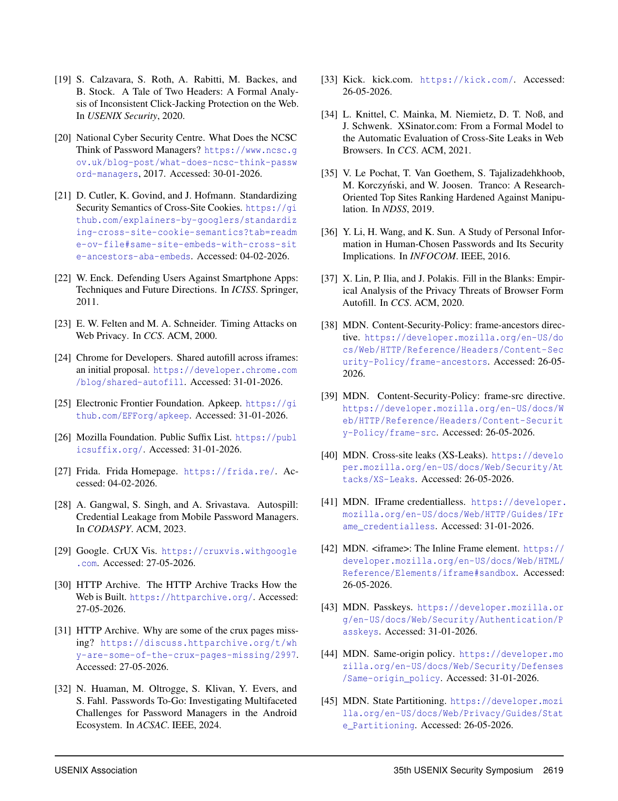

### Searchable text — page 20

```text
[19] S. Calzavara, S. Roth, A. Rabitti, M. Backes, and
B. Stock. A Tale of Two Headers: A Formal Analysis of Inconsistent Click-Jacking Protection on the Web.
In USENIX Security, 2020.
[20] National Cyber Security Centre. What Does the NCSC
Think of Password Managers? https://www.ncsc.g
ov.uk/blog-post/what-does-ncsc-think-passw
ord-managers, 2017. Accessed: 30-01-2026.
[21] D. Cutler, K. Govind, and J. Hofmann. Standardizing
Security Semantics of Cross-Site Cookies. https://gi
thub.com/explainers-by-googlers/standardiz
ing-cross-site-cookie-semantics?tab=readm
e-ov-file#same-site-embeds-with-cross-sit
e-ancestors-aba-embeds. Accessed: 04-02-2026.

[33] Kick. kick.com. https://kick.com/. Accessed:
26-05-2026.
[34] L. Knittel, C. Mainka, M. Niemietz, D. T. Noß, and
J. Schwenk. XSinator.com: From a Formal Model to
the Automatic Evaluation of Cross-Site Leaks in Web
Browsers. In CCS. ACM, 2021.
[35] V. Le Pochat, T. Van Goethem, S. Tajalizadehkhoob,
M. Korczyński, and W. Joosen. Tranco: A ResearchOriented Top Sites Ranking Hardened Against Manipulation. In NDSS, 2019.
[36] Y. Li, H. Wang, and K. Sun. A Study of Personal Information in Human-Chosen Passwords and Its Security
Implications. In INFOCOM. IEEE, 2016.

[22] W. Enck. Defending Users Against Smartphone Apps:
Techniques and Future Directions. In ICISS. Springer,
2011.

[37] X. Lin, P. Ilia, and J. Polakis. Fill in the Blanks: Empirical Analysis of the Privacy Threats of Browser Form
Autofill. In CCS. ACM, 2020.

[23] E. W. Felten and M. A. Schneider. Timing Attacks on
Web Privacy. In CCS. ACM, 2000.

[38] MDN. Content-Security-Policy: frame-ancestors directive. https://developer.mozilla.org/en-US/do
cs/Web/HTTP/Reference/Headers/Content-Sec
urity-Policy/frame-ancestors. Accessed: 26-052026.

[24] Chrome for Developers. Shared autofill across iframes:
an initial proposal. https://developer.chrome.com
/blog/shared-autofill. Accessed: 31-01-2026.
[25] Electronic Frontier Foundation. Apkeep. https://gi
thub.com/EFForg/apkeep. Accessed: 31-01-2026.
[26] Mozilla Foundation. Public Suffix List. https://publ
icsuffix.org/. Accessed: 31-01-2026.

[39] MDN. Content-Security-Policy: frame-src directive.
https://developer.mozilla.org/en-US/docs/W
eb/HTTP/Reference/Headers/Content-Securit
y-Policy/frame-src. Accessed: 26-05-2026.

[27] Frida. Frida Homepage. https://frida.re/. Accessed: 04-02-2026.

[40] MDN. Cross-site leaks (XS-Leaks). https://develo
per.mozilla.org/en-US/docs/Web/Security/At
tacks/XS-Leaks. Accessed: 26-05-2026.

[28] A. Gangwal, S. Singh, and A. Srivastava. Autospill:
Credential Leakage from Mobile Password Managers.
In CODASPY. ACM, 2023.

[41] MDN. IFrame credentialless. https://developer.
mozilla.org/en-US/docs/Web/HTTP/Guides/IFr
ame_credentialless. Accessed: 31-01-2026.

[29] Google. CrUX Vis. https://cruxvis.withgoogle
.com. Accessed: 27-05-2026.

[42] MDN. <iframe>: The Inline Frame element. https://
developer.mozilla.org/en-US/docs/Web/HTML/
Reference/Elements/iframe#sandbox. Accessed:
26-05-2026.

[30] HTTP Archive. The HTTP Archive Tracks How the
Web is Built. https://httparchive.org/. Accessed:
27-05-2026.
[31] HTTP Archive. Why are some of the crux pages missing? https://discuss.httparchive.org/t/wh
y-are-some-of-the-crux-pages-missing/2997.
Accessed: 27-05-2026.
[32] N. Huaman, M. Oltrogge, S. Klivan, Y. Evers, and
S. Fahl. Passwords To-Go: Investigating Multifaceted
Challenges for Password Managers in the Android
Ecosystem. In ACSAC. IEEE, 2024.

USENIX Association

[43] MDN. Passkeys. https://developer.mozilla.or
g/en-US/docs/Web/Security/Authentication/P
asskeys. Accessed: 31-01-2026.
[44] MDN. Same-origin policy. https://developer.mo
zilla.org/en-US/docs/Web/Security/Defenses
/Same-origin_policy. Accessed: 31-01-2026.
[45] MDN. State Partitioning. https://developer.mozi
lla.org/en-US/docs/Web/Privacy/Guides/Stat
e_Partitioning. Accessed: 26-05-2026.

35th USENIX Security Symposium

2619
```

## Page 21

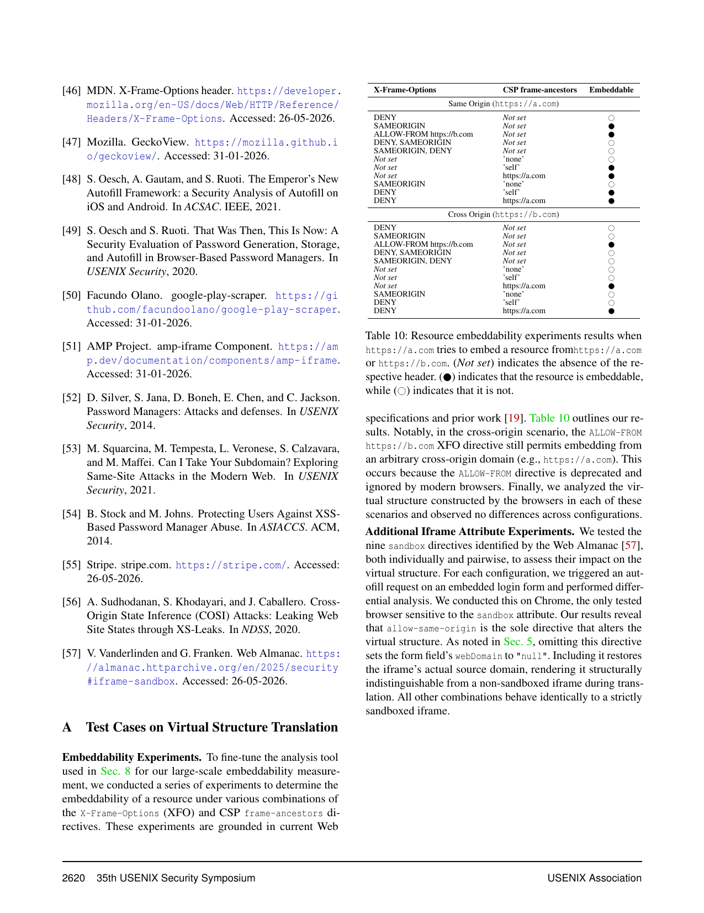

### Searchable text — page 21

```text
[46] MDN. X-Frame-Options header. https://developer.
mozilla.org/en-US/docs/Web/HTTP/Reference/
Headers/X-Frame-Options. Accessed: 26-05-2026.
[47] Mozilla. GeckoView. https://mozilla.github.i
o/geckoview/. Accessed: 31-01-2026.
[48] S. Oesch, A. Gautam, and S. Ruoti. The Emperor’s New
Autofill Framework: a Security Analysis of Autofill on
iOS and Android. In ACSAC. IEEE, 2021.
[49] S. Oesch and S. Ruoti. That Was Then, This Is Now: A
Security Evaluation of Password Generation, Storage,
and Autofill in Browser-Based Password Managers. In
USENIX Security, 2020.
[50] Facundo Olano. google-play-scraper. https://gi
thub.com/facundoolano/google-play-scraper.
Accessed: 31-01-2026.
[51] AMP Project. amp-iframe Component. https://am
p.dev/documentation/components/amp-iframe.
Accessed: 31-01-2026.
[52] D. Silver, S. Jana, D. Boneh, E. Chen, and C. Jackson.
Password Managers: Attacks and defenses. In USENIX
Security, 2014.
[53] M. Squarcina, M. Tempesta, L. Veronese, S. Calzavara,
and M. Maffei. Can I Take Your Subdomain? Exploring
Same-Site Attacks in the Modern Web. In USENIX
Security, 2021.
[54] B. Stock and M. Johns. Protecting Users Against XSSBased Password Manager Abuse. In ASIACCS. ACM,
2014.
[55] Stripe. stripe.com. https://stripe.com/. Accessed:
26-05-2026.
[56] A. Sudhodanan, S. Khodayari, and J. Caballero. CrossOrigin State Inference (COSI) Attacks: Leaking Web
Site States through XS-Leaks. In NDSS, 2020.
[57] V. Vanderlinden and G. Franken. Web Almanac. https:
//almanac.httparchive.org/en/2025/security
#iframe-sandbox. Accessed: 26-05-2026.

A

X-Frame-Options

CSP frame-ancestors

Embeddable

Same Origin (https://a.com)
DENY
SAMEORIGIN
ALLOW-FROM https://b.com
DENY, SAMEORIGIN
SAMEORIGIN, DENY
Not set
Not set
Not set
SAMEORIGIN
DENY
DENY

Not set
Not set
Not set
Not set
Not set
’none’
’self’
https://a.com
’none’
’self’
https://a.com

#
#
#
#
#

Cross Origin (https://b.com)
DENY
SAMEORIGIN
ALLOW-FROM https://b.com
DENY, SAMEORIGIN
SAMEORIGIN, DENY
Not set
Not set
Not set
SAMEORIGIN
DENY
DENY

Not set
Not set
Not set
Not set
Not set
’none’
’self’
https://a.com
’none’
’self’
https://a.com

#
#
#
#
#
#
#
#

Table 10: Resource embeddability experiments results when
https://a.com tries to embed a resource fromhttps://a.com
or https://b.com. (Not set) indicates the absence of the respective header. ( ) indicates that the resource is embeddable,
while (#) indicates that it is not.
specifications and prior work [19]. Table 10 outlines our results. Notably, in the cross-origin scenario, the ALLOW-FROM
https://b.com XFO directive still permits embedding from
an arbitrary cross-origin domain (e.g., https://a.com). This
occurs because the ALLOW-FROM directive is deprecated and
ignored by modern browsers. Finally, we analyzed the virtual structure constructed by the browsers in each of these
scenarios and observed no differences across configurations.
Additional Iframe Attribute Experiments. We tested the
nine sandbox directives identified by the Web Almanac [57],
both individually and pairwise, to assess their impact on the
virtual structure. For each configuration, we triggered an autofill request on an embedded login form and performed differential analysis. We conducted this on Chrome, the only tested
browser sensitive to the sandbox attribute. Our results reveal
that allow-same-origin is the sole directive that alters the
virtual structure. As noted in Sec. 5, omitting this directive
sets the form field’s webDomain to "null". Including it restores
the iframe’s actual source domain, rendering it structurally
indistinguishable from a non-sandboxed iframe during translation. All other combinations behave identically to a strictly
sandboxed iframe.

Test Cases on Virtual Structure Translation

Embeddability Experiments. To fine-tune the analysis tool
used in Sec. 8 for our large-scale embeddability measurement, we conducted a series of experiments to determine the
embeddability of a resource under various combinations of
the X-Frame-Options (XFO) and CSP frame-ancestors directives. These experiments are grounded in current Web

2620

35th USENIX Security Symposium

USENIX Association
```
